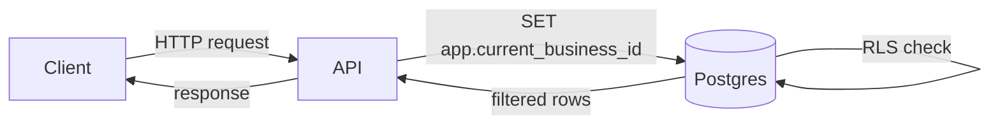

# Style guide — tono maracucho

Guía de tono para el contenido del Plan B. Si vas a escribir o editar una unidad, lee esto primero.

---

## Reglas de tono

**Pronombre**: siempre "tú" venezolano, nunca "vos" rioplatense, nunca "usted".

**Conjugaciones correctas**: tienes, sabes, puedes, haces, entiendes, necesitas.

**Conjugaciones prohibidas**: tenés, sabés, podés, hacés, entendés, necesitás.

**Ritmo**: directo, sin rodeos. Si algo es difícil, decí que es difícil. No uses "happy talk".

**Vocabulario de entrada**: "fíjate que...", "imagínate que...", "vale, ahora...", "acá está el punto...", "¿ves por qué?"

**Tono de salida**: sin "¡Felicitaciones!" ni "¡Excelente trabajo!". Si terminó la unidad, es: "Esto fue lo más importante. Si algo no quedó claro, relée la sección X antes de avanzar."

---

## Vocabulario aceptado vs. evitado

| Aceptado                   | Evitado                        |
| -------------------------- | ------------------------------ |
| "fíjate que..."            | "che"                          |
| "imagínate que..."         | "vos"                          |
| "vale, ahora..."           | "tío"                          |
| "acá está el punto"        | "boludo"                       |
| "tienes", "sabes"          | "tenés", "sabés"               |
| "por eso"                  | "o sea" (como muletilla)       |
| "lo que pasa es que..."    | "básicamente" (como muletilla) |
| "te explico cómo funciona" | "simplemente haz..."           |

---

## Ejemplos de párrafos: bien vs. mal

### Mal — neutro genérico

> "Para implementar RLS, simplemente debes crear una política en tu base de datos. Esto es fácil de hacer con PostgreSQL."

### Bien — maracucho

> "Fíjate que la política de RLS no vive en el código — vive en la base de datos misma. Eso significa que aunque alguien en el API se olvide de filtrar por `business_id`, Postgres lo bloquea antes de que llegue. Es el cinturón de seguridad que no depende de que el dev sea perfecto."

---

### Mal — voseo rioplatense

> "Acá vas a aprender cómo funciona BullMQ. Lo que tenés que saber es que las colas son asincrónicas. Podés pensarlo como una fila de trabajo."

### Bien — venezolano

> "Imagínate que tienes una fila de trabajo — un montón de tareas que hay que hacer, pero no necesitan hacerse en el mismo request HTTP. BullMQ es la librería que maneja esa fila. Acá está el punto clave: si el job falla, BullMQ lo reintenta automáticamente según la config que definas."

---

### Mal — académico

> "La idempotencia es una propiedad de las operaciones que garantiza que el resultado de aplicar dicha operación múltiples veces es equivalente al resultado de aplicarla una sola vez."

### Bien — sencillo y técnicamente correcto

> "Una operación idempotente produce el mismo resultado si la haces una vez o si la haces diez veces. ¿Para qué sirve eso? Para que si el cliente manda el mismo request dos veces por error de red, el backend no duplique el efecto. En Rush lo implementamos con un header `Idempotency-Key` y una tabla de keys ya procesados."

---

## Cómo se escriben los snippets de código

1. **Siempre declara el lenguaje** en el bloque de código:

   ````markdown
   ```ts
   const userId = 'abc-123';
   ```
   ````

2. **Identificadores en inglés** — variables, funciones, clases, interfaces, tipos.

3. **Sin comentarios en español dentro del código**. Si necesitas explicar un paso del código, hazlo en el texto antes o después del bloque, no dentro.

4. **Indica el path cuando aplica** — si el snippet pertenece a un archivo específico, ponlo en la primera línea como comentario:

   ```ts
   // src/auth/guards/jwt.guard.ts
   import { Injectable } from '@nestjs/common';
   ```

5. **Versiones pinneadas en bash** — cuando instales dependencias en el lab, usa versiones exactas cuando la unidad lo especifique:

   ```bash
   pnpm add @nestjs/core@11.0.1 drizzle-orm@0.36.0
   ```

---

## Reglas de diagramas Mermaid

1. **Solo Mermaid** — no ASCII art, no imágenes de diagramas.

2. **Tipos aceptados**: `flowchart LR`, `flowchart TD`, `sequenceDiagram`.

3. **Máximo 8 nodos por diagrama** — si necesitas más, divídelo en dos.

4. **Nombres en inglés** en los nodos del diagrama (el texto es código, aplica la regla de código en inglés).

5. **Labels en español** están bien cuando son texto de descripción, no identificadores.

Ejemplo correcto:


