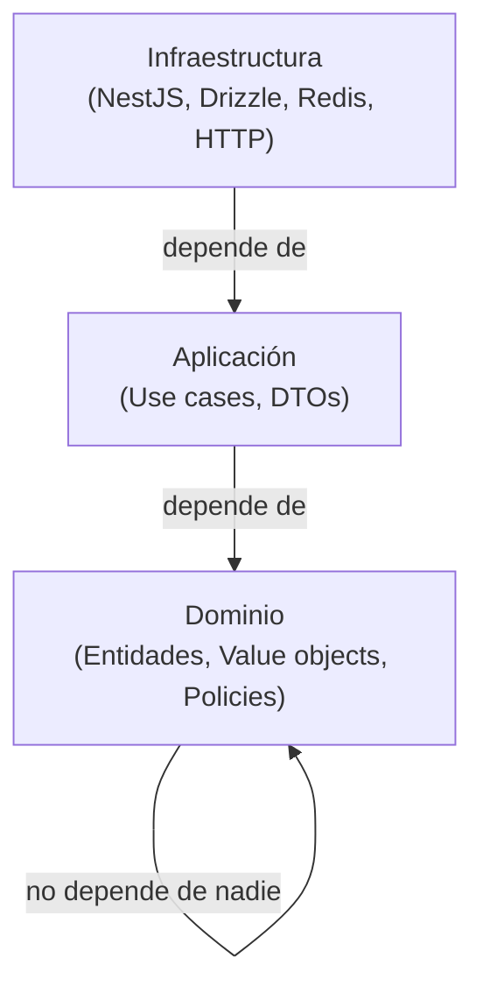

import LabSpec from '../../../components/LabSpec.astro';
import Checkpoint from '../../../components/Checkpoint.astro';
import TimeEstimate from '../../../components/TimeEstimate.astro';
import TrackBadge from '../../../components/TrackBadge.astro';

<TimeEstimate hours={3} />
<TrackBadge track="modulo-0" />

## 1. Conceptos

Clean Architecture no es una librería ni un framework. Es un conjunto de principios para organizar el código de forma que los cambios en la infraestructura (base de datos, HTTP, terceros) no rompan la lógica de negocio.

En Rush lo usamos porque el negocio es complejo: doble moneda, multi-tenant, eventos append-only. La lógica de negocio tiene que ser testeable por sí sola, sin levantar Postgres, sin HTTP, sin Redis.

### Las tres capas



La regla es simple: las dependencias siempre apuntan hacia adentro. El dominio no sabe que existe NestJS. La aplicación no sabe que existe Postgres. La infraestructura sabe de todo porque es la que conecta los puntos.

### Capa de Dominio

Aquí vive la lógica de negocio pura. Sin frameworks. Sin base de datos. Sin HTTP.

```ts
// domain/money/money.ts
export class Money {
  constructor(
    public readonly amount: number,
    public readonly currency: 'USD' | 'VES',
  ) {
    if (amount < 0) throw new Error('Amount cannot be negative');
    if (amount === 0) throw new Error('Amount must be greater than zero');
  }

  add(other: Money): Money {
    if (this.currency !== other.currency) {
      throw new Error('Cannot add money with different currencies');
    }
    return new Money(this.amount + other.amount, this.currency);
  }
}
```

```ts
// domain/transactions/transaction.policy.ts
export function canCreateTransaction(business: Business): boolean {
  return business.isActive && !business.isSuspended;
}
```

Fíjate que estas clases no tienen ningún `import` de NestJS, Drizzle, ni nada de infraestructura. Son código TypeScript puro que puedes testear con Vitest sin ningún setup.

### Capa de Aplicación

Los use cases coordinan las operaciones. Hablan con el dominio y con las interfaces de infraestructura (repositorios).

```ts
// application/transactions/create-transaction.usecase.ts
export class CreateTransactionUseCase {
  constructor(
    private readonly transactionRepo: ITransactionRepository,
    private readonly businessRepo: IBusinessRepository,
  ) {}

  async execute(input: CreateTransactionInput): Promise<Transaction> {
    const business = await this.businessRepo.findById(input.businessId);
    if (!business) throw new BusinessNotFoundError(input.businessId);

    if (!canCreateTransaction(business)) {
      throw new BusinessNotActiveError(input.businessId);
    }

    const money = new Money(input.amount, input.currency);
    return this.transactionRepo.save({ businessId: business.id, money });
  }
}
```

El use case no sabe si `transactionRepo` usa Postgres o un array en memoria. Solo conoce la interfaz.

### Capa de Infraestructura

Aquí está el NestJS, el Drizzle, el Redis. Esta capa implementa las interfaces que la aplicación define.

```ts
// infrastructure/transactions/drizzle-transaction.repository.ts
export class DrizzleTransactionRepository implements ITransactionRepository {
  constructor(private readonly db: DrizzleDatabase) {}

  async save(data: CreateTransactionData): Promise<Transaction> {
    const [result] = await this.db
      .insert(transactions)
      .values({
        businessId: data.businessId,
        amount: data.money.amount.toString(),
        currency: data.money.currency,
      })
      .returning();
    return result;
  }
}
```

### Cuándo usar esto en Rush

En Rush, el 80% del código del backend es `insert + snapshot + query`. Clean Architecture no significa que cada acción simple tenga un use case, un repositorio, un value object y tres interfaces.

Acá está el balance que usamos:

- Si la lógica de negocio tiene reglas complejas → Clean Architecture con capas
- Si es un CRUD simple sin reglas de negocio → repository + controller directo, sin capa de dominio
- Si hay computaciones financieras (Money, doble moneda, compensating events) → siempre en el dominio

---

## 2. Lab guiado

<LabSpec title="Clean Architecture básica con TypeScript" estimatedMinutes={90}>

### Setup

```bash
mkdir clean-arch-lab && cd clean-arch-lab
pnpm init
pnpm add -D typescript@6.0.3
npx tsc --init --strict true --target ES2022 --module NodeNext --moduleResolution NodeNext
```

### Paso 1: Crear la capa de dominio

```bash
mkdir -p src/domain/money src/application/transactions src/infrastructure
```

```ts
// src/domain/money/money.ts
export class Money {
  constructor(
    public readonly amount: number,
    public readonly currency: 'USD' | 'VES',
  ) {
    if (!Number.isFinite(amount) || amount <= 0) {
      throw new Error(`Invalid amount: ${amount}`);
    }
  }

  add(other: Money): Money {
    if (this.currency !== other.currency) {
      throw new TypeError(`Currency mismatch: ${this.currency} vs ${other.currency}`);
    }
    return new Money(this.amount + other.amount, this.currency);
  }

  toString(): string {
    return `${this.currency} ${this.amount.toFixed(2)}`;
  }
}
```

```ts
// src/domain/transactions/transaction.ts
import { Money } from '../money/money.js';

export interface Transaction {
  id: string;
  businessId: string;
  money: Money;
  description: string;
  createdAt: Date;
}

export interface ITransactionRepository {
  save(data: Omit<Transaction, 'id' | 'createdAt'>): Promise<Transaction>;
  findByBusiness(businessId: string): Promise<Transaction[]>;
}
```

### Paso 2: Crear el use case

```ts
// src/application/transactions/create-transaction.usecase.ts
import { ITransactionRepository, Transaction } from '../../domain/transactions/transaction.js';
import { Money } from '../../domain/money/money.js';

export interface CreateTransactionInput {
  businessId: string;
  amount: number;
  currency: 'USD' | 'VES';
  description: string;
}

export class CreateTransactionUseCase {
  constructor(private readonly repo: ITransactionRepository) {}

  async execute(input: CreateTransactionInput): Promise<Transaction> {
    const money = new Money(input.amount, input.currency);
    return this.repo.save({
      businessId: input.businessId,
      money,
      description: input.description,
    });
  }
}
```

### Paso 3: Crear un repositorio en memoria (para tests)

```ts
// src/infrastructure/in-memory-transaction.repository.ts
import { ITransactionRepository, Transaction } from '../domain/transactions/transaction.js';
import { Money } from '../domain/money/money.js';

export class InMemoryTransactionRepository implements ITransactionRepository {
  private readonly store: Transaction[] = [];

  async save(data: Omit<Transaction, 'id' | 'createdAt'>): Promise<Transaction> {
    const transaction: Transaction = {
      ...data,
      id: crypto.randomUUID(),
      createdAt: new Date(),
    };
    this.store.push(transaction);
    return transaction;
  }

  async findByBusiness(businessId: string): Promise<Transaction[]> {
    return this.store.filter((t) => t.businessId === businessId);
  }
}
```

### Paso 4: Probar el use case sin infraestructura real

```ts
// src/main.ts
import { CreateTransactionUseCase } from './application/transactions/create-transaction.usecase.js';
import { InMemoryTransactionRepository } from './infrastructure/in-memory-transaction.repository.js';

async function main() {
  const repo = new InMemoryTransactionRepository();
  const useCase = new CreateTransactionUseCase(repo);

  const result = await useCase.execute({
    businessId: 'biz-001',
    amount: 150.0,
    currency: 'USD',
    description: 'Test transaction',
  });

  console.log(`Created: ${result.id} — ${result.money.toString()}`);

  const transactions = await repo.findByBusiness('biz-001');
  console.log(`Total transactions for biz-001: ${transactions.length}`);
}

main().catch(console.error);
```

### Verificación final

```bash
npx tsc --noEmit
```

Debe pasar sin errores. Fíjate en los imports: el dominio no importa nada de infraestructura, el use case solo conoce las interfaces del dominio.

</LabSpec>

---

## 3. Checkpoint

<Checkpoint unit="Clean Architecture sin ceremonias">

### Preguntas conceptuales

1. ¿Por qué el dominio no puede depender de Drizzle o NestJS? ¿Qué problema concreto resuelve esa restricción?
2. Imagínate que Rush cambia de Drizzle a Prisma. ¿Qué capas tendrías que modificar? ¿Cuáles no necesitarías tocar?
3. ¿En qué situaciones usarías Clean Architecture completa vs un repository + controller directo? ¿Cómo decides en Rush?

### Tests que tienes que hacer pasar/fallar

- [ ] Test 1: Intenta importar `drizzle-orm` dentro de `src/domain/money/money.ts`. ¿Qué pasa? (Nota: el compilador no lo impide automáticamente — necesitas ESLint con `eslint-plugin-boundaries` para eso. Por ahora verifica el concepto: ese import estaría violando la arquitectura.)
- [ ] Test 2: Crea un segundo repositorio en memoria que falle intencionalmente (`throw new Error('DB down')`). Úsalo en el use case y verifica que el error se propaga correctamente sin que el use case tenga que cambiar.
- [ ] Test 3: Agrega una regla de dominio: las transacciones de más de `10000 USD` requieren un campo `approvalCode: string`. Implementa la validación en `Money` o en el use case — decide cuál es el lugar correcto y justifica tu decisión.

</Checkpoint>

## Próxima unidad

→ [Screaming Architecture](../vertical-slices/)
