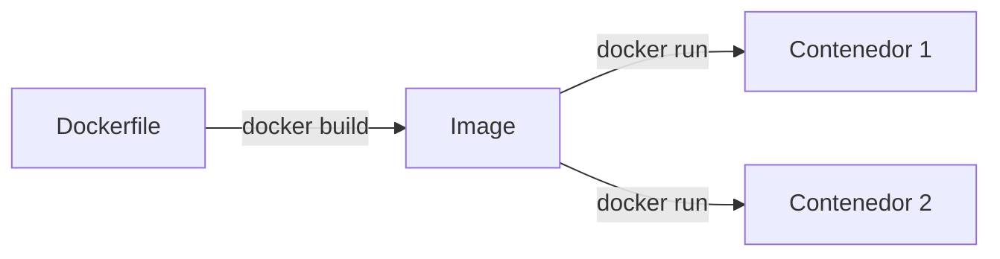

import LabSpec from '../../../components/LabSpec.astro';
import Checkpoint from '../../../components/Checkpoint.astro';
import TimeEstimate from '../../../components/TimeEstimate.astro';
import TrackBadge from '../../../components/TrackBadge.astro';

<TimeEstimate hours={2} />
<TrackBadge track="modulo-0" />

## 1. Conceptos

Docker resuelve el problema clásico de "en mi máquina funciona". Empaqueta la aplicación con todo lo que necesita para correr — runtime, dependencias, configuración — en una unidad que se comporta igual en cualquier entorno.

Fíjate que en Rush usamos Docker para dos cosas distintas:

1. **Desarrollo local**: levantar Postgres, Redis y otros servicios sin instalarlos directamente en la máquina
2. **Producción**: empaquetar los servicios de Rush en imágenes mínimas y seguras (eso lo ves en el Track DevOps)

Aquí te enfocas en el caso de desarrollo local.

### Imagen vs contenedor

La confusión más común es mezclar imagen y contenedor:

```text
Imagen = el molde (como una clase en POO)
Contenedor = la instancia corriendo (como un objeto)
```



Una imagen puede generar múltiples contenedores. Los contenedores comparten la imagen pero tienen su propio estado.

### Dockerfile — instrucción por instrucción

```dockerfile
# FROM — imagen base (punto de partida)
FROM node:20-alpine

# WORKDIR — directorio de trabajo dentro del contenedor
WORKDIR /app

# COPY — copiar archivos del host al contenedor
COPY package.json pnpm-lock.yaml ./

# RUN — ejecutar comandos durante el build
RUN npm install -g pnpm && pnpm install --frozen-lockfile

# COPY el resto del código
COPY . .

# EXPOSE — documentar qué puerto usa el proceso
EXPOSE 3000

# CMD — comando que corre cuando arranca el contenedor
CMD ["node", "dist/main.js"]
```

Fíjate en el orden: primero copia el `package.json`, luego instala, luego copia el código. Eso aprovecha el cache de capas de Docker — si el código cambia pero las dependencias no, el `pnpm install` no corre de nuevo. Si inviertes el orden, cada cambio de código invalida el cache de dependencias.

### docker-compose — múltiples servicios juntos

En vez de correr cada contenedor por separado, `docker-compose` te permite definir todos los servicios en un archivo YAML y levantarlos juntos:

```yaml
# docker-compose.yml
services:
  postgres:
    image: postgres:17-alpine
    environment:
      POSTGRES_PASSWORD: password
      POSTGRES_DB: rush_dev
    ports:
      - "5432:5432"
    volumes:
      - postgres_data:/var/lib/postgresql/data

  redis:
    image: redis:7-alpine
    ports:
      - "6379:6379"

volumes:
  postgres_data:
```

Con eso, un solo `docker compose up -d` levanta Postgres y Redis, y `docker compose down` los apaga.

El flag `-d` (detached) corre los contenedores en segundo plano para que la terminal quede libre.

### Volúmenes — datos que persisten

Por defecto, cuando un contenedor se elimina, sus datos desaparecen. Los volúmenes son la manera de hacer que los datos persistan entre reinicios:

```yaml
volumes:
  - postgres_data:/var/lib/postgresql/data
```

Esto mapea el directorio de datos de Postgres dentro del contenedor a un volumen nombrado en el host. Si haces `docker compose down` y luego `docker compose up`, los datos siguen ahí.

---

## 2. Lab guiado

<LabSpec title="Stack local de Rush con docker-compose" estimatedMinutes={60}>

### Setup

Verifica que tienes Docker instalado:

```bash
docker --version
docker compose version
```

### Paso 1: Levantar Postgres y Redis

Crea un directorio de práctica:

```bash
mkdir docker-lab && cd docker-lab
```

Crea el archivo `docker-compose.yml`:

```yaml
services:
  postgres:
    image: postgres:17-alpine
    container_name: rush-postgres
    environment:
      POSTGRES_PASSWORD: password
      POSTGRES_DB: rush_dev
      POSTGRES_USER: postgres
    ports:
      - "5432:5432"
    volumes:
      - postgres_data:/var/lib/postgresql/data
    healthcheck:
      test: ["CMD-SHELL", "pg_isready -U postgres"]
      interval: 5s
      timeout: 5s
      retries: 5

  redis:
    image: redis:7-alpine
    container_name: rush-redis
    ports:
      - "6379:6379"
    healthcheck:
      test: ["CMD", "redis-cli", "ping"]
      interval: 5s
      timeout: 3s
      retries: 5

volumes:
  postgres_data:
```

Levanta los servicios:

```bash
docker compose up -d
```

### Paso 2: Verificar que los servicios están corriendo

```bash
# Ver el estado de los contenedores
docker compose ps

# Ver los logs de postgres
docker compose logs postgres

# Conectarse a Postgres
docker exec -it rush-postgres psql -U postgres -d rush_dev
```

Dentro de psql:

```sql
SELECT version();
-- PostgreSQL 17.x on x86_64...
\q
```

### Paso 3: Persistencia de datos

```bash
# Crear una tabla y agregar datos
docker exec -it rush-postgres psql -U postgres -d rush_dev -c "
CREATE TABLE test_persistence (id serial, value text);
INSERT INTO test_persistence (value) VALUES ('datos de prueba');
SELECT * FROM test_persistence;
"

# Detener y volver a levantar
docker compose down
docker compose up -d

# Verificar que los datos persisten
docker exec -it rush-postgres psql -U postgres -d rush_dev -c "SELECT * FROM test_persistence;"
```

### Verificación final

```bash
docker compose ps
```

Todos los servicios deben mostrar `Up` y `healthy` en el status. Si alguno muestra `unhealthy` o `Exit`, revisa los logs con `docker compose logs <servicio>`.

</LabSpec>

---

## 3. Checkpoint

<Checkpoint unit="Docker sin miedo">

### Preguntas conceptuales

1. ¿Cuál es la diferencia entre `docker compose down` y `docker compose down -v`? ¿Cuándo usarías cada uno?
2. ¿Por qué el orden de las instrucciones en el Dockerfile importa para el rendimiento del build? Explica cómo funciona el cache de capas.
3. ¿Qué hace el `healthcheck` en el docker-compose? ¿Por qué es importante para el stack de Rush?

### Tests que tienes que hacer pasar/fallar

- [ ] Test 1: Levanta el stack, crea una tabla con datos, haz `docker compose down`, vuelve a levantar y confirma que los datos persisten. Luego haz `docker compose down -v` y verifica que los datos desaparecen.
- [ ] Test 2: Modifica el `docker-compose.yml` para agregar una variable de entorno `POSTGRES_USER: rush_user` y un usuario diferente. Verifica que puedes conectarte con ese usuario.
- [ ] Test 3: Corre `docker compose logs -f` (follow) mientras levantas los servicios y observa el orden de inicialización. ¿Qué pasa si el healthcheck falla?

</Checkpoint>

## Próxima unidad

→ [pnpm y el workspace de Rush](../pnpm-monorepo/)
