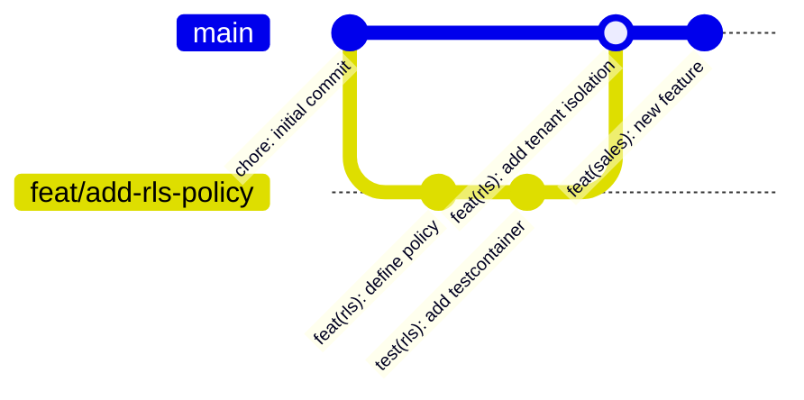

import LabSpec from '../../../components/LabSpec.astro';
import Checkpoint from '../../../components/Checkpoint.astro';
import TimeEstimate from '../../../components/TimeEstimate.astro';
import TrackBadge from '../../../components/TrackBadge.astro';

<TimeEstimate hours={2} />
<TrackBadge track="modulo-0" />

## 1. Conceptos

Git es la herramienta que más afecta la capacidad de un equipo para trabajar en paralelo sin pisarse. La mayoría sabe hacer `git commit` y `git push`. El problema está en todo lo que viene después: cómo el historial queda limpio, cómo los conflictos se minimizan, y cómo el code review funciona sin fricción.

En Rush, el flujo es simple: feature branches + squash merge + conventional commits. Nada más sofisticado que eso.

### Feature branches

Todo cambio vive en una rama separada de `main`. Nunca se trabaja directamente en `main`.



La convención de nombres en Rush:

```text
feat/<scope>-<descripcion-breve>   → nueva funcionalidad
fix/<scope>-<descripcion-breve>    → corrección de bug
chore/<descripcion>                → tooling, deps, config
```

Ejemplos reales:

```bash
git checkout -b feat/transactions-rls-policy
git checkout -b fix/auth-refresh-token-expiry
git checkout -b chore/update-drizzle-0-36
```

### Squash merge

Cuando haces merge de un PR en Rush, todos los commits de la rama se "aplanan" en un solo commit en `main`. Eso significa que el historial de `main` queda limpio — un commit por feature, uno por fix.

```text
main antes:  A ─ B ─ C
                       │
feat/xyz:              D ─ E ─ F ─ G

main después: A ─ B ─ C ─ H
                             (H = squash de D+E+F+G)
```

El mensaje del commit de squash es el título del PR — por eso el título del PR tiene que ser descriptivo y en formato conventional commits.

### Conventional commits

El formato es simple:

```text
<tipo>(<scope opcional>): <descripción en minúsculas>
```

Tipos permitidos en Rush:

| Tipo       | Cuándo usarlo                                        |
| ---------- | ---------------------------------------------------- |
| `feat`     | Nueva funcionalidad para el usuario                  |
| `fix`      | Corrección de bug                                    |
| `docs`     | Solo documentación                                   |
| `chore`    | Tooling, deps, config — no toca código de producción |
| `refactor` | Reestructura sin cambio de comportamiento            |
| `test`     | Agregar o arreglar tests                             |
| `perf`     | Mejora de performance                                |

Ejemplos:

```text
feat(transactions): add idempotency key validation
fix(auth): handle refresh token expiry correctly
chore: upgrade drizzle-orm to 0.36.0
test(rls): add testcontainers suite for tenant isolation
```

Lo que NO hacemos en Rush:

```text
feat: stuff                          ← sin descripción
Fix the bug                          ← sin tipo, mayúscula
feat: Added the thing and also...    ← dos cosas en un commit
```

### Cómo se ve un PR limpio

Un PR de Rush tiene:

1. **Título**: conventional commit format — `feat(scope): descripción`
2. **Descripción**: qué cambia y por qué, no cómo (el código ya muestra el cómo)
3. **Diff acotado**: un PR = una cosa. Si tocás 10 archivos no relacionados, son dos PRs
4. **Tests pasando**: el CI tiene que estar verde antes del review

---

## 2. Lab guiado

<LabSpec title="Flujo de trabajo Git de Rush" estimatedMinutes={60}>

### Setup

Crea un repo de práctica:

```bash
mkdir git-workflow-lab && cd git-workflow-lab
git init
git commit --allow-empty -m "chore: initial commit"
```

### Paso 1: Crear y trabajar en una feature branch

```bash
# Crear la rama con el formato de Rush
git checkout -b feat/users-endpoint

# Crear un archivo de práctica
mkdir -p src/users
cat > src/users/users.service.ts << 'EOF'
export class UsersService {
  findById(id: string) {
    return { id, name: 'placeholder' };
  }
}
EOF

# Commit con formato conventional
git add src/
git commit -m "feat(users): add placeholder UsersService"
```

### Paso 2: Simular trabajo en paralelo

```bash
# Volver a main y simular otro dev que hizo cambios
git checkout main
cat > README.md << 'EOF'
# Rush API

Backend de Rush. Ver docs en /docs.
EOF
git add README.md
git commit -m "docs: add readme"

# Volver a tu rama y hacer rebase
git checkout feat/users-endpoint
git rebase main
# Si hay conflictos, resolverlos y continuar con:
# git rebase --continue
```

### Paso 3: Preparar commits limpios

```bash
# Agrega más cambios
cat >> src/users/users.service.ts << 'EOF'

export class UsersController {
  constructor(private readonly usersService: UsersService) {}

  getUser(id: string) {
    return this.usersService.findById(id);
  }
}
EOF

git add src/
git commit -m "feat(users): add UsersController"

# Ver el historial de la rama
git log main..HEAD --oneline
```

### Paso 4: Simular squash merge

```bash
# Squash de todos los commits de la rama en uno
git checkout main
git merge --squash feat/users-endpoint
git commit -m "feat(users): add UsersService and UsersController"

# El historial de main queda limpio
git log --oneline
```

### Verificación final

```bash
git log --oneline
```

Deberías ver solo 2 commits en main: el inicial y el de la feature. Sin el historial intermedio de la rama.

</LabSpec>

---

## 3. Checkpoint

<Checkpoint unit="Git como herramienta de equipo">

### Preguntas conceptuales

1. ¿Por qué Rush usa squash merge en vez de merge commit normal? ¿Qué problema resuelve en el historial de `main`?
2. ¿Qué ventaja tiene hacer `git rebase main` en tu feature branch antes del PR, en vez de hacer merge de main hacia tu rama?
3. Si tu PR tiene 15 archivos modificados en 3 features distintas, ¿qué harías? ¿Por qué?

### Tests que tienes que hacer pasar/fallar

- [ ] Test 1: Crea dos branches desde el mismo punto, modifica el mismo archivo en ambas, luego intenta mergear — resuelve el conflicto correctamente y verifica que el resultado final tiene los cambios de ambas.
- [ ] Test 2: Escribe 5 commits con mensajes mal formateados (sin tipo, con mayúscula, demasiado genéricos) y practica reescribirlos con `git rebase -i` usando mensajes en conventional commits format.
- [ ] Test 3: Usa `git log --graph --oneline --all` para visualizar cómo queda el historial después de un squash merge vs un merge commit normal.

</Checkpoint>

## Próxima unidad

→ [Docker sin miedo](../docker-basico/)
