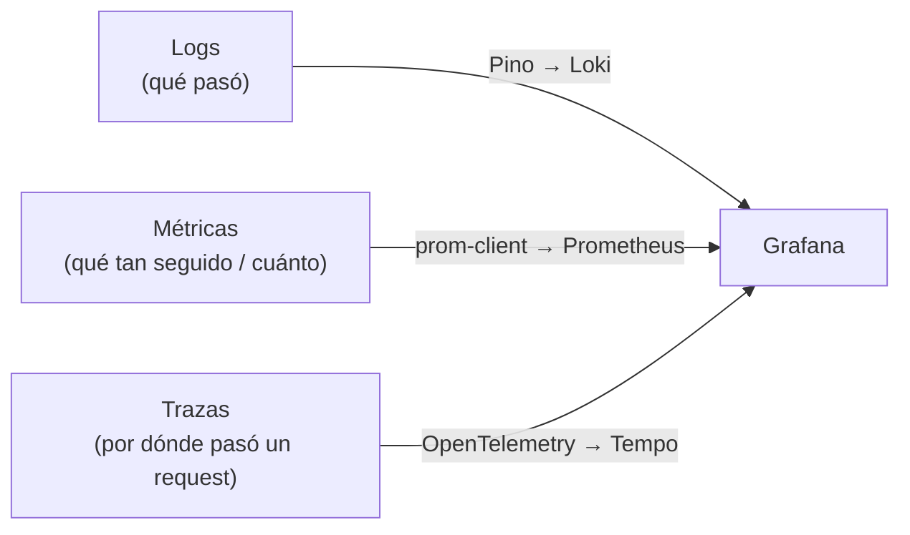

import LabSpec from '../../../components/LabSpec.astro';
import Checkpoint from '../../../components/Checkpoint.astro';
import TimeEstimate from '../../../components/TimeEstimate.astro';
import TrackBadge from '../../../components/TrackBadge.astro';

<TimeEstimate hours={2} />
<TrackBadge track="modulo-0" />

## 1. Conceptos

Observabilidad es la capacidad de entender qué está pasando en un sistema en producción sin tener que conectarte directamente al servidor. Si tienes que usar `console.log` en producción para entender un bug, el sistema no es observable.

En Rush tenemos tres herramientas para eso: Pino (logs), Prometheus (métricas) y Grafana (dashboards). Son el stack OSS estándar para monitoreo.

### Los tres pilares de observabilidad



Cada uno responde a preguntas distintas:

- **Logs**: "¿Qué pasó exactamente en este request fallido?" — miras el log y ves el error con contexto
- **Métricas**: "¿Cuántos requests fallan por minuto en el endpoint de ventas?" — ves una gráfica en el tiempo
- **Trazas**: "¿Por qué este request tardó 3 segundos?" — ves el desglose paso a paso de qué parte tomó cuánto tiempo

### Logs estructurados con Pino

`console.log('Error procesando venta')` no es un log — es un mensaje de texto sin estructura que no puedes buscar, filtrar ni alertar.

Un log estructurado en JSON es la base:

```ts
// NO — texto plano, inútil para monitoreo
console.log('Error al procesar venta de negocio ' + businessId);

// SÍ — JSON estructurado con contexto
logger.error({
  event: 'sale.create.failed',
  businessId,
  errorCode: 'INSUFFICIENT_FUNDS',
  requestId,
}, 'Sale creation failed');
```

El log estructurado se puede enviar a Loki (la base de datos de logs de Grafana) y hacer queries como:

```text
{app="rush-api"} | json | event="sale.create.failed" | businessId="some-id"
```

### Qué NO se loggea en Rush

La regla de seguridad más importante: nunca loggear datos sensibles.

```ts
// MAL — fuga de datos sensibles
logger.info({ payload: requestBody }, 'Processing payment');
// Si requestBody tiene el amount, el RIF, datos del dueño → fuga

// BIEN — solo los campos necesarios para debug
logger.info({
  event: 'payment.processing',
  businessId: payload.businessId,
  idempotencyKey: payload.idempotencyKey,
  currency: payload.currency,
  // NO el amount, NO el RIF, NO información personal
}, 'Processing payment');
```

Los campos prohibidos en logs de Rush:

- Montos (`amount`, `total`, `balance`)
- RIF/cédula del dueño
- Tokens de autenticación
- Contraseñas o códigos OTP
- Números de teléfono

### Métricas con Prometheus

Una métrica es un número que representa el estado del sistema en el tiempo. Prometheus scrapea métricas de tus servicios a intervalos regulares y las guarda.

Los tipos de métricas más comunes:

```ts
// Counter — solo sube, nunca baja (ej: total de requests)
const requestCounter = new Counter({
  name: 'http_requests_total',
  help: 'Total HTTP requests',
  labelNames: ['method', 'route', 'status_code'],
});

// Gauge — puede subir y bajar (ej: conexiones activas, memoria)
const activeConnections = new Gauge({
  name: 'active_connections',
  help: 'Current active connections',
});

// Histogram — distribución de valores (ej: latencia de requests)
const requestDuration = new Histogram({
  name: 'http_request_duration_seconds',
  help: 'HTTP request duration in seconds',
  buckets: [0.01, 0.05, 0.1, 0.5, 1, 2, 5],
});
```

En Grafana, un histogram te permite ver percentiles: "el p99 de latencia de mi endpoint es 450ms" — eso es mucho más útil que "el promedio es 120ms".

### Grafana — visualizar todo

Grafana es el dashboard donde ves logs (desde Loki) y métricas (desde Prometheus) en el mismo lugar.

Los dashboards que Rush tiene en producción:

- **API Overview**: requests por minuto, error rate, latencia p50/p95/p99
- **Business Health**: transacciones por business por hora, errores de validación
- **Infrastructure**: CPU, memoria, conexiones Postgres, Redis memory

El setup completo del stack Grafana+Loki+Prometheus lo ves en el Track DevOps. Acá entiendes los conceptos para saber para qué sirve cada cosa.

---

## 2. Lab guiado

<LabSpec title="Logs estructurados con Pino" estimatedMinutes={60}>

### Setup

```bash
mkdir observability-lab && cd observability-lab
pnpm init
pnpm add pino@9
pnpm add -D typescript@6.0.3 @types/node@20
npx tsc --init --strict true --target ES2022 --module NodeNext --moduleResolution NodeNext
```

### Paso 1: Configurar Pino correctamente

```ts
// src/logger.ts
import pino from 'pino';

export const logger = pino({
  level: process.env.LOG_LEVEL ?? 'info',
  // En desarrollo: pretty print. En producción: JSON puro
  transport:
    process.env.NODE_ENV !== 'production'
      ? { target: 'pino-pretty', options: { colorize: true } }
      : undefined,
  // Campos base que van en todos los logs
  base: {
    app: 'rush-api',
    version: '1.0.0',
    env: process.env.NODE_ENV ?? 'development',
  },
  // Nunca serializar estos campos si aparecen
  redact: {
    paths: ['password', 'token', 'authorization', '*.password', '*.token'],
    censor: '[REDACTED]',
  },
});
```

### Paso 2: Escribir logs con contexto correcto

```ts
// src/sales.service.ts
import { logger } from './logger.js';

interface CreateSaleInput {
  businessId: string;
  currency: 'USD' | 'VES';
  idempotencyKey: string;
}

export async function createSale(input: CreateSaleInput): Promise<void> {
  const childLogger = logger.child({
    service: 'SalesService',
    businessId: input.businessId,
    idempotencyKey: input.idempotencyKey,
  });

  childLogger.info({ event: 'sale.create.start', currency: input.currency }, 'Creating sale');

  try {
    // Simular trabajo
    await new Promise((resolve) => setTimeout(resolve, 100));

    childLogger.info({ event: 'sale.create.success' }, 'Sale created successfully');
  } catch (err) {
    childLogger.error(
      { event: 'sale.create.failed', error: err instanceof Error ? err.message : String(err) },
      'Sale creation failed',
    );
    throw err;
  }
}
```

### Paso 3: Comparar log malo vs bueno

```ts
// src/compare.ts
import { logger } from './logger.js';

const businessId = 'biz-001';
const amount = 150.0; // dato sensible

// MAL — texto plano + dato sensible
console.log(`Processing sale for business ${businessId} with amount ${amount}`);

// BIEN — estructurado + sin dato sensible
logger.info(
  {
    event: 'sale.processing',
    businessId,
    // NO amount
  },
  'Processing sale',
);
```

Corre el archivo y mira el output. El log malo es un string. El log bueno es JSON que puedes parsear, filtrar y alertar.

### Verificación final

```bash
npx tsc --noEmit
```

El código compila sin errores. Los logs tienen `event`, `businessId`, y ningún campo sensible.

</LabSpec>

---

## 3. Checkpoint

<Checkpoint unit="Observabilidad: ver qué pasa en producción">

### Preguntas conceptuales

1. ¿Cuándo usarías logs vs métricas para diagnosticar un problema? Da un ejemplo de una situación donde los logs ayudan y otra donde las métricas ayudan.
2. ¿Por qué no se loggea el `amount` de una transacción en Rush? ¿Qué riesgo concreto mitiga esa regla?
3. ¿Cuál es la diferencia entre un Counter y un Gauge en Prometheus? Da un ejemplo de qué medirías con cada uno en Rush.

### Tests que tienes que hacer pasar/fallar

- [ ] Test 1: Configura Pino con `redact` para que el campo `amount` en cualquier nivel del objeto sea reemplazado por `[REDACTED]`. Verifica que `logger.info({ amount: 150, businessId: 'biz-001' }, 'test')` no expone el amount.
- [ ] Test 2: Crea un child logger para un `requestId` específico y verifica que todos los logs emitidos desde ese child incluyen el `requestId` automáticamente.
- [ ] Test 3: Escribe un pseudocódigo (no tiene que correr) de cómo instrumentarías el endpoint `POST /sales` con un Histogram de latencia. ¿Qué labels usarías? ¿Por qué?

</Checkpoint>

## Próxima unidad

→ [Testar es diseñar, no verificar](../testing-filosofia/)
