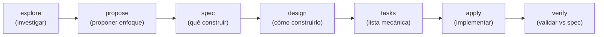

import LabSpec from '../../../components/LabSpec.astro';
import Checkpoint from '../../../components/Checkpoint.astro';
import TimeEstimate from '../../../components/TimeEstimate.astro';
import TrackBadge from '../../../components/TrackBadge.astro';

<TimeEstimate hours={2} />
<TrackBadge track="modulo-0" />

## 1. Conceptos

SDD (Spec-Driven Development) es el proceso que usa Rush para tomar decisiones técnicas antes de escribir código. El principio base es simple: **el humano dirige, la IA ejecuta**.

Esto no es solo proceso por proceso. Es la diferencia entre codear algo y entender por qué se codea así.

### El pipeline SDD



Cada fase produce un artefacto. El artefacto de una fase es el input de la siguiente.

### Qué hace cada fase

**explore** — investigar el problema. ¿Existe algo así en el repo? ¿Cuáles son las opciones? ¿Qué hace el stack actual?

**propose** — proponer el enfoque general. ¿Qué vamos a construir y por qué? ¿Cuáles son las alternativas que descartamos y por qué?

**spec** — definir QUÉ construir exactamente. Criterios de aceptación verificables. Catálogo de endpoints, schemas, comportamientos. Sin decir cómo hacerlo.

**design** — definir CÓMO construirlo. Decisiones de arquitectura, estructura de carpetas, contratos de interfaces, dependencias.

**tasks** — desglose mecánico de trabajo. Lista de tareas numeradas que un sub-agente puede ejecutar sin tener que tomar decisiones de diseño.

**apply** — implementar las tareas. El sub-agente escribe el código siguiendo exactamente las tasks, el spec y el design.

**verify** — validar que lo implementado coincide con el spec. Si hay divergencias, reportarlas.

### El humano dirige — qué significa en práctica

El founder (o el dev senior) toma las decisiones en estas fases:

- **explore + propose**: define el problema y aprueba el enfoque
- **spec**: aprueba los criterios de aceptación antes de pasar a design
- **design**: aprueba las decisiones de arquitectura antes de tasks
- **verify**: revisa el reporte final y decide si está listo para PR

La IA ejecuta:

- Explora el repo y genera el artefacto de explore
- Genera la propuesta y el spec basados en el input del humano
- Genera el design basado en el spec aprobado
- Desglosa las tasks y las ejecuta (apply)
- Genera el reporte de verify

Fíjate que la IA nunca toma decisiones de diseño por sí sola. Si hay ambigüedad en la spec, para y reporta — no improvisa.

### Por qué importa el artefacto de spec

El spec es el contrato entre el humano y el proceso de implementación. Si el spec es vago, el apply produce código que no coincide con lo que el founder tenía en mente. Si el spec es preciso, el verify puede comparar el código contra criterios concretos.

Un spec malo:

> "Agregar autenticación al sistema"

Un spec bien formado:

> - REQ-01: El endpoint `POST /auth/login` acepta `{email, password}` y retorna `{accessToken, refreshToken, expiresIn}`
> - REQ-02: Si el email no existe, retorna 401 con `{code: 'INVALID_CREDENTIALS'}`
> - REQ-03: Si el password es incorrecto, retorna 401 con `{code: 'INVALID_CREDENTIALS'}` (mismo error — no revela si el email existe)
> - REQ-04: El accessToken expira en 15 minutos

---

## 2. Lab guiado

<LabSpec title="Tu primer mini-SDD" estimatedMinutes={60}>

### Setup

Para este lab solo necesitas un editor de texto y Claude Code (o cualquier Claude con contexto de proyecto).

### Paso 1: Definir el scope

Vamos a hacer un SDD mínimo para una feature simple: "agregar un endpoint que devuelve el total de ventas del día para un negocio".

Escribe el explore tú mismo — sin la IA:

```markdown
## Explore: total de ventas del día

Pregunta: ¿cómo calculamos el total de ventas del día para un business?

Contexto del repo:

- Tabla `sales_events` con columnas: id, business_id, amount, currency, created_at (TIMESTAMPTZ)
- El endpoint de sales existe en `src/sales/sales.controller.ts`
- No existe ningún endpoint de "resumen" o "totales"

Opciones:

1. Query directa a la tabla con SUM y WHERE created_at >= hoy
2. KPI snapshot pre-calculado (más complejo, para futuro)

Decisión: opción 1 para el MVP. El snapshot va en el Track BE.
```

### Paso 2: Escribir el spec

```markdown
## Spec: daily-sales-total endpoint

### REQ-01: Endpoint de totales del día

- GIVEN un business_id válido y un token de autenticación
- WHEN GET /businesses/:businessId/sales/today
- THEN retorna { total_usd: number, total_ves: number, count: number, date: string }
- AND los totales son exactos hasta 2 decimales
- AND incluye solo transacciones con created_at >= inicio del día en UTC-4

### REQ-02: Autorización

- GIVEN un token de otro business
- WHEN GET /businesses/:businessId/sales/today
- THEN retorna 403 (no 404, para no revelar que el business existe)

### REQ-03: Business inexistente

- GIVEN un businessId que no existe en la tabla businesses
- WHEN GET /businesses/:businessId/sales/today
- THEN retorna 404 con { code: 'BUSINESS_NOT_FOUND' }
```

### Paso 3: Leer un spec real de Rush

El proceso completo de SDD para un cambio real lo puedes ver en engram (si tienes acceso al contexto del proyecto). El artefacto de spec de `study-plan-tech` es un ejemplo de spec real de ~150 líneas con REQs verificables.

La clave es notar la estructura: GIVEN / WHEN / THEN. No "debería hacer X" sino "dado Y, cuando Z, entonces el resultado es W y es verificable".

### Verificación final

Revisa tu spec del Paso 2 contra estas preguntas:

- ¿Cada REQ tiene un criterio de aceptación que puedes verificar con código o con una llamada HTTP?
- ¿El spec dice QUÉ sin decir CÓMO?
- ¿Si le das este spec a un dev que no conoce el proyecto, puede implementarlo sin preguntarte nada?

Si la respuesta es sí a las tres, el spec está bien.

</LabSpec>

---

## 3. Checkpoint

<Checkpoint unit="SDD: cómo Rush decide antes de codear">

### Preguntas conceptuales

1. ¿Por qué el spec y el design son fases separadas? ¿Qué problema causa mezclarlas?
2. Si el sub-agente que hace `apply` encuentra una ambigüedad en las tasks que no puede resolver solo, ¿qué debería hacer? ¿Por qué eso es correcto?
3. ¿Cuál es la diferencia entre un REQ bien formado y uno vago? Da un ejemplo de cada uno para la misma feature.

### Tests que tienes que hacer pasar/fallar

- [ ] Test 1: Toma la feature "agregar paginación al endpoint de transacciones" y escribe un spec con al menos 3 REQs en formato GIVEN/WHEN/THEN. Verifica que cada REQ es verificable con una llamada HTTP o un test.
- [ ] Test 2: Dado el spec del Paso 2 del lab, escribe las tasks (lista numerada de pasos mecánicos que un dev puede ejecutar sin tomar decisiones de diseño).
- [ ] Test 3: Toma un spec con un REQ ambiguo (ej: "el endpoint debe ser rápido") y reescríbelo con un criterio verificable (ej: "el p99 de latencia del endpoint debe ser < 200ms bajo carga de 50 req/s").

</Checkpoint>

## Próxima unidad

→ [Claude Code y Engram como herramientas](../ai-tooling/)
