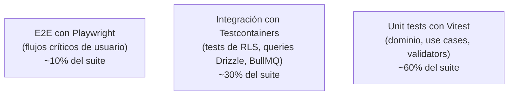

import LabSpec from '../../../components/LabSpec.astro';
import Checkpoint from '../../../components/Checkpoint.astro';
import TimeEstimate from '../../../components/TimeEstimate.astro';
import TrackBadge from '../../../components/TrackBadge.astro';

<TimeEstimate hours={3} />
<TrackBadge track="modulo-0" />

## 1. Conceptos

La mayoría de los devs tratan los tests como algo que se hace al final, para verificar que el código que escribieron funciona. Eso es usar los tests de forma reactiva.

La manera correcta es usarlos de forma proactiva: antes de escribir el código, escribes el test. Eso te obliga a pensar en la interfaz del código (cómo se usa) antes de pensar en la implementación (cómo funciona). El resultado es código con mejor diseño.

Pero en Rush hay una razón más concreta: los tests de RLS (Row Level Security) son **obligatorios antes del primer insert en producción**. No es opcional. Si no hay un test que confirme que el tenant A no puede ver datos del tenant B, no se hace deploy.

### El modelo de tres capas de tests



Cada capa tiene un propósito distinto:

- **Unit tests**: testean lógica de negocio pura, sin infraestructura. Rápidos (< 1ms por test).
- **Integration tests**: testean el código contra infraestructura real (Postgres, Redis). Más lentos pero verifican comportamiento real.
- **E2E tests**: testean flujos completos desde el browser. Solo para los flujos monetarios críticos.

### Unit tests con Vitest — qué y cómo

Vitest es el test runner que usa Rush — compatible con Vite, más rápido que Jest, API idéntica.

```ts
// domain/money/money.test.ts
import { describe, it, expect } from 'vitest';
import { Money } from './money.js';

describe('Money', () => {
  it('creates a valid money instance', () => {
    const money = new Money(150.0, 'USD');
    expect(money.amount).toBe(150.0);
    expect(money.currency).toBe('USD');
  });

  it('throws on negative amount', () => {
    expect(() => new Money(-50, 'USD')).toThrow();
  });

  it('adds two money values with same currency', () => {
    const a = new Money(100, 'USD');
    const b = new Money(50, 'USD');
    expect(a.add(b).amount).toBe(150);
  });

  it('throws when adding different currencies', () => {
    const usd = new Money(100, 'USD');
    const ves = new Money(500, 'VES');
    expect(() => usd.add(ves)).toThrow();
  });
});
```

Fíjate que estos tests no necesitan nada más que el código de dominio. No hay base de datos, no hay HTTP, no hay mocks complejos. Corren en millisegundos.

### Testcontainers — por qué los mocks de DB no sirven para RLS

Imagínate que tienes un mock de la base de datos que simula el comportamiento de Postgres. El mock no tiene Row Level Security — es una clase TypeScript que devuelve datos. Si las políticas de RLS están mal configuradas, el mock no lo detecta.

Testcontainers resuelve eso: levanta un contenedor Docker de Postgres real durante el test, corre el test contra ese Postgres (con RLS activado), y lo apaga al terminar.

```ts
// tests/rls/tenant-isolation.test.ts
import { PostgreSqlContainer } from '@testcontainers/postgresql';
import { describe, it, expect, beforeAll, afterAll } from 'vitest';

describe('RLS tenant isolation', () => {
  let container: StartedPostgreSqlContainer;

  beforeAll(async () => {
    container = await new PostgreSqlContainer('postgres:17-alpine').start();
    // Aplicar migrations + policies de RLS
    await runMigrations(container.getConnectionUri());
  });

  afterAll(async () => {
    await container.stop();
  });

  it('tenant A cannot read tenant B transactions', async () => {
    const tenantA = 'biz-001';
    const tenantB = 'biz-002';

    // Insertar datos como superuser
    await insertTransaction({ businessId: tenantA, amount: 100 });
    await insertTransaction({ businessId: tenantB, amount: 200 });

    // Conectarse como tenant A (con RLS activo)
    const db = createDrizzleWithTenant(container.getConnectionUri(), tenantA);

    const results = await db.select().from(transactions);
    // Tenant A solo puede ver sus propias transacciones
    expect(results).toHaveLength(1);
    expect(results[0].businessId).toBe(tenantA);
    // La fila de tenant B no aparece — RLS la bloquea
  });
});
```

Este test verifica el comportamiento real de Postgres con políticas reales. Un mock no puede hacer eso.

### Playwright E2E — cuándo sí, cuándo no

E2E tests son los más costosos: lentos, frágiles ante cambios de UI, y difíciles de mantener. En Rush solo los usamos para flujos monetarios críticos:

- Flujo completo de registro de venta
- Flujo de cancelación con evento compensador
- Flujo de login + step-up auth para operaciones críticas

No usamos E2E para:

- Validación de formularios (eso lo hace Zod + React Hook Form, testeable con Vitest)
- Estilos o layouts (eso es snapshot testing visual, no parte del stack de Rush)
- Flujos informativos sin acción monetaria

---

## 2. Lab guiado

<LabSpec title="Tests de dominio con Vitest" estimatedMinutes={90}>

### Setup

```bash
mkdir testing-lab && cd testing-lab
pnpm init
pnpm add -D vitest@2 typescript@6.0.3
```

Agrega el script en `package.json`:

```json
{
  "scripts": {
    "test": "vitest run",
    "test:watch": "vitest"
  }
}
```

### Paso 1: Código a testear (Money del dominio)

```ts
// src/domain/money.ts
export class Money {
  constructor(
    public readonly amount: number,
    public readonly currency: 'USD' | 'VES',
  ) {
    if (!Number.isFinite(amount) || amount <= 0) {
      throw new Error(`Invalid amount: ${amount}`);
    }
  }

  add(other: Money): Money {
    if (this.currency !== other.currency) {
      throw new TypeError(`Currency mismatch: ${this.currency} vs ${other.currency}`);
    }
    return new Money(this.amount + other.amount, this.currency);
  }

  equals(other: Money): boolean {
    return this.amount === other.amount && this.currency === other.currency;
  }
}
```

### Paso 2: Escribir los tests

```ts
// src/domain/money.test.ts
import { describe, it, expect } from 'vitest';
import { Money } from './money.js';

describe('Money', () => {
  describe('constructor', () => {
    it('creates valid money', () => {
      const m = new Money(100, 'USD');
      expect(m.amount).toBe(100);
      expect(m.currency).toBe('USD');
    });

    it('rejects zero amount', () => {
      expect(() => new Money(0, 'USD')).toThrow('Invalid amount');
    });

    it('rejects negative amount', () => {
      expect(() => new Money(-1, 'USD')).toThrow('Invalid amount');
    });

    it('rejects NaN', () => {
      expect(() => new Money(NaN, 'USD')).toThrow('Invalid amount');
    });

    it('rejects Infinity', () => {
      expect(() => new Money(Infinity, 'USD')).toThrow('Invalid amount');
    });
  });

  describe('add', () => {
    it('adds same-currency money', () => {
      const result = new Money(100, 'USD').add(new Money(50, 'USD'));
      expect(result.amount).toBe(150);
      expect(result.currency).toBe('USD');
    });

    it('throws on currency mismatch', () => {
      expect(() => new Money(100, 'USD').add(new Money(100, 'VES'))).toThrow(
        'Currency mismatch',
      );
    });
  });

  describe('equals', () => {
    it('returns true for same amount and currency', () => {
      expect(new Money(100, 'USD').equals(new Money(100, 'USD'))).toBe(true);
    });

    it('returns false for different amount', () => {
      expect(new Money(100, 'USD').equals(new Money(101, 'USD'))).toBe(false);
    });
  });
});
```

### Paso 3: Correr los tests

```bash
pnpm test
```

Todos los tests deben pasar. Si alguno falla, arregla el código de dominio (no el test — el test define el contrato).

### Verificación final

```bash
pnpm test
```

Output esperado: todos los tests en verde, con el tiempo total menor a 100ms.

</LabSpec>

---

## 3. Checkpoint

<Checkpoint unit="Testar es diseñar, no verificar">

### Preguntas conceptuales

1. ¿Por qué los tests de RLS no se pueden hacer con mocks del repositorio? ¿Qué verifica Testcontainers que un mock no puede verificar?
2. ¿Cuál es el costo de no tener tests de RLS antes del primer insert en producción? ¿Qué podría pasar?
3. En el modelo de tres capas (unit / integration / E2E), ¿qué tipo de test usarías para verificar que el endpoint `POST /sales` aplica correctamente la política de RLS? ¿Por qué?

### Tests que tienes que hacer pasar/fallar

- [ ] Test 1: Agrega un test que verifique que `new Money(100.999, 'USD')` es válido (no hay límite de decimales en el constructor). Luego agrega la validación en `Money` para que el número de decimales sea máximo 2. Verifica que el test falla, arregla la implementación, y verifica que pasa.
- [ ] Test 2: Escribe un test para una función `sumTransactions(transactions: Money[]): Money` que suma todas las transacciones de la misma moneda y lanza error si las monedas son mixtas. Escribe el test PRIMERO, luego implementa la función.
- [ ] Test 3: Identifica en los tests del lab qué propiedad del valor de negocio verifica cada test (ej: "el test de currency mismatch verifica que no se pueden mezclar monedas en una operación"). Documenta eso como comentario en el test.

</Checkpoint>

## Módulo 0 completado

Terminaste el Módulo 0. Revisa los checkpoints de las 12 unidades. Si puedes responder sin dudar todas las preguntas conceptuales, estás listo para elegir un track:

- **[Track Backend](../../track-be/)** — NestJS, Drizzle, RLS, eventos
- **[Track Frontend](../../track-fe/)** — React, TanStack Query, shadcn/ui
- **[Track DevOps](../../track-devops/)** — Docker, CI/CD, Grafana
