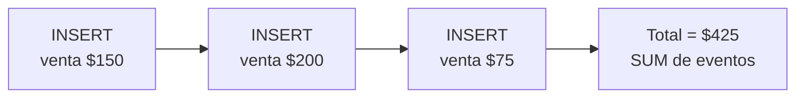

import LabSpec from '../../../components/LabSpec.astro';
import Checkpoint from '../../../components/Checkpoint.astro';

## 1. Conceptos

Imagínate que tienes una tabla `sales` con una columna `total_amount`. Cuando alguien modifica una venta, haces un `UPDATE`. ¿Cuál fue el monto original? No lo sabes — lo pisaste. ¿Quién lo cambió? No lo sabes. ¿Cuándo? No lo sabes.

En un sistema financiero, eso es un problema grave. Rush usa el patrón append-only para evitarlo.

### El patrón append-only

En vez de una tabla de estado mutable (`sales` con `UPDATE`), tienes una tabla de eventos:

```sql
CREATE TABLE sales_events (
  id          UUID DEFAULT gen_random_uuid() PRIMARY KEY,
  business_id UUID NOT NULL,
  event_type  TEXT NOT NULL,
  amount      NUMERIC(19, 4) NOT NULL,
  currency    TEXT NOT NULL,
  metadata    JSONB,
  created_at  TIMESTAMPTZ DEFAULT NOW() NOT NULL
);
```

Cada venta es un `INSERT`. Nunca hay `UPDATE` ni `DELETE` en esta tabla. Si hay un error, se registra un evento compensador (lo verás en la próxima unidad).



### El schema en Drizzle

```ts
// src/db/schema/sales-events.ts
import { pgTable, uuid, numeric, text, timestamp, jsonb, index } from 'drizzle-orm/pg-core';

export const salesEvents = pgTable(
  'sales_events',
  {
    id: uuid('id').defaultRandom().primaryKey(),
    businessId: uuid('business_id').notNull(),
    eventType: text('event_type').notNull(),
    amount: numeric('amount', { precision: 19, scale: 4 }).notNull(),
    currency: text('currency').notNull(),
    usdEquivalent: numeric('usd_equivalent', { precision: 19, scale: 4 }),
    referenceRate: numeric('reference_rate', { precision: 19, scale: 6 }),
    metadata: jsonb('metadata'),
    createdAt: timestamp('created_at', { withTimezone: true }).defaultNow().notNull(),
  },
  (table) => [
    index('sales_events_business_id_idx').on(table.businessId),
    index('sales_events_created_at_idx').on(table.createdAt),
  ],
);
```

Fíjate en los dos índices: uno por `business_id` para el filtro de tenant, otro por `created_at` para queries de rango de fechas. Ambos son necesarios para performance en producción.

### Calcular el total sumando eventos

En vez de leer un campo `total`, sumas los eventos:

```ts
// src/sales/sales.service.ts
async getSalesTotal(businessId: string, from: Date, to: Date): Promise<number> {
  const rows = await this.db
    .select({ amount: salesEvents.amount })
    .from(salesEvents)
    .where(
      and(
        eq(salesEvents.businessId, businessId),
        gte(salesEvents.createdAt, from),
        lte(salesEvents.createdAt, to),
      ),
    );

  return rows.reduce((sum, row) => sum + parseFloat(row.amount), 0);
}
```

Para queries frecuentes, esto se pre-calcula en `kpi_snapshots` (lo verás más adelante). El sum directo es correcto pero puede ser lento en tablas grandes — los snapshots resuelven eso.

### Ventajas del append-only en Rush

1. **Auditoría gratis**: cada venta tiene su timestamp y nunca se modifica. El historial completo está ahí.
2. **Rollback sin drama**: si hay un error, insertas un evento compensador — no hay que deshacer un `UPDATE`.
3. **Debug más fácil**: puedes reproducir el estado exacto de cualquier punto en el tiempo.
4. **RLS funciona bien**: cada fila tiene `business_id`, la política se aplica directamente.

### ¿Qué tablas son append-only en Rush?

- `sales_events`: ventas registradas
- `input_cost_events`: costos de insumos
- `inventory_events`: movimientos de inventario
- `business_activity_log`: audit log de acciones del usuario

Las tablas de configuración (como el perfil del negocio, los productos, los empleados) no son append-only — esas sí se modifican. El append-only es para datos financieros y de auditoría.

## 2. Lab guiado

<LabSpec
  title="Tabla de ventas append-only con Drizzle"
  estimatedMinutes={60}
  runnable={false}
>

Vas a implementar la tabla `sales_events` con el service que calcula totales sumando eventos.

### Paso 1: definir el schema

```ts
// src/db/schema/sales-events.ts
import { pgTable, uuid, numeric, text, timestamp, jsonb, index } from 'drizzle-orm/pg-core';

export type SaleEventType = 'sale' | 'refund' | 'adjustment';

export const salesEvents = pgTable(
  'sales_events',
  {
    id: uuid('id').defaultRandom().primaryKey(),
    businessId: uuid('business_id').notNull(),
    eventType: text('event_type').$type<SaleEventType>().notNull(),
    amount: numeric('amount', { precision: 19, scale: 4 }).notNull(),
    currency: text('currency').notNull(),
    createdAt: timestamp('created_at', { withTimezone: true }).defaultNow().notNull(),
  },
  (table) => [
    index('sales_events_business_id_idx').on(table.businessId),
    index('sales_events_created_at_idx').on(table.createdAt),
  ],
);
```

### Paso 2: service con operaciones append-only

```ts
// src/sales/sales.service.ts
import { Injectable } from '@nestjs/common';
import { DrizzleService } from '../drizzle/drizzle.service';
import { salesEvents } from '../db/schema/sales-events';
import { and, eq, gte, lte, sql } from 'drizzle-orm';

@Injectable()
export class SalesService {
  constructor(private readonly drizzle: DrizzleService) {}

  async recordSale(businessId: string, amount: number, currency: string) {
    const [event] = await this.drizzle.db
      .insert(salesEvents)
      .values({ businessId, eventType: 'sale', amount: String(amount), currency })
      .returning();
    return event;
  }

  async getTotalByPeriod(businessId: string, from: Date, to: Date): Promise<number> {
    const result = await this.drizzle.db
      .select({ total: sql<string>`COALESCE(SUM(amount::numeric), 0)` })
      .from(salesEvents)
      .where(
        and(
          eq(salesEvents.businessId, businessId),
          gte(salesEvents.createdAt, from),
          lte(salesEvents.createdAt, to),
        ),
      );

    return parseFloat(result[0]?.total ?? '0');
  }
}
```

### Paso 3: controller de ventas

```ts
// src/sales/sales.controller.ts
import { Controller, Post, Get, Body, Param, Query } from '@nestjs/common';
import { SalesService } from './sales.service';

@Controller('sales')
export class SalesController {
  constructor(private readonly salesService: SalesService) {}

  @Post(':businessId')
  recordSale(
    @Param('businessId') businessId: string,
    @Body() body: { amount: number; currency: string },
  ) {
    return this.salesService.recordSale(businessId, body.amount, body.currency);
  }

  @Get(':businessId/total')
  getTotal(
    @Param('businessId') businessId: string,
    @Query('from') from: string,
    @Query('to') to: string,
  ) {
    return this.salesService.getTotalByPeriod(businessId, new Date(from), new Date(to));
  }
}
```

### Verificación final

```bash
curl -X POST http://localhost:3000/sales/biz-123 \
  -H "Content-Type: application/json" \
  -d '{"amount": 100, "currency": "USD"}'

curl -X POST http://localhost:3000/sales/biz-123 \
  -H "Content-Type: application/json" \
  -d '{"amount": 50, "currency": "USD"}'

curl "http://localhost:3000/sales/biz-123/total?from=2026-01-01&to=2026-12-31"
```

El total debe ser 150. Si tratas de hacer un `UPDATE` directo a la tabla — no hay ningún endpoint para eso. Eso es intencional.

</LabSpec>

## 3. Checkpoint

<Checkpoint unit="Append-only: el historial que no miente">

1. ¿Qué problema resuelve append-only que un `UPDATE` a una columna `total` no puede resolver?
2. ¿Por qué necesitas dos índices en `sales_events` y no solo uno?
3. Si un cliente reporta que "el total de ventas del martes está mal", ¿cómo debug eso con una tabla append-only versus una tabla con `UPDATE`?

- [ ] La tabla `sales_events` no tiene ninguna operación `UPDATE` ni `DELETE` en el código del service.
- [ ] El total se calcula con `SUM(amount)` sobre los eventos del período, no leyendo una columna de estado.
- [ ] Puedes ver el historial completo de eventos de un business consultando la tabla directamente, en orden cronológico.

</Checkpoint>

## Próxima unidad → [Compensating events: deshacer sin borrar](../compensating-events/)
