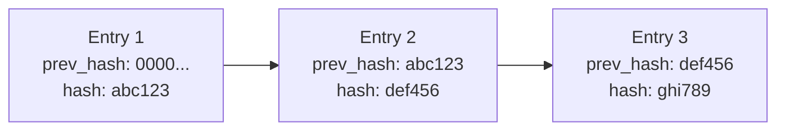

import LabSpec from '../../../components/LabSpec.astro';
import Checkpoint from '../../../components/Checkpoint.astro';

## 1. Conceptos

Un audit log registra qué hizo cada usuario en el sistema. Pero si alguien puede borrar o modificar entradas del audit log, no sirve para nada — un actor malicioso simplemente borraría las evidencias de lo que hizo.

El hash chain resuelve eso: cada entrada incluye el hash SHA-256 de la entrada anterior. Si alguien modifica o borra una entrada, el hash de la siguiente deja de cuadrar. La alteración es detectable.

### Cómo funciona el hash chain



La primera entrada tiene `prev_hash = '0000...'` (el hash genesis). Cada entrada subsiguiente incluye el hash de la entrada anterior. Si alguien borra o modifica la Entry 2, el `prev_hash` de la Entry 3 no coincide con el hash de lo que está en Entry 1. La cadena está rota.

### El schema

```ts
// src/db/schema/business-activity-log.ts
import { pgTable, uuid, text, timestamp, jsonb } from 'drizzle-orm/pg-core';

export const businessActivityLog = pgTable('business_activity_log', {
  id: uuid('id').defaultRandom().primaryKey(),
  businessId: uuid('business_id').notNull(),
  userId: uuid('user_id').notNull(),
  action: text('action').notNull(),
  metadata: jsonb('metadata'),
  prevHash: text('prev_hash').notNull(),
  hash: text('hash').notNull(),
  createdAt: timestamp('created_at', { withTimezone: true }).defaultNow().notNull(),
});
```

### Calcular el hash de cada entrada

```ts
// src/audit/audit.service.ts
import { Injectable } from '@nestjs/common';
import { createHash } from 'crypto';
import { DrizzleService } from '../drizzle/drizzle.service';
import { businessActivityLog } from '../db/schema/business-activity-log';
import { eq, desc } from 'drizzle-orm';

const GENESIS_HASH = '0'.repeat(64);

@Injectable()
export class AuditService {
  constructor(private readonly drizzle: DrizzleService) {}

  private computeHash(entry: {
    businessId: string;
    userId: string;
    action: string;
    metadata: unknown;
    prevHash: string;
    createdAt: Date;
  }): string {
    const content = JSON.stringify({
      businessId: entry.businessId,
      userId: entry.userId,
      action: entry.action,
      metadata: entry.metadata,
      prevHash: entry.prevHash,
      createdAt: entry.createdAt.toISOString(),
    });
    return createHash('sha256').update(content).digest('hex');
  }

  async log(businessId: string, userId: string, action: string, metadata?: unknown) {
    const [last] = await this.drizzle.db
      .select({ hash: businessActivityLog.hash })
      .from(businessActivityLog)
      .where(eq(businessActivityLog.businessId, businessId))
      .orderBy(desc(businessActivityLog.createdAt))
      .limit(1);

    const prevHash = last?.hash ?? GENESIS_HASH;
    const createdAt = new Date();

    const hash = this.computeHash({ businessId, userId, action, metadata, prevHash, createdAt });

    await this.drizzle.db.insert(businessActivityLog).values({
      businessId,
      userId,
      action,
      metadata: metadata ?? null,
      prevHash,
      hash,
      createdAt,
    });
  }
}
```

### Verificar la integridad del chain

```ts
async verifyChain(businessId: string): Promise<{ valid: boolean; brokenAt?: string }> {
  const entries = await this.drizzle.db
    .select()
    .from(businessActivityLog)
    .where(eq(businessActivityLog.businessId, businessId))
    .orderBy(businessActivityLog.createdAt);

  for (let i = 0; i < entries.length; i++) {
    const entry = entries[i];
    const expectedPrevHash = i === 0 ? GENESIS_HASH : entries[i - 1].hash;

    if (entry.prevHash !== expectedPrevHash) {
      return { valid: false, brokenAt: entry.id };
    }

    const computedHash = this.computeHash({
      businessId: entry.businessId,
      userId: entry.userId,
      action: entry.action,
      metadata: entry.metadata,
      prevHash: entry.prevHash,
      createdAt: entry.createdAt,
    });

    if (computedHash !== entry.hash) {
      return { valid: false, brokenAt: entry.id };
    }
  }

  return { valid: true };
}
```

Si `valid: false`, alguien modificó o borró una entrada del log. `brokenAt` indica qué entrada rompió la cadena.

## 2. Lab guiado

<LabSpec
  title="business_activity_log con hash chain SHA-256"
  estimatedMinutes={50}
  runnable={false}
>

Vas a implementar el audit log con hash chain y verificar que la detección de manipulación funciona.

### Paso 1: crear la tabla

Usa el schema del ejemplo y genera la migration.

### Paso 2: implementar AuditService

Crea el service con los métodos `log` y `verifyChain`.

### Paso 3: registrar acciones en el log

Usa el `AuditService` en el `SalesService` para registrar cada venta:

```ts
async recordSale(businessId: string, userId: string, amount: number, currency: string) {
  const event = await this.insertSaleEvent(businessId, amount, currency);
  await this.auditService.log(businessId, userId, 'SALE_RECORDED', { eventId: event.id, amount });
  return event;
}
```

### Paso 4: verificar el chain

```bash
curl http://localhost:3000/audit/biz-123/verify
```

Respuesta esperada: `{"valid":true}`.

### Paso 5: simular una manipulación

Conéctate directamente a Postgres y modifica el `action` de una entrada:

```sql
UPDATE business_activity_log
SET action = 'MODIFIED_MANUALLY'
WHERE id = '<algún-id>';
```

Vuelve a verificar el chain. Debe devolver `{"valid":false,"brokenAt":"<el-id-modificado>"}`.

### Verificación final

El hash chain detecta la manipulación. Si cambias cualquier campo de cualquier entrada — `action`, `metadata`, `userId` — el hash no cuadra y la verificación lo detecta.

</LabSpec>

## 3. Checkpoint

<Checkpoint unit="Audit log inmutable con hash chain">

1. ¿Qué pasa con el hash chain si alguien borra una entrada del medio del log?
2. ¿Por qué el hash genesis es `'0'.repeat(64)` y no simplemente `null`?
3. Si hay 100.000 entradas en el log de un business, ¿cuánto tiempo tarda verificar el chain completo? ¿Es aceptable en producción?

- [ ] El `AuditService.log` calcula el `prevHash` de la última entrada antes de insertar.
- [ ] El `verifyChain` detecta si se modifica cualquier campo de cualquier entrada.
- [ ] Un UPDATE directo a PostgreSQL en el log es detectado por el verificador como `valid: false`.

</Checkpoint>

## Próxima unidad → [Migrations sin down-migrations](../expand-contract-migrations/)
