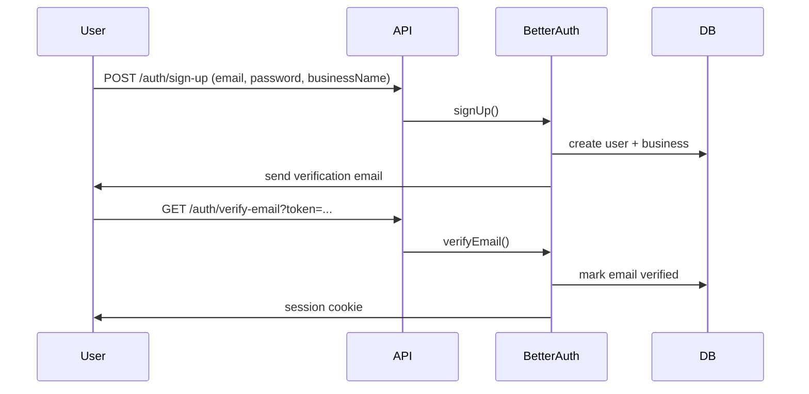

import LabSpec from '../../../components/LabSpec.astro';
import Checkpoint from '../../../components/Checkpoint.astro';

## 1. Conceptos

Rush usa Better Auth como solución de autenticación. La razón: es una librería moderna que soporta multi-tenant nativamente, y el founder tiene control total sobre el código — no hay un proveedor externo que maneje las sesiones.

### cookieCache DESACTIVADO — razón crítica

Better Auth tiene una feature llamada `cookieCache` que guarda una copia del usuario en la cookie para evitar queries a la base de datos en cada request. El problema: si hay un cambio en los permisos del usuario (por ejemplo, se le revoca el acceso a un tenant), esa cookie cacheada sigue siendo válida hasta que expire.

En un sistema financiero donde un empleado puede ser desactivado por el dueño del negocio, tener cookieCache activo es un riesgo de seguridad. En Rush, **cookieCache está siempre desactivado**.

```ts
// src/auth/auth.config.ts
import { betterAuth } from 'better-auth';

export const auth = betterAuth({
  database: { /* drizzle config */ },
  session: {
    cookieCache: {
      enabled: false,
    },
  },
});
```

### Los 5 flujos de autenticación de Rush

#### Flujo 1: registro de un negocio nuevo

El founder o encargado crea la cuenta del negocio. El email se verifica antes de poder operar.



#### Flujo 2: login recurrente

El usuario ya tiene cuenta verificada y hace login. Better Auth verifica credenciales y crea una sesión.

```ts
const session = await auth.api.signInEmail({
  body: { email, password },
});
```

#### Flujo 3: invitación de empleado

El encargado invita a un empleado. Better Auth genera un token de invitación y lo envía por email. El empleado usa ese token para crear su cuenta en el negocio.

```ts
const invitation = await auth.api.organization.createInvitation({
  body: {
    email: employeeEmail,
    role: 'member',
    organizationId: businessId,
  },
  headers: adminHeaders,
});
```

#### Flujo 4: recovery de contraseña

El usuario solicita un reset. Better Auth envía un token por email con TTL limitado.

```ts
await auth.api.forgetPassword({
  body: { email, redirectTo: 'https://app.rush.io/reset-password' },
});
```

#### Flujo 5: step-up auth

Para operaciones críticas (anular ventas grandes, cambiar datos del negocio), se requiere un segundo factor. El flujo de step-up se detalla en la siguiente unidad.

### Integrar Better Auth con NestJS

Better Auth se integra como middleware en NestJS:

```ts
// src/auth/auth.controller.ts
import { All, Controller, Req, Res } from '@nestjs/common';
import { auth } from './auth.config';
import { toNodeHandler } from 'better-auth/node';

@Controller('auth')
export class AuthController {
  @All('*')
  async handleAuth(@Req() req: Request, @Res() res: Response) {
    return toNodeHandler(auth)(req, res);
  }
}
```

Better Auth maneja todas las rutas bajo `/auth/*`. NestJS no necesita saber nada de la lógica de auth — solo hace de proxy.

### Guard para endpoints protegidos

```ts
// src/auth/guards/session.guard.ts
import { Injectable, CanActivate, ExecutionContext, UnauthorizedException } from '@nestjs/common';
import { auth } from '../auth.config';

@Injectable()
export class SessionGuard implements CanActivate {
  async canActivate(context: ExecutionContext): Promise<boolean> {
    const req = context.switchToHttp().getRequest();
    const res = context.switchToHttp().getResponse();

    const session = await auth.api.getSession({ headers: req.headers });
    if (!session) {
      throw new UnauthorizedException('No active session');
    }

    req.user = session.user;
    req.businessId = session.session.activeOrganizationId;
    return true;
  }
}
```

## 2. Lab guiado

<LabSpec
  title="Configurar Better Auth con sign-up + login"
  estimatedMinutes={80}
  runnable={false}
>

Vas a configurar los flujos de registro y login de Better Auth en un proyecto NestJS.

### Paso 1: instalar Better Auth

```bash
pnpm add better-auth
```

### Paso 2: configurar auth.config.ts

```ts
// src/auth/auth.config.ts
import { betterAuth } from 'better-auth';
import { drizzleAdapter } from 'better-auth/adapters/drizzle';
import { organization } from 'better-auth/plugins';
import { db } from '../drizzle/drizzle.service';
import * as schema from '../db/schema';

export const auth = betterAuth({
  database: drizzleAdapter(db, {
    provider: 'pg',
    schema,
  }),
  emailAndPassword: { enabled: true },
  session: {
    cookieCache: { enabled: false },
  },
  plugins: [organization()],
});
```

### Paso 3: crear el módulo de auth

```ts
// src/auth/auth.module.ts
import { Module } from '@nestjs/common';
import { AuthController } from './auth.controller';
import { SessionGuard } from './guards/session.guard';

@Module({
  controllers: [AuthController],
  providers: [SessionGuard],
  exports: [SessionGuard],
})
export class AuthModule {}
```

### Paso 4: generar el schema de Better Auth

Better Auth necesita sus propias tablas (users, sessions, accounts). Usa su CLI para generarlas:

```bash
npx better-auth generate --config src/auth/auth.config.ts
```

Aplica las migrations generadas.

### Paso 5: verificar los flujos

Registra un usuario:

```bash
curl -X POST http://localhost:3000/auth/sign-up/email \
  -H "Content-Type: application/json" \
  -d '{"email": "test@test.com", "password": "Password123!", "name": "Test User"}'
```

Haz login:

```bash
curl -X POST http://localhost:3000/auth/sign-in/email \
  -H "Content-Type: application/json" \
  -d '{"email": "test@test.com", "password": "Password123!"}'
```

### Verificación final

Verifica que `cookieCache.enabled` sea `false` en la config. Intenta acceder a un endpoint protegido con `SessionGuard` sin sesión — debe devolver 401. Con sesión válida — debe devolver 200.

</LabSpec>

## 3. Checkpoint

<Checkpoint unit="Better Auth: auth multi-tenant sin cookieCache">

1. ¿Por qué desactivar `cookieCache` es necesario en un sistema donde el encargado puede revocar el acceso de un empleado?
2. ¿Qué ventaja tiene usar Better Auth integrado en NestJS versus un servicio de auth externo como Auth0?
3. ¿Qué información devuelve `auth.api.getSession()` y cómo se usa en el guard?

- [ ] El flujo de sign-up crea un usuario en la base de datos y el de sign-in devuelve una cookie de sesión.
- [ ] `cookieCache.enabled: false` está configurado explícitamente en `auth.config.ts`.
- [ ] El `SessionGuard` devuelve 401 para requests sin sesión válida.

</Checkpoint>

## Próxima unidad → [Step-up auth: segundo factor para operaciones críticas](../step-up-auth/)
