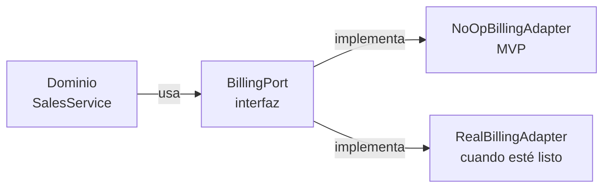

import LabSpec from '../../../components/LabSpec.astro';
import Checkpoint from '../../../components/Checkpoint.astro';

## 1. Conceptos

Rush tiene capacidades que están planificadas pero no implementadas todavía: el módulo de facturación electrónica, el coach IA, el módulo fiscal. El dominio del backend sabe que estas capacidades existen — las llama — pero no sabe si están activas o son un NoOp (no hacen nada).

Este patrón te permite desarrollar el dominio completo sin esperar a que la capacidad externa esté lista. Cuando se active, solo tienes que escribir el adapter real — el dominio no cambia.

### El contrato: una interfaz TypeScript

```ts
// src/billing/billing.port.ts
export interface BillingPort {
  issueInvoice(params: {
    businessId: string;
    amount: number;
    currency: string;
    customerId: string;
  }): Promise<{ invoiceId: string; status: 'issued' | 'pending' }>;

  getInvoiceStatus(invoiceId: string): Promise<{ status: 'issued' | 'pending' | 'failed' }>;
}

export const BILLING_PORT = Symbol('BillingPort');
```

El dominio llama a `BillingPort`. No sabe si el billing está activo o no.



### El NoOp adapter

```ts
// src/billing/adapters/noop-billing.adapter.ts
import { Injectable } from '@nestjs/common';
import { BillingPort } from '../billing.port';

@Injectable()
export class NoOpBillingAdapter implements BillingPort {
  async issueInvoice() {
    return { invoiceId: 'noop', status: 'pending' as const };
  }

  async getInvoiceStatus() {
    return { status: 'pending' as const };
  }
}
```

El NoOp no lanza errores — simplemente hace lo mínimo para cumplir el contrato. Las ventas se procesan normalmente, el billing no hace nada todavía.

### Registrar el adapter en el módulo

```ts
// src/billing/billing.module.ts
import { Module } from '@nestjs/common';
import { BILLING_PORT } from './billing.port';
import { NoOpBillingAdapter } from './adapters/noop-billing.adapter';

@Module({
  providers: [
    {
      provide: BILLING_PORT,
      useClass: NoOpBillingAdapter,
    },
  ],
  exports: [BILLING_PORT],
})
export class BillingModule {}
```

Cuando se active el billing real, solo cambias `useClass: NoOpBillingAdapter` por `useClass: RealBillingAdapter`. El dominio no cambia.

### Inyectar el port en el service

```ts
// src/sales/sales.service.ts
import { Inject, Injectable } from '@nestjs/common';
import { BILLING_PORT, BillingPort } from '../billing/billing.port';

@Injectable()
export class SalesService {
  constructor(
    @Inject(BILLING_PORT) private readonly billing: BillingPort,
    private readonly repo: SalesEventsRepository,
  ) {}

  async recordSale(businessId: string, customerId: string, amount: number, currency: string) {
    const event = await this.repo.insert(businessId, String(amount), currency);
    const invoice = await this.billing.issueInvoice({ businessId, amount, currency, customerId });
    return { event, invoice };
  }
}
```

El `SalesService` no sabe si el billing es real o NoOp. Llama al contrato.

### Los tres boundaries de Rush

| Capacidad | Estado | Adapter actual |
|-----------|--------|----------------|
| Billing (facturación electrónica) | Planificado | `NoOpBillingAdapter` |
| Coach IA | Planificado | `NoOpCoachAdapter` |
| Módulo fiscal (SENIAT) | Planificado | `NoOpFiscalAdapter` |

## 2. Lab guiado

<LabSpec
  title="BillingPort con NoOp adapter + test"
  estimatedMinutes={35}
  runnable={false}
>

Vas a implementar el `BillingPort` completo con el NoOp adapter y verificar que el `SalesService` funciona sin billing real.

### Paso 1: crear el port

Crea `src/billing/billing.port.ts` con la interfaz del ejemplo.

### Paso 2: crear el NoOp adapter

Crea `src/billing/adapters/noop-billing.adapter.ts` con el código del ejemplo.

### Paso 3: crear el módulo de billing

Crea `src/billing/billing.module.ts` registrando el NoOp adapter.

### Paso 4: actualizar SalesService

Inyecta el `BILLING_PORT` en `SalesService` usando `@Inject(BILLING_PORT)`.

### Paso 5: escribir un test de contrato

```ts
// test/billing/billing-port.spec.ts
import { NoOpBillingAdapter } from '../../src/billing/adapters/noop-billing.adapter';

describe('NoOpBillingAdapter', () => {
  const adapter = new NoOpBillingAdapter();

  it('issueInvoice returns noop result without throwing', async () => {
    const result = await adapter.issueInvoice({
      businessId: 'biz-123',
      amount: 100,
      currency: 'USD',
      customerId: 'customer-123',
    });
    expect(result.invoiceId).toBeDefined();
    expect(['issued', 'pending']).toContain(result.status);
  });
});
```

### Verificación final

El test pasa. El `SalesService` registra ventas sin error aunque el billing sea NoOp. Cuando implementes el `RealBillingAdapter`, solo cambias el `useClass` en el módulo — el test de contrato funciona para ambos adapters.

</LabSpec>

## 3. Checkpoint

<Checkpoint unit="Boundaries contract-only: billing, coach, fiscal">

1. ¿Por qué el `SalesService` usa `@Inject(BILLING_PORT)` en vez de inyectar `NoOpBillingAdapter` directamente?
2. ¿Qué tienes que cambiar en el codebase cuando el billing real esté listo para activarse?
3. ¿Qué pasa si el NoOp adapter lanza una excepción? ¿Cómo afecta eso al flujo de ventas?

- [ ] El `SalesService` no importa ni `NoOpBillingAdapter` ni ningún adapter concreto — solo la interfaz.
- [ ] El test de contrato pasa tanto para el NoOp adapter como pasaría para el adapter real.
- [ ] Cambiar de NoOp a adapter real solo requiere modificar el `BillingModule` — el dominio no cambia.

</Checkpoint>

## Próxima unidad → [DDD sin overengineering](../ddd-ligero/)
