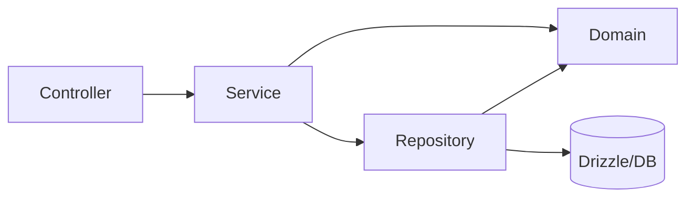

import LabSpec from '../../../components/LabSpec.astro';
import Checkpoint from '../../../components/Checkpoint.astro';

## 1. Conceptos

El error más común al organizar un backend es hacerlo por tipo técnico: carpeta `controllers/`, carpeta `services/`, carpeta `models/`. Eso produce un código que no te dice nada sobre lo que hace el sistema.

Rush organiza el backend por capacidades del Business OS: `onboarding/`, `sales/`, `health-score/`, `auth/`. Cada módulo es una capacidad completa con su controller, su service, sus domain errors y su schema de base de datos.

### La estructura de un módulo en Rush

```text
src/
  onboarding/
    onboarding.module.ts
    onboarding.controller.ts          (HTTP)
    onboarding.service.ts             (use cases)
    domain/
      onboarding.errors.ts            (domain errors)
      onboarding.types.ts             (value objects)
    infrastructure/
      onboarding-events.repository.ts (queries a DB)
  sales/
    sales.module.ts
    sales.controller.ts
    sales.service.ts
    domain/
      ...
    infrastructure/
      ...
  health-score/
    ...
```

La capa `domain/` no importa nada de `infrastructure/`. El `sales.service.ts` conoce los domain errors y los tipos, pero no sabe nada de Drizzle directamente — llama al repositorio.

### La regla de dependencias



El flujo va de afuera hacia adentro. El `Controller` llama al `Service`. El `Service` conoce los tipos del dominio y llama al `Repository` para queries. El `Repository` habla con Drizzle. El `Domain` no habla con nadie — es el corazón que todos conocen pero que no depende de nada externo.

### eslint-plugin-boundaries

Esta librería te permite definir reglas de qué módulo puede importar de qué otro:

```js
// .eslintrc.js
module.exports = {
  plugins: ['boundaries'],
  rules: {
    'boundaries/element-types': ['error', {
      default: 'disallow',
      rules: [
        { from: 'controller', allow: ['service'] },
        { from: 'service', allow: ['domain', 'repository'] },
        { from: 'repository', allow: ['domain'] },
      ],
    }],
  },
};
```

Si un `sales.service.ts` intenta importar directamente del `drizzle.service.ts` (saltándose el repositorio), ESLint da error. Así la arquitectura se mantiene limpia sin depender de la disciplina de cada dev.

### ¿Qué no va en cada capa?

| Capa | Tiene | No tiene |
|------|-------|----------|
| Controller | Routing, validación de input | Lógica de negocio |
| Service | Use cases, reglas de negocio | SQL, frameworks externos |
| Domain | Tipos, errores, value objects | Frameworks, IO |
| Repository | Queries SQL | Lógica de negocio |

Si el service tiene un `db.select().from(...)` directo, algo está mal — eso debería estar en el repositorio.

## 2. Lab guiado

<LabSpec
  title="Módulo Sales con Clean Architecture"
  estimatedMinutes={50}
  runnable={false}
>

Vas a refactorizar el módulo de ventas para separar controller, service, domain y repository correctamente.

### Paso 1: crear la estructura del módulo

```bash
mkdir -p src/sales/domain
mkdir -p src/sales/infrastructure
```

### Paso 2: mover los domain errors al domain

```ts
// src/sales/domain/sales.errors.ts
import { DomainError } from '../../common/errors/domain.error';

export class SaleAmountTooLowError extends DomainError {
  constructor(min: number) {
    super('SALE_AMOUNT_TOO_LOW', `Sale amount must be at least ${min}`);
  }
}

export class SaleNotFoundError extends DomainError {
  constructor(id: string) {
    super('SALE_NOT_FOUND', `Sale event ${id} not found`);
  }
}
```

### Paso 3: crear el repositorio

```ts
// src/sales/infrastructure/sales-events.repository.ts
import { Injectable } from '@nestjs/common';
import { DrizzleService } from '../../drizzle/drizzle.service';
import { salesEvents } from '../../db/schema/sales-events';
import { eq, and } from 'drizzle-orm';

@Injectable()
export class SalesEventsRepository {
  constructor(private readonly drizzle: DrizzleService) {}

  async insert(businessId: string, amount: string, currency: string) {
    const [event] = await this.drizzle.db
      .insert(salesEvents)
      .values({ businessId, eventType: 'sale', amount, currency })
      .returning();
    return event;
  }

  async findById(id: string, businessId: string) {
    const [event] = await this.drizzle.db
      .select()
      .from(salesEvents)
      .where(and(eq(salesEvents.id, id), eq(salesEvents.businessId, businessId)));
    return event ?? null;
  }
}
```

### Paso 4: simplificar el service

El service ya no toca Drizzle directamente:

```ts
// src/sales/sales.service.ts
import { Injectable } from '@nestjs/common';
import { SalesEventsRepository } from './infrastructure/sales-events.repository';
import { SaleAmountTooLowError } from './domain/sales.errors';

const MIN_AMOUNT = 1;

@Injectable()
export class SalesService {
  constructor(private readonly repo: SalesEventsRepository) {}

  async recordSale(businessId: string, amount: number, currency: string) {
    if (amount < MIN_AMOUNT) throw new SaleAmountTooLowError(MIN_AMOUNT);
    return this.repo.insert(businessId, String(amount), currency);
  }
}
```

### Verificación final

El `SalesService` no tiene ningún import de `drizzle-orm` ni de `DrizzleService`. Todo el SQL está en `SalesEventsRepository`. El controller solo llama al service y no sabe nada de errores de dominio — los maneja el exception filter global.

</LabSpec>

## 3. Checkpoint

<Checkpoint unit="Módulos como capacidades del Business OS">

1. ¿Por qué organizar el código por tipo técnico (`controllers/`, `services/`) es problemático a largo plazo?
2. ¿Qué pasa si el service importa directamente de `DrizzleService` en vez de usar un repositorio?
3. ¿Cómo `eslint-plugin-boundaries` previene que la arquitectura se deteriore con el tiempo?

- [ ] El `SalesService` no tiene ningún import de `drizzle-orm` — todas las queries están en el repositorio.
- [ ] La estructura de carpetas refleja capacidades del negocio, no tipos técnicos.
- [ ] Los domain errors del módulo `sales` están en `src/sales/domain/` y no se mezclan con otros módulos.

</Checkpoint>

## Próxima unidad → [Boundaries contract-only: billing, coach, fiscal](../boundaries-contract-only/)
