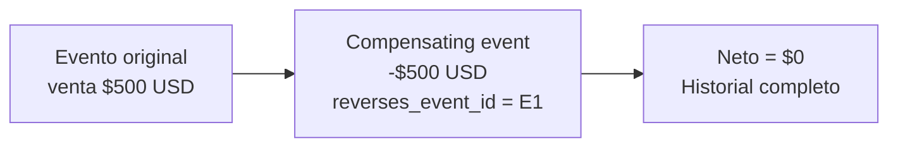

import LabSpec from '../../../components/LabSpec.astro';
import Checkpoint from '../../../components/Checkpoint.astro';

## 1. Conceptos

En un sistema append-only, cuando hay un error — una venta registrada por el monto equivocado, por ejemplo — no puedes hacer `DELETE` ni `UPDATE`. Tienes que registrar un evento que compense el efecto del evento anterior.

Fíjate en la diferencia con un DELETE: con DELETE pierdes la evidencia de que algo pasó. Con un compensating event, el historial queda completo — el evento original, el error, y la corrección. Eso es vital en un sistema financiero.



### El campo reverses_event_id

El evento compensador lleva dos cosas especiales:

1. Un monto negativo que cancela el original.
2. Un `reverses_event_id` que apunta al evento que está compensando.

```ts
// src/db/schema/sales-events.ts (ampliado)
export const salesEvents = pgTable('sales_events', {
  id: uuid('id').defaultRandom().primaryKey(),
  businessId: uuid('business_id').notNull(),
  eventType: text('event_type').notNull(),
  amount: numeric('amount', { precision: 19, scale: 4 }).notNull(),
  currency: text('currency').notNull(),
  reversesEventId: uuid('reverses_event_id').references((): AnyPgColumn => salesEvents.id),
  createdAt: timestamp('created_at', { withTimezone: true }).defaultNow().notNull(),
});
```

La referencia circular (`references((): AnyPgColumn => salesEvents.id)`) le dice a Drizzle que `reverses_event_id` apunta a la misma tabla. En SQL:

```sql
ALTER TABLE sales_events
  ADD COLUMN reverses_event_id UUID REFERENCES sales_events(id);
```

### Registrar un compensating event

```ts
// src/sales/sales.service.ts
async compensateSale(businessId: string, originalEventId: string): Promise<SaleEvent> {
  const [original] = await this.drizzle.db
    .select()
    .from(salesEvents)
    .where(and(
      eq(salesEvents.id, originalEventId),
      eq(salesEvents.businessId, businessId),
    ));

  if (!original) {
    throw new DomainError('SALE_NOT_FOUND', `Sale event ${originalEventId} not found`);
  }

  if (original.reversesEventId) {
    throw new DomainError('ALREADY_COMPENSATED', `Event ${originalEventId} is itself a compensation`);
  }

  const alreadyCompensated = await this.drizzle.db
    .select({ id: salesEvents.id })
    .from(salesEvents)
    .where(eq(salesEvents.reversesEventId, originalEventId));

  if (alreadyCompensated.length > 0) {
    throw new DomainError('ALREADY_COMPENSATED', `Event ${originalEventId} already has a compensation`);
  }

  const [compensation] = await this.drizzle.db
    .insert(salesEvents)
    .values({
      businessId,
      eventType: 'compensation',
      amount: String(-parseFloat(original.amount)),
      currency: original.currency,
      reversesEventId: originalEventId,
    })
    .returning();

  return compensation;
}
```

### Compensation netting en el total

Cuando calculas el total, los compensating events ya están incluidos porque tienen monto negativo:

```ts
async getTotalByPeriod(businessId: string, from: Date, to: Date) {
  const result = await this.drizzle.db
    .select({ total: sql<string>`COALESCE(SUM(amount::numeric), 0)` })
    .from(salesEvents)
    .where(and(
      eq(salesEvents.businessId, businessId),
      gte(salesEvents.createdAt, from),
      lte(salesEvents.createdAt, to),
    ));

  return parseFloat(result[0]?.total ?? '0');
}
```

Si tienes una venta de 100 y un compensating event de -100, el total es 0. El SUM hace el netting automáticamente.

### Regla: un evento solo se puede compensar una vez

El check de `alreadyCompensated.length > 0` previene compensar el mismo evento dos veces. Sin esa verificación, podrías crear múltiples compensating events para la misma venta y el neto sería negativo — lo que no tiene sentido en ventas.

## 2. Lab guiado

<LabSpec
  title="Compensating events con validación de duplicados"
  estimatedMinutes={50}
  runnable={false}
>

Vas a agregar el endpoint de compensación con todas las validaciones.

### Paso 1: actualizar el schema

Agrega `reversesEventId` al schema existente:

```ts
// src/db/schema/sales-events.ts
import { pgTable, uuid, numeric, text, timestamp, AnyPgColumn } from 'drizzle-orm/pg-core';

export const salesEvents = pgTable('sales_events', {
  id: uuid('id').defaultRandom().primaryKey(),
  businessId: uuid('business_id').notNull(),
  eventType: text('event_type').notNull(),
  amount: numeric('amount', { precision: 19, scale: 4 }).notNull(),
  currency: text('currency').notNull(),
  reversesEventId: uuid('reverses_event_id').references((): AnyPgColumn => salesEvents.id),
  createdAt: timestamp('created_at', { withTimezone: true }).defaultNow().notNull(),
});
```

Genera y aplica la migration:

```bash
pnpm drizzle-kit generate
pnpm drizzle-kit migrate
```

### Paso 2: agregar el método de compensación al service

Usa el código del ejemplo de arriba. Asegúrate de importar los domain errors de la unidad anterior.

### Paso 3: endpoint de compensación

```ts
// src/sales/sales.controller.ts
@Post(':businessId/compensate/:eventId')
compensate(
  @Param('businessId') businessId: string,
  @Param('eventId') eventId: string,
) {
  return this.salesService.compensateSale(businessId, eventId);
}
```

### Verificación final

Registra una venta:

```bash
curl -X POST http://localhost:3000/sales/biz-123 \
  -H "Content-Type: application/json" \
  -d '{"amount": 100, "currency": "USD"}'
```

Guarda el `id` de la respuesta. Compénsala:

```bash
curl -X POST http://localhost:3000/sales/biz-123/compensate/<event-id>
```

Verifica el total — debe ser 0:

```bash
curl "http://localhost:3000/sales/biz-123/total?from=2026-01-01&to=2026-12-31"
```

Intenta compensar el mismo evento otra vez — debe devolver `ALREADY_COMPENSATED`.

</LabSpec>

## 3. Checkpoint

<Checkpoint unit="Compensating events: deshacer sin borrar">

1. ¿Por qué el monto del compensating event es negativo y no cero?
2. Si no verificas que un evento ya tiene compensación, ¿qué problema concreto puede ocurrir?
3. ¿Cómo distingues en la tabla si un evento es una venta original, una compensación, o un ajuste?

- [ ] El compensating event tiene `reversesEventId` apuntando al evento original y `amount` negativo.
- [ ] El SUM de ventas incluye los compensating events automáticamente — el netting es correcto.
- [ ] Intentar compensar el mismo evento dos veces devuelve un domain error, no un registro duplicado.

</Checkpoint>

## Próxima unidad → [Idempotencia: operaciones que no se duplican](../idempotencia/)
