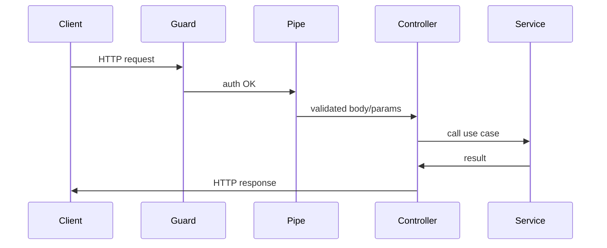

import LabSpec from '../../../components/LabSpec.astro';
import Checkpoint from '../../../components/Checkpoint.astro';

## 1. Conceptos

NestJS es el framework que usa Rush para el backend. La razón no es modas — es que NestJS fuerza una estructura que escala sin que el equipo tenga que ponerse de acuerdo en cada PR sobre cómo organizar el código.

### Módulos: la unidad de organización

Un módulo en NestJS es una clase con el decorator `@Module`. Agrupa todo lo que pertenece a una capacidad del sistema.

Fíjate que en Rush no hay un módulo gigante "de todo". Hay un módulo `SalesModule`, un módulo `OnboardingModule`, un módulo `AuthModule`. Cada uno es dueño de sus providers y controllers, y lo que necesita de afuera lo importa explícitamente.

```ts
// src/sales/sales.module.ts
import { Module } from '@nestjs/common';
import { SalesController } from './sales.controller';
import { SalesService } from './sales.service';
import { DrizzleModule } from '../drizzle/drizzle.module';

@Module({
  imports: [DrizzleModule],
  controllers: [SalesController],
  providers: [SalesService],
  exports: [SalesService],
})
export class SalesModule {}
```

`imports` dice de qué módulos externos depende. `exports` dice qué providers ofrece a otros módulos.

### Providers e inyección de dependencias

Un provider es cualquier clase marcada con `@Injectable()`. NestJS gestiona su ciclo de vida — tú pides el provider en el constructor y NestJS te lo entrega.

```ts
// src/sales/sales.service.ts
import { Injectable } from '@nestjs/common';
import { DrizzleService } from '../drizzle/drizzle.service';

@Injectable()
export class SalesService {
  constructor(private readonly db: DrizzleService) {}

  async getSalesByBusiness(businessId: string) {
    return this.db.query.salesEvents.findMany({
      where: (t, { eq }) => eq(t.businessId, businessId),
    });
  }
}
```

El punto clave: `SalesService` no crea `DrizzleService`. Lo recibe. Esto es la inversión de dependencias en la práctica.

### Controllers: la puerta de entrada HTTP

El controller recibe el request HTTP y llama al service. Nada más. No tiene lógica de negocio.

```ts
// src/sales/sales.controller.ts
import { Controller, Get, Param } from '@nestjs/common';
import { SalesService } from './sales.service';

@Controller('sales')
export class SalesController {
  constructor(private readonly salesService: SalesService) {}

  @Get(':businessId')
  getSales(@Param('businessId') businessId: string) {
    return this.salesService.getSalesByBusiness(businessId);
  }
}
```

### El ciclo de vida de un request



Cada paso tiene su lugar. El guard verifica autenticación. El pipe valida y transforma. El controller coordina. El service ejecuta la lógica.

### Preguntas frecuentes

**¿Qué pasa si el provider no está registrado en ningún módulo?** NestJS lanza un error en el arranque, no en runtime. Eso es una ventaja — los errores de DI los detectas al iniciar la app, no cuando un usuario llega a ese endpoint.

**¿Cuántos providers puede tener un módulo?** No hay límite técnico, pero si tienes más de 5-6 providers en un módulo, revisa si estás mezclando responsabilidades. Probablemente debes dividir el módulo.

## 2. Lab guiado

<LabSpec
  title="Crear módulo Sales con NestJS + DI"
  estimatedMinutes={60}
  runnable={false}
>

Vas a crear un módulo `SalesModule` completo con controller, service y la inyección de dependencias correcta.

### Paso 1: crear el proyecto

```bash
pnpm add -g @nestjs/cli
nest new lab-nestjs-fundamentos --package-manager pnpm --skip-git
cd lab-nestjs-fundamentos
```

NestJS CLI crea la estructura base. Abre `src/app.module.ts` para ver el módulo raíz.

### Paso 2: crear el módulo Sales

```bash
nest generate module sales
nest generate controller sales --no-spec
nest generate service sales --no-spec
```

Fíjate que el CLI ya agrega `SalesController` y `SalesService` a `SalesModule` automáticamente.

### Paso 3: crear un segundo service e inyectarlo

Crea `src/sales/sales-validator.service.ts`:

```ts
// src/sales/sales-validator.service.ts
import { Injectable } from '@nestjs/common';

@Injectable()
export class SalesValidatorService {
  isValidAmount(amount: number): boolean {
    return amount > 0 && Number.isFinite(amount);
  }
}
```

Agrégalo al módulo y al constructor del `SalesService`:

```ts
// src/sales/sales.module.ts
import { Module } from '@nestjs/common';
import { SalesController } from './sales.controller';
import { SalesService } from './sales.service';
import { SalesValidatorService } from './sales-validator.service';

@Module({
  controllers: [SalesController],
  providers: [SalesService, SalesValidatorService],
})
export class SalesModule {}
```

```ts
// src/sales/sales.service.ts
import { Injectable } from '@nestjs/common';
import { SalesValidatorService } from './sales-validator.service';

@Injectable()
export class SalesService {
  constructor(private readonly validator: SalesValidatorService) {}

  createSale(amount: number): { ok: boolean; amount: number } {
    if (!this.validator.isValidAmount(amount)) {
      return { ok: false, amount };
    }
    return { ok: true, amount };
  }
}
```

### Paso 4: exponer el endpoint

```ts
// src/sales/sales.controller.ts
import { Controller, Post, Body } from '@nestjs/common';
import { SalesService } from './sales.service';

@Controller('sales')
export class SalesController {
  constructor(private readonly salesService: SalesService) {}

  @Post()
  create(@Body() body: { amount: number }) {
    return this.salesService.createSale(body.amount);
  }
}
```

### Paso 5: registrar el módulo en AppModule

```ts
// src/app.module.ts
import { Module } from '@nestjs/common';
import { SalesModule } from './sales/sales.module';

@Module({
  imports: [SalesModule],
})
export class AppModule {}
```

### Verificación final

```bash
pnpm start:dev
```

Envía un request POST:

```bash
curl -X POST http://localhost:3000/sales \
  -H "Content-Type: application/json" \
  -d '{"amount": 100}'
```

Respuesta esperada: `{"ok":true,"amount":100}`.

Prueba con un monto inválido:

```bash
curl -X POST http://localhost:3000/sales \
  -H "Content-Type: application/json" \
  -d '{"amount": -5}'
```

Respuesta esperada: `{"ok":false,"amount":-5}`.

</LabSpec>

## 3. Checkpoint

<Checkpoint unit="NestJS: módulos, decorators y DI">

1. ¿Por qué NestJS usa inyección de dependencias en vez de que cada service cree sus propias dependencias con `new`?
2. ¿Qué pasa si intentas usar un provider en un módulo que no lo tiene en `providers` ni lo importa desde otro módulo?
3. ¿Cuál es la diferencia entre `providers` y `exports` en la definición de un módulo?

- [ ] El `SalesModule` tiene controller, service y un segundo service inyectado correctamente — sin errores de DI al arrancar.
- [ ] El endpoint POST `/sales` responde con `{ok: true}` para montos positivos y `{ok: false}` para negativos.
- [ ] Puedes explicar en una oración qué hace cada decorator: `@Module`, `@Injectable`, `@Controller`, `@Get`, `@Post`.

</Checkpoint>

## Próxima unidad → [Guards, pipes e interceptors](../nestjs-guards-pipes/)
