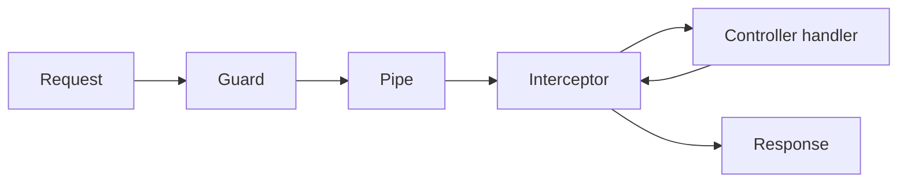

import LabSpec from '../../../components/LabSpec.astro';
import Checkpoint from '../../../components/Checkpoint.astro';

## 1. Conceptos

NestJS tiene tres mecanismos para procesar un request antes de que llegue al controller: guards, pipes e interceptors. Cada uno tiene su responsabilidad y su lugar en el pipeline.

### Guards: ¿tienes permiso para pasar?

Un guard decide si el request puede continuar o no. Si devuelve `false` o lanza una excepción, el request se detiene ahí y NestJS devuelve 403 Forbidden.

El caso más común en Rush: verificar que el JWT sea válido antes de dejar pasar el request a cualquier endpoint protegido.

```ts
// src/auth/guards/jwt.guard.ts
import { Injectable, CanActivate, ExecutionContext, UnauthorizedException } from '@nestjs/common';
import { JwtService } from '@nestjs/jwt';

@Injectable()
export class JwtGuard implements CanActivate {
  constructor(private readonly jwt: JwtService) {}

  canActivate(context: ExecutionContext): boolean {
    const request = context.switchToHttp().getRequest();
    const authHeader = request.headers['authorization'];

    if (!authHeader?.startsWith('Bearer ')) {
      throw new UnauthorizedException('Missing or invalid token');
    }

    try {
      const token = authHeader.split(' ')[1];
      const payload = this.jwt.verify(token);
      request.user = payload;
      return true;
    } catch {
      throw new UnauthorizedException('Token expired or invalid');
    }
  }
}
```

Fíjate que el guard también adjunta el payload del JWT al `request.user`. Eso le permite al controller leer quién hace el request sin repetir la verificación.

### Pipes: transforma y valida el input

Un pipe recibe el valor crudo del request (body, param, query) y devuelve el valor transformado — o lanza una excepción si es inválido.

La ventaja de Zod como pipe: defines el schema una sola vez y lo reutilizas tanto en el pipe del controller como en la lógica del use case.

```ts
// src/common/pipes/zod-validation.pipe.ts
import { PipeTransform, Injectable, BadRequestException } from '@nestjs/common';
import { ZodSchema } from 'zod';

@Injectable()
export class ZodValidationPipe implements PipeTransform {
  constructor(private readonly schema: ZodSchema) {}

  transform(value: unknown) {
    const result = this.schema.safeParse(value);
    if (!result.success) {
      throw new BadRequestException(result.error.flatten());
    }
    return result.data;
  }
}
```

Usarlo en el controller:

```ts
// src/sales/sales.controller.ts
import { Controller, Post, Body, UsePipes } from '@nestjs/common';
import { z } from 'zod';
import { ZodValidationPipe } from '../common/pipes/zod-validation.pipe';

const createSaleSchema = z.object({
  amount: z.number().positive(),
  currency: z.enum(['VES', 'USD']),
});

type CreateSaleDto = z.infer<typeof createSaleSchema>;

@Controller('sales')
export class SalesController {
  @Post()
  @UsePipes(new ZodValidationPipe(createSaleSchema))
  create(@Body() dto: CreateSaleDto) {
    return { received: dto };
  }
}
```

### Interceptors: antes y después del handler

Un interceptor envuelve la ejecución del controller. Puedes hacer algo antes del handler, esperar su respuesta y hacer algo después. El caso clásico en Rush: loggear el tiempo de respuesta de cada request.

```ts
// src/common/interceptors/logging.interceptor.ts
import { Injectable, NestInterceptor, ExecutionContext, CallHandler } from '@nestjs/common';
import { Observable, tap } from 'rxjs';

@Injectable()
export class LoggingInterceptor implements NestInterceptor {
  intercept(context: ExecutionContext, next: CallHandler): Observable<unknown> {
    const req = context.switchToHttp().getRequest();
    const start = Date.now();

    return next.handle().pipe(
      tap(() => {
        const ms = Date.now() - start;
        console.log(`${req.method} ${req.url} — ${ms}ms`);
      }),
    );
  }
}
```

### Orden de ejecución



El orden importa: los guards van primero (si no hay permiso, no tiene sentido validar el body). Los pipes van después (ya sabemos que el user puede pasar — ahora verificamos que el dato sea válido). Los interceptors envuelven todo.

## 2. Lab guiado

<LabSpec
  title="Pipeline completo: guard + pipe + interceptor"
  estimatedMinutes={50}
  runnable={false}
>

Vas a agregar un guard JWT simulado, un pipe Zod y un interceptor de logging al proyecto del lab anterior.

### Paso 1: crear el pipe de Zod global

Crea `src/common/pipes/zod-validation.pipe.ts` con el código del ejemplo de arriba.

Crea `src/common/index.ts`:

```ts
// src/common/index.ts
export { ZodValidationPipe } from './pipes/zod-validation.pipe';
```

### Paso 2: crear el guard JWT simulado

```ts
// src/auth/guards/jwt.guard.ts
import { Injectable, CanActivate, ExecutionContext, UnauthorizedException } from '@nestjs/common';

@Injectable()
export class JwtGuard implements CanActivate {
  canActivate(context: ExecutionContext): boolean {
    const request = context
      .switchToHttp()
      .getRequest<{ headers: Record<string, string>; user?: unknown }>();
    const token = request.headers['x-test-token'];

    if (token !== 'valid-token') {
      throw new UnauthorizedException('Missing or invalid token');
    }

    request.user = { id: 'user-123', businessId: 'biz-456' };
    return true;
  }
}
```

### Paso 3: aplicar el guard al controller

```ts
// src/sales/sales.controller.ts
import { Controller, Post, Body, UseGuards, Request } from '@nestjs/common';
import { z } from 'zod';
import { JwtGuard } from '../auth/guards/jwt.guard';
import { ZodValidationPipe } from '../common/pipes/zod-validation.pipe';

const createSaleSchema = z.object({
  amount: z.number().positive(),
  currency: z.enum(['VES', 'USD']),
});

type CreateSaleDto = z.infer<typeof createSaleSchema>;

@Controller('sales')
@UseGuards(JwtGuard)
export class SalesController {
  @Post()
  create(
    @Body(new ZodValidationPipe(createSaleSchema)) dto: CreateSaleDto,
    @Request() req: { user: { businessId: string } },
  ) {
    return { businessId: req.user.businessId, sale: dto };
  }
}
```

### Paso 4: crear y registrar el interceptor

```ts
// src/common/interceptors/logging.interceptor.ts
import { Injectable, NestInterceptor, ExecutionContext, CallHandler } from '@nestjs/common';
import { Observable, tap } from 'rxjs';

@Injectable()
export class LoggingInterceptor implements NestInterceptor {
  intercept(context: ExecutionContext, next: CallHandler): Observable<unknown> {
    const req = context.switchToHttp().getRequest<{ method: string; url: string }>();
    const start = Date.now();
    return next
      .handle()
      .pipe(tap(() => console.log(`${req.method} ${req.url} — ${Date.now() - start}ms`)));
  }
}
```

Registrarlo globalmente en `main.ts`:

```ts
// src/main.ts
import { NestFactory } from '@nestjs/core';
import { AppModule } from './app.module';
import { LoggingInterceptor } from './common/interceptors/logging.interceptor';

async function bootstrap() {
  const app = await NestFactory.create(AppModule);
  app.useGlobalInterceptors(new LoggingInterceptor());
  await app.listen(3000);
}
bootstrap();
```

### Verificación final

Sin token — debe dar 401:

```bash
curl -X POST http://localhost:3000/sales \
  -H "Content-Type: application/json" \
  -d '{"amount": 100, "currency": "USD"}'
```

Con token válido — debe dar 200:

```bash
curl -X POST http://localhost:3000/sales \
  -H "Content-Type: application/json" \
  -H "x-test-token: valid-token" \
  -d '{"amount": 100, "currency": "USD"}'
```

Con body inválido — debe dar 400:

```bash
curl -X POST http://localhost:3000/sales \
  -H "Content-Type: application/json" \
  -H "x-test-token: valid-token" \
  -d '{"amount": -5, "currency": "INVALID"}'
```

El log del servidor debe mostrar el tiempo de cada request.

</LabSpec>

## 3. Checkpoint

<Checkpoint unit="Guards, pipes e interceptors">

1. ¿Por qué conviene usar Zod en un pipe en lugar de class-validator? ¿Qué ventaja técnica tiene?
2. Si un guard devuelve `false` sin lanzar excepción, ¿qué código HTTP responde NestJS por defecto?
3. ¿Qué diferencia hay entre un interceptor y un middleware en NestJS?

- [ ] El endpoint protegido devuelve 401 cuando no hay token y 400 cuando el body no pasa el schema de Zod.
- [ ] El interceptor imprime el tiempo de respuesta en el log del servidor para cada request.
- [ ] Puedes usar el mismo schema Zod tanto en el pipe del controller como en la lógica del service sin duplicarlo.

</Checkpoint>

## Próxima unidad → [Manejo de errores con estilo](../nestjs-exception-filters/)
