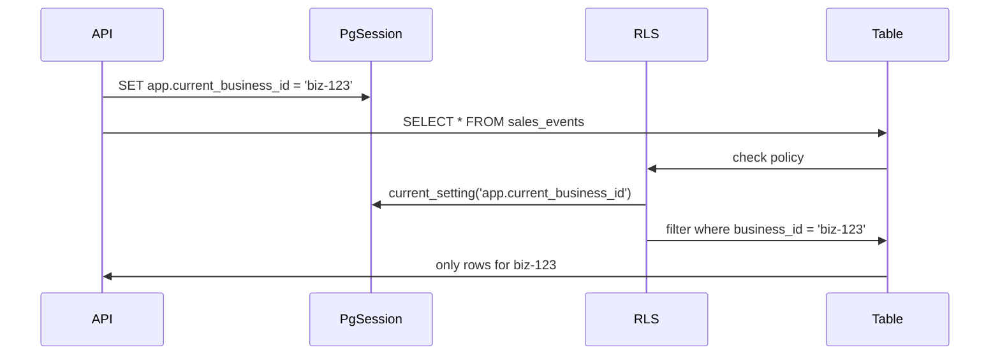

import LabSpec from '../../../components/LabSpec.astro';
import Checkpoint from '../../../components/Checkpoint.astro';

## 1. Conceptos

Row-Level Security (RLS) es una feature de PostgreSQL que permite definir políticas de acceso a nivel de fila directamente en la base de datos. Eso significa que aunque un dev se olvide de filtrar por `business_id` en el código, Postgres lo bloquea antes de devolver datos.

Fíjate en el problema que resuelve: en una app multi-tenant, el error más peligroso es devolver datos de un tenant a otro. Si eso depende de que el código siempre filtre por `business_id`, estás apostando a que ningún dev se equivoque jamás. Con RLS, la base de datos es la última línea de defensa.

### Cómo funciona RLS en Rush

El flujo es este:



El API le dice a Postgres "estoy actuando en nombre de este business" usando un parámetro de sesión. La política RLS usa ese parámetro para filtrar cada query automáticamente.

### Habilitar RLS en una tabla

```sql
ALTER TABLE sales_events ENABLE ROW LEVEL SECURITY;

CREATE POLICY tenant_isolation ON sales_events
  USING (business_id = current_setting('app.current_business_id')::uuid);
```

La política `USING` se aplica a SELECT, UPDATE y DELETE. Para INSERT, puedes agregar `WITH CHECK` si quieres evitar que alguien inserte datos de otro tenant:

```sql
CREATE POLICY tenant_isolation ON sales_events
  USING (business_id = current_setting('app.current_business_id')::uuid)
  WITH CHECK (business_id = current_setting('app.current_business_id')::uuid);
```

### SET app.current_business_id en cada request

En NestJS, esto va en el middleware que se ejecuta antes de cada query. La forma correcta es hacerlo dentro de una transacción para que el parámetro sea local a esa transacción:

```ts
// src/drizzle/drizzle.service.ts
async withTenant<T>(
  businessId: string,
  fn: (db: NodePgDatabase<typeof schema>) => Promise<T>,
): Promise<T> {
  return this.db.transaction(async (tx) => {
    await tx.execute(sql`SET LOCAL app.current_business_id = ${businessId}`);
    return fn(tx);
  });
}
```

El `SET LOCAL` es clave: limita el parámetro a la transacción actual. Si usas `SET` sin `LOCAL`, el parámetro se queda en la conexión y puede contaminar el próximo request que reutilice esa conexión del pool.

### User de base de datos sin privilegios de bypass

RLS se aplica a todos los usuarios de PostgreSQL excepto los superusers y los que tienen el atributo `BYPASSRLS`. El user que usa la aplicación en producción nunca debe tener esos privilegios:

```sql
CREATE ROLE app_user LOGIN PASSWORD 'password';
GRANT SELECT, INSERT, UPDATE ON sales_events TO app_user;
```

Si el user tiene `BYPASSRLS`, RLS no sirve para nada.

## 2. Lab guiado

<LabSpec
  title="RLS con SET LOCAL en transacción"
  estimatedMinutes={80}
  runnable={false}
>

Vas a habilitar RLS en la tabla `sales_events` y verificar que el aislamiento funciona a nivel de base de datos.

### Paso 1: crear el user de app sin bypass

Conéctate a Postgres como superuser:

```bash
docker exec -it lab-pg psql -U postgres -d labdb
```

Crea el user:

```sql
CREATE ROLE app_user LOGIN PASSWORD 'apppassword';
GRANT USAGE ON SCHEMA public TO app_user;
GRANT SELECT, INSERT, UPDATE ON businesses, sales_events TO app_user;
```

### Paso 2: habilitar RLS y crear la política

```sql
ALTER TABLE sales_events ENABLE ROW LEVEL SECURITY;

CREATE POLICY tenant_isolation ON sales_events
  AS PERMISSIVE
  FOR ALL
  TO app_user
  USING (business_id = current_setting('app.current_business_id', true)::uuid)
  WITH CHECK (business_id = current_setting('app.current_business_id', true)::uuid);
```

El segundo parámetro `true` en `current_setting` hace que devuelva `NULL` en vez de lanzar un error si la variable no está seteada. Si el API se olvida de setear el contexto, la política filtra todo (porque `NULL::uuid` no iguala nada).

### Paso 3: insertar datos de dos tenants como superuser

```sql
INSERT INTO businesses (id, name) VALUES
  ('aaaaaaaa-0000-0000-0000-000000000001', 'Business A'),
  ('bbbbbbbb-0000-0000-0000-000000000002', 'Business B');

INSERT INTO sales_events (business_id, amount, currency) VALUES
  ('aaaaaaaa-0000-0000-0000-000000000001', 100, 'USD'),
  ('bbbbbbbb-0000-0000-0000-000000000002', 200, 'USD');
```

### Paso 4: verificar el aislamiento desde app_user

```sql
\c labdb app_user

SET app.current_business_id = 'aaaaaaaa-0000-0000-0000-000000000001';
SELECT * FROM sales_events;
```

Debes ver solo 1 fila (la de Business A). Si ves 2, la política no está aplicada correctamente.

```sql
SET app.current_business_id = 'bbbbbbbb-0000-0000-0000-000000000002';
SELECT * FROM sales_events;
```

Debes ver solo 1 fila (la de Business B).

### Paso 5: verificar que sin contexto no hay datos

```sql
RESET app.current_business_id;
SELECT * FROM sales_events;
```

Debes ver 0 filas — la política filtra todo cuando no hay contexto de tenant.

### Verificación final

Implementa la función `withTenant` en `DrizzleService` y úsala en el controller de ventas:

```ts
// src/sales/sales.controller.ts
@Get(':businessId')
@UseGuards(JwtGuard)
getSales(@Param('businessId') businessId: string) {
  return this.drizzle.withTenant(businessId, (tx) =>
    tx.select().from(salesEvents),
  );
}
```

Verifica con curl que cada tenant solo ve sus propios datos.

</LabSpec>

## 3. Checkpoint

<Checkpoint unit="RLS: PostgreSQL como barrera de aislamiento">

1. ¿Por qué usar `SET LOCAL` en vez de `SET` cuando configuras `app.current_business_id`?
2. ¿Qué pasa si el user de base de datos tiene el atributo `BYPASSRLS`? ¿Sirve de algo la política RLS?
3. ¿Qué ocurre cuando haces `SELECT * FROM sales_events` como `app_user` sin haber seteado `app.current_business_id`?

- [ ] La política RLS está activa en la tabla `sales_events` y funciona con `app_user`.
- [ ] La query de Business A devuelve solo sus filas, aunque ambos tenants tengan datos en la misma tabla.
- [ ] La función `withTenant` usa `SET LOCAL` dentro de una transacción — no `SET` a nivel de conexión.

</Checkpoint>

## Próxima unidad → [Testear RLS con Postgres real](../testcontainers-rls/)
