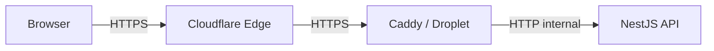

import LabSpec from '../../../components/LabSpec.astro';
import Checkpoint from '../../../components/Checkpoint.astro';

## 1. Conceptos

**1. ¿Qué posición ocupa Cloudflare en el stack de Rush?**

Cuando un usuario abre la app de Rush, el request no va directamente al Droplet. Va primero a la red de Cloudflare, que actúa como intermediario:



Esto le da a Rush tres cosas sin esfuerzo:

- **CDN**: Cloudflare cachea assets estáticos en sus edge nodes distribuidos globalmente. Para el frontend de Rush, eso significa cargas más rápidas desde Venezuela, Argentina o España.
- **WAF básico**: filtra tráfico malicioso conocido antes de que llegue al servidor.
- **DDoS protection**: absorbe ataques volumétricos en la capa de Cloudflare, no en el Droplet.

**2. ¿Qué significa el proxy naranja (orange cloud) en DNS?**

En el panel de DNS de Cloudflare, cada registro tiene un ícono de nube. Si está naranja (proxy habilitado), el tráfico pasa por Cloudflare antes de llegar al Droplet. Si está gris (DNS-only), el registro apunta directamente al Droplet sin pasar por Cloudflare.

Para los registros del dominio principal de Rush (la app y la API), siempre usa orange cloud. Esto oculta la IP real del Droplet, lo que reduce la superficie de ataque directo.

**3. ¿Qué hace el WAF básico de Cloudflare?**

El Web Application Firewall de Cloudflare tiene reglas administradas que bloquean patrones de ataque conocidos: inyección SQL, XSS, exploits de frameworks comunes. En el plan Free ya tienes un subconjunto de estas reglas activo. En Pro/Business tienes el conjunto completo.

Para Rush en etapa MVP, el plan Free da cobertura razonable. Lo que no hace el WAF de Cloudflare es reemplazar la validación de input en el backend: Zod y los guards de NestJS son la primera línea, Cloudflare es una capa adicional.

---

## 2. Lab guiado

<LabSpec
  title="Configuración de Cloudflare para un dominio de Rush"
  estimatedMinutes={40}
  runnable={false}
>

No vas a configurar un dominio real aquí, pero vas a entender cada paso que harías en producción.

### Registros DNS típicos de Rush

En el panel de DNS de Cloudflare, los registros para el stack de Rush lucirían así:

```text
Tipo    Nombre             Contenido            Proxy
A       @                  <IP del Droplet>     Naranja (proxy ON)
A       www                <IP del Droplet>     Naranja (proxy ON)
A       api                <IP del Droplet>     Naranja (proxy ON)
CNAME   grafana            <IP del Droplet>     Gris (DNS-only)
```

El `grafana` subdomain usa DNS-only porque el acceso a Grafana es interno del equipo y preferimos no exponerlo a través de Cloudflare CDN. Solo la app pública y la API van por el proxy naranja.

### SSL/TLS en Cloudflare

En la sección SSL/TLS del panel, configura el modo a **Full (strict)**. Esto significa:

- El browser se conecta a Cloudflare con HTTPS.
- Cloudflare se conecta al Droplet con HTTPS y valida el certificado de Caddy.

Nunca uses el modo **Flexible** (que conecta Cloudflare al backend en HTTP plano). Eso significa que el tráfico entre Cloudflare y tu servidor va sin cifrar.

### Page Rules para redirecciones

Las Page Rules permiten redirigir o reescribir URLs. Un caso común en Rush: forzar que `www.example.com` rediriga a `example.com`.

```text
URL: www.example.com/*
Setting: Forwarding URL (301 Permanent)
Destination: https://example.com/$1
```

Cloudflare procesa esta regla en el edge, sin que el request llegue al Droplet.

### Firewall Rules básicas

Puedes crear reglas para bloquear tráfico de países que no son mercados objetivo de Rush:

```text
Expresión: (ip.geoip.country ne "VE" and ip.geoip.country ne "US")
Acción: Challenge (CAPTCHA)
```

Esto no bloquea — desafía. Un humano legítimo puede pasar el CAPTCHA. Un bot automatizado no.

</LabSpec>

---

## 3. Checkpoint

<Checkpoint unit="track-devops/cloudflare-setup">

- [ ] Puedo explicar por qué el tráfico de la app de Rush pasa por Cloudflare antes de llegar al Droplet.
- [ ] Sé la diferencia entre orange cloud y grey cloud en DNS, y cuándo usar cada uno.
- [ ] Entiendo qué hace el WAF de Cloudflare y por qué no reemplaza la validación en el backend.
- [ ] Sé configurar el modo SSL/TLS en Full (strict) y por qué el modo Flexible es un problema.

</Checkpoint>

## Próxima unidad → [Infisical para secretos en runtime](../infisical-secrets/)
