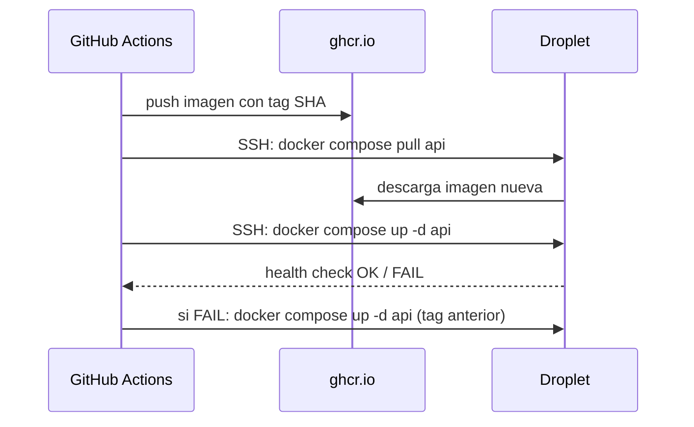

import LabSpec from '../../../components/LabSpec.astro';
import Checkpoint from '../../../components/Checkpoint.astro';

## 1. Conceptos

**1. ¿Cómo funciona el ciclo de deploy en un Droplet con docker-compose?**

El ciclo completo de un deploy en Rush es:

1. El pipeline de CI/CD publica la nueva imagen en ghcr.io con tag del commit SHA.
2. El pipeline se conecta al Droplet por SSH.
3. En el Droplet, `docker compose pull api` descarga la nueva imagen.
4. `docker compose up -d api` reinicia el servicio con la nueva imagen.
5. El pipeline espera y verifica el health check del servicio.
6. Si el health check pasa: deploy exitoso.
7. Si el health check falla: rollback inmediato.



Entre el paso 4 y el 5, docker-compose tiene configurado un health check con retries y un período de gracia. El servicio viejo sigue corriendo hasta que el nuevo esté healthy.

**2. ¿Cómo funciona el rollback en Rush?**

Rollback de código = redeploy de la imagen anterior. Tan simple como eso.

Cada deploy usa un tag de imagen con el SHA del commit. Si el deploy nuevo falla, el pipeline corre `docker compose up -d api` con el tag del commit anterior. El servicio vuelve a la versión anterior en el tiempo que tarda en descargar la imagen (que probablemente ya está en caché en el Droplet).

No hay scripts de rollback complejos. No hay feature flags que activar. El estado del servicio está en la imagen.

**3. ¿Cómo maneja Caddy el período de transición del servicio?**

Cuando `docker compose up -d` reinicia el contenedor del API, hay un período corto donde el nuevo contenedor está arrancando y el viejo ya está parado. En ese período, los requests nuevos que llegan a Caddy pueden recibir un 502.

Para minimizar ese período:

- El Dockerfile tiene un CMD que arranca el proceso rápido (Node.js sin compilation overhead).
- El `start_period` del health check da tiempo al proceso para inicializarse.
- Caddy tiene configurado `health_interval` para dejar de enrutar si el upstream no responde.

Para deploys con cero downtime completo necesitarías múltiples réplicas, lo que escapa al diseño single-node de Rush.

---

## 2. Lab guiado

<LabSpec
  title="Script de deploy y rollback del Droplet de Rush"
  estimatedMinutes={80}
  runnable={false}
>

### Script de deploy en el Droplet

El pipeline llama a un script en el Droplet en vez de encadenar comandos SSH inline. Esto hace el proceso más mantenible:

```bash
# /opt/rush/scripts/deploy.sh
#!/usr/bin/env bash
set -euo pipefail

IMAGE_TAG="${1:?IMAGE_TAG is required}"
APP_DIR="/opt/rush"

echo "Starting deploy: image tag $IMAGE_TAG"

cd "$APP_DIR"

# 1. Pull the new image
IMAGE_TAG="$IMAGE_TAG" docker compose pull api

# 2. Apply migrations before deploying
IMAGE_TAG="$IMAGE_TAG" docker compose run --rm api node dist/cli/migrate.js

# 3. Deploy the new image
IMAGE_TAG="$IMAGE_TAG" docker compose up -d api

# 4. Wait for health check
echo "Waiting for service health..."
RETRIES=0
MAX_RETRIES=10
until docker compose exec api wget -qO- http://localhost:3000/health > /dev/null 2>&1; do
  RETRIES=$((RETRIES + 1))
  if [ "$RETRIES" -ge "$MAX_RETRIES" ]; then
    echo "Health check failed after $MAX_RETRIES attempts. Rolling back..."
    exit 1
  fi
  echo "Attempt $RETRIES/$MAX_RETRIES..."
  sleep 5
done

echo "Deploy successful: $IMAGE_TAG"
```

El `set -euo pipefail` hace que el script falle inmediatamente si cualquier comando falla. Sin eso, un fallo en el pull podría pasar desapercibido y el script seguiría ejecutando.

### Llamar al script desde GitHub Actions

```yaml
- name: Deploy to Droplet
  run: |
    ssh -o StrictHostKeyChecking=no deploy@${{ secrets.DROPLET_IP }} \
      "bash /opt/rush/scripts/deploy.sh ${{ needs.build-and-push.outputs.image-tag }}"
```

### Script de rollback manual

Si el deploy falla en producción después de que el pipeline reportó éxito:

```bash
# /opt/rush/scripts/rollback.sh
#!/usr/bin/env bash
set -euo pipefail

PREVIOUS_TAG="${1:?PREVIOUS_IMAGE_TAG is required}"

cd /opt/rush

echo "Rolling back to $PREVIOUS_TAG"

IMAGE_TAG="$PREVIOUS_TAG" docker compose up -d api

echo "Rollback complete. Verify: docker compose ps"
```

El founder corre este script manualmente con el SHA del commit anterior:

```bash
ssh deploy@DROPLET_IP "bash /opt/rush/scripts/rollback.sh sha-abc1234"
```

Toma menos de 1 minuto si la imagen anterior está en caché del Droplet.

### Caddy reload sin downtime

Si cambias el Caddyfile (por ejemplo, para agregar un nuevo dominio), puedes recargarlo sin reiniciar Caddy:

```bash
ssh deploy@DROPLET_IP "docker compose exec caddy caddy reload --config /etc/caddy/Caddyfile"
```

Caddy recarga la configuración en caliente. Los requests en vuelo no se interrumpen.

### Monitorear el estado post-deploy en Grafana

Después de cada deploy, revisa en Grafana:

1. La tasa de errores 5xx en el panel del API (debería volver a cero).
2. El error rate de Postgres connections (debería ser estable).
3. Los logs de Loki del servicio `api` en los primeros 5 minutos post-deploy.

Si algo sube, el rollback es el paso 1.

</LabSpec>

---

## 3. Checkpoint

<Checkpoint unit="track-devops/droplet-single-node-deploy">

- [ ] Puedo describir el ciclo completo de un deploy: desde el push al pipeline hasta el health check en el Droplet.
- [ ] Entiendo por qué rollback de código = redeploy de imagen anterior, y por qué eso funciona en el modelo de Rush.
- [ ] Sé cómo funciona el script de deploy con health check y qué pasa si el health check falla.
- [ ] Puedo explicar por qué `set -euo pipefail` es importante en un script de deploy.

</Checkpoint>

## Próximas unidades

Terminaste el track obligatorio de DevOps. Si quieres profundizar más allá del stack de Rush, hay unidades extras disponibles:

- [Kubernetes: intro y cuándo tiene sentido](./extras/kubernetes-intro/)
- [Terraform e IaC](./extras/terraform-iac/)
- [GitHub Actions avanzado](./extras/github-actions-avanzado/)
