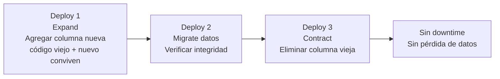

import LabSpec from '../../../components/LabSpec.astro';
import Checkpoint from '../../../components/Checkpoint.astro';

## 1. Conceptos

**1. ¿Qué es expand-contract y por qué Rush lo usa?**

El patrón expand-contract es una forma de hacer cambios de schema en base de datos sin downtime y sin necesitar down-migrations.

La idea es simple: en vez de cambiar la base de datos de golpe, lo haces en dos deploys:

- **Expand**: agregas lo nuevo sin borrar lo viejo. La nueva columna existe, el código viejo sigue funcionando porque no la usa.
- **Contract**: cuando el código nuevo está en producción y estabilizado, borras lo viejo con un segundo deploy.

Entre esos dos deploys puede pasar horas, días o semanas. No hay prisa.



**2. ¿Por qué no hay down-migrations en producción?**

Una down-migration es el script que deshace una migration: borra columnas, elimina tablas, revierte cambios de schema. En teoría, si algo sale mal, corres la down-migration y vuelves al estado anterior.

El problema es que en producción hay datos reales. Si la migration agregó una columna y algunos registros ya tienen datos en esa columna, la down-migration que elimina esa columna borra esos datos permanentemente. No hay ctrl+Z.

En Rush, el rollback de una migration es un problema de datos, no de código. Por eso rollback = redeploy del código anterior con la base de datos en el estado nuevo. El código anterior ignora la columna nueva, y eso está bien.

**3. ¿Cuál es el orden correcto de operaciones en un deploy?**

Siempre: **migration primero, deploy después**.

Si el deploy ocurre antes de la migration, el código nuevo llega a producción intentando usar columnas o tablas que todavía no existen. Error garantizado.

Si la migration ocurre primero, el schema ya está actualizado cuando el código nuevo arranca. Si el código nuevo falla por algún otro motivo, el código viejo todavía es compatible con el schema nuevo porque seguiste el patrón expand-contract.

---

## 2. Lab guiado

<LabSpec
  title="Ciclo expand-contract para agregar una columna a ventas"
  estimatedMinutes={40}
  runnable={false}
>

### Escenario: agregar `payment_method` a la tabla de ventas

Supón que quieres agregar el método de pago (`efectivo`, `transferencia`, `divisas`) a cada venta.

#### Fase 1 — Expand

Migration:

```sql
ALTER TABLE sales ADD COLUMN payment_method TEXT;
```

La columna es nullable (sin `NOT NULL`). Eso permite que el código viejo siga insertando ventas sin ese campo — los registros antiguos quedan con `NULL`.

El código nuevo empieza a escribir el campo en las inserciones nuevas:

```ts
await db.insert(salesTable).values({
  tenantId: input.tenantId,
  amount: input.amount,
  paymentMethod: input.paymentMethod,
});
```

Después del deploy de la Fase 1, coexisten en producción registros con `payment_method` y registros con `NULL`.

#### Fase 2 — Contract (semanas después)

Cuando ya no hay registros con `NULL` (o cuando ya no importa que los haya), aplicas el constraint:

```sql
ALTER TABLE sales ALTER COLUMN payment_method SET DEFAULT 'efectivo';
UPDATE sales SET payment_method = 'efectivo' WHERE payment_method IS NULL;
ALTER TABLE sales ALTER COLUMN payment_method SET NOT NULL;
```

Ahora la columna es obligatoria. El código viejo ya no está en producción, así que no hay conflicto.

### Drizzle: generar y aplicar migrations

```bash
# Generar el archivo de migration desde el schema TypeScript
pnpm drizzle-kit generate

# Aplicar en la base de datos de desarrollo
pnpm drizzle-kit migrate
```

El archivo generado queda en `drizzle/migrations/`. Commitealo junto al cambio de schema en el mismo PR.

### Migration en el pipeline de CI/CD

```yaml
- name: Apply migrations
  run: |
    ssh deploy@${{ secrets.DROPLET_IP }} \
      "cd /opt/rush && docker compose run --rm api node dist/cli/migrate.js"
```

Este step corre antes del step que actualiza el servicio `api`. Migration primero, deploy después.

</LabSpec>

---

## 3. Checkpoint

<Checkpoint unit="track-devops/expand-contract-deploy">

- [ ] Puedo explicar el patrón expand-contract con un ejemplo concreto de cambio de schema.
- [ ] Entiendo por qué Rush no usa down-migrations en producción y qué implica eso para el rollback.
- [ ] Sé el orden correcto de operaciones en un deploy con cambio de schema.
- [ ] Puedo describir qué pasa si el deploy ocurre antes de la migration.

</Checkpoint>

## Próxima unidad → [Pre-commit hooks con gitleaks](../pre-commit-hooks/)
