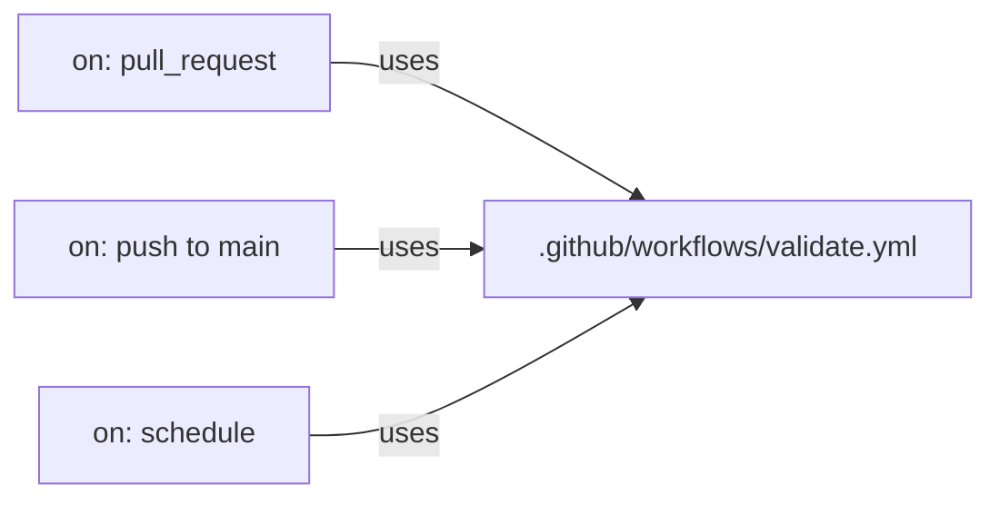

import LabSpec from '../../../../components/LabSpec.astro';
import Checkpoint from '../../../../components/Checkpoint.astro';

## 1. Conceptos

**1. ¿Qué es matrix strategy y cuándo lo necesitas?**

Imagínate que tienes una librería de TypeScript y quieres asegurarte de que funciona en Node.js 20, 22 y 24. Sin matrix, escribirías tres jobs casi idénticos. Con matrix, defines la variación y GitHub Actions corre el mismo job una vez por cada combinación.

Fíjate en la diferencia: un job normal corre una vez, en un entorno fijo. Un job con matrix corre N veces, en N combinaciones, en paralelo si los recursos lo permiten.

```yaml
# Ejemplo: correr tests en tres versiones de Node
strategy:
  matrix:
    node-version: ['20', '22', '24']
steps:
  - uses: actions/setup-node@v4
    with:
      node-version: ${{ matrix.node-version }}
```

Esto genera tres jobs: uno por cada versión de Node, corriendo en paralelo.

¿Cuándo lo necesitas en Rush? Hoy probablemente no — Rush usa una versión de Node fija (`20.18.0`). Pero si mantienes una librería de npm o necesitas testear en múltiples entornos (Linux + macOS, o múltiples versiones de Postgres), matrix es la herramienta correcta.

**2. ¿Cómo funciona el cache de dependencias?**

`pnpm install` en CI descarga todos los paquetes desde el registro en cada run. Si tienes 300 dependencias y el CI corre 20 veces al día, eso es tráfico y tiempo redundante.

El cache de Actions guarda el directorio de paquetes entre runs. La clave del cache incluye un hash del lockfile — si `pnpm-lock.yaml` no cambió, el cache es válido y se restaura. Si cambió (alguien agregó o actualizó una dependencia), el cache se invalida y se regenera.

```yaml
- uses: actions/setup-node@v4
  with:
    node-version: '20.18.0'
    cache: 'pnpm'
```

Esa sola línea hace toda la magia: Actions busca el cache, lo restaura si existe, y lo guarda al final del job si no existía o si el lockfile cambió.

Para pnpm, también puedes ser más explícito:

```yaml
- uses: pnpm/action-setup@v4
  with:
    version: 10
- uses: actions/setup-node@v4
  with:
    node-version: '20.18.0'
    cache: 'pnpm'
- run: pnpm install --frozen-lockfile
```

El `--frozen-lockfile` garantiza que si `pnpm-lock.yaml` no coincide con `package.json`, el install falla en lugar de actualizar silenciosamente. Eso evita sorpresas en CI.

**3. ¿Qué son los reusable workflows?**

Cuando tienes varios repositorios o varios pipelines en el mismo repo y todos hacen los mismos pasos (checkout, install, lint, build), estás duplicando YAML. Los reusable workflows son el equivalente de una función: defines el workflow una vez en un archivo `.yml`, y lo llamas desde otros workflows con `uses`.



El workflow reutilizable recibe inputs y secrets por parámetro, igual que una función recibe argumentos. El que llama no necesita saber los detalles de implementación.

¿Cuándo lo necesitas? Si tienes un solo repo y un solo pipeline, no hace falta. Cuando tienes varios servicios o varios repos del mismo proyecto que todos necesitan el mismo proceso de CI, los reusable workflows evitan que actualizar un paso requiera editar quince archivos.

---

## 2. Lab guiado

<LabSpec title="Agregar matrix, cache y reusable workflow a un pipeline existente" estimatedMinutes={50} runnable={false}>

En este lab vas a tomar el pipeline de CI del Plan B (el `.github/workflows/ci.yml` que ya existe en `study-plan-tech`) y extenderlo con cache optimizado. Luego vas a crear un reusable workflow de ejemplo para entender la mecánica, sin modificar el pipeline de producción.

</LabSpec>

### Setup

Necesitas un repo con un workflow de GitHub Actions existente. Puedes usar el de `study-plan-tech` o crear un repo de prueba. El lab asume que tienes acceso a push en el repo.

### Paso 1: revisar el pipeline actual

Abre `.github/workflows/ci.yml` y encuentra el step de setup de Node. Fíjate si ya tiene cache configurado.

El pipeline del Batch 1 debería tener algo como:

```yaml
- uses: actions/setup-node@v4
  with:
    node-version: '20.18.0'
    cache: 'pnpm'
```

Si está, ya tienes cache básico. Si no está, agrégalo.

### Paso 2: crear un reusable workflow

Crea el archivo `.github/workflows/validate-content.yml`:

```yaml
# .github/workflows/validate-content.yml
name: validate-content

on:
  workflow_call:
    inputs:
      node-version:
        description: 'Node.js version to use'
        required: false
        type: string
        default: '20.18.0'

jobs:
  validate:
    runs-on: ubuntu-latest
    steps:
      - uses: actions/checkout@v4

      - uses: pnpm/action-setup@v4
        with:
          version: 10

      - uses: actions/setup-node@v4
        with:
          node-version: ${{ inputs.node-version }}
          cache: 'pnpm'

      - run: pnpm install --frozen-lockfile

      - name: Lint Markdown
        run: pnpm lint:md

      - name: Check types
        run: pnpm check

      - name: Build
        run: pnpm build
```

### Paso 3: llamar el reusable workflow desde el pipeline principal

Modifica `.github/workflows/ci.yml` para usar el workflow reutilizable:

```yaml
# .github/workflows/ci.yml
name: ci

on:
  pull_request:
    branches: [main]
  push:
    branches: [main]

concurrency:
  group: ${{ github.workflow }}-${{ github.ref }}
  cancel-in-progress: true

jobs:
  validate:
    uses: ./.github/workflows/validate-content.yml
    with:
      node-version: '20.18.0'
```

### Paso 4: agregar matrix (ejemplo de aprendizaje)

Crea un workflow separado `.github/workflows/matrix-example.yml` para experimentar con matrix sin afectar el CI principal:

```yaml
# .github/workflows/matrix-example.yml
name: matrix-example

on:
  workflow_dispatch:

jobs:
  build:
    runs-on: ubuntu-latest
    strategy:
      matrix:
        node-version: ['20', '22']
    steps:
      - uses: actions/checkout@v4
      - uses: pnpm/action-setup@v4
        with:
          version: 10
      - uses: actions/setup-node@v4
        with:
          node-version: ${{ matrix.node-version }}
          cache: 'pnpm'
      - run: pnpm install --frozen-lockfile
      - run: pnpm build
```

El trigger `workflow_dispatch` significa que solo corre cuando lo activas manualmente desde la UI de GitHub o con la CLI.

### Verificación final

Para verificar que el reusable workflow funciona:

```bash
git add .github/workflows/validate-content.yml .github/workflows/ci.yml
git commit -m "ci: extract validate-content reusable workflow"
git push origin main
```

Ve a la pestaña Actions de tu repo en GitHub y verifica que el workflow `ci` corra y llame exitosamente al reusable `validate-content`. Deberías ver en el log del job el step `uses: ./.github/workflows/validate-content.yml` con los sub-steps del workflow reutilizable.

Si el CI ya pasaba antes de este cambio y sigue pasando después, la refactorización fue exitosa.

---

## 3. Checkpoint

<Checkpoint unit="github-actions-avanzado">

- [ ] Entiendo qué genera matrix strategy en términos de jobs en paralelo.
- [ ] Sé cuándo el cache de pnpm en Actions ahorra tiempo y cuándo no aplica.
- [ ] Puedo explicar la diferencia entre un workflow normal y un reusable workflow.
- [ ] Logré crear el reusable workflow y llamarlo desde el pipeline principal sin romper el CI.

1. Si tienes un matrix con `node-version: ['20', '22', '24']` y `os: ['ubuntu-latest', 'macos-latest']`, ¿cuántos jobs en paralelo crea GitHub Actions?

2. ¿Cuál es el riesgo de usar un reusable workflow referenciado con `@main` en lugar de `@v1` o un SHA fijo? ¿En qué contexto importa eso?

3. El cache de pnpm usa el hash del lockfile como clave. ¿Qué pasa si dos PRs distintos modifican `pnpm-lock.yaml` al mismo tiempo? ¿Hay conflicto de cache?

</Checkpoint>

## Esta es la última unidad del Track DevOps

Si no completaste las unidades core, vuelve a [docker-multistage-distroless](../../docker-multistage-distroless/) y sigue el orden recomendado.
