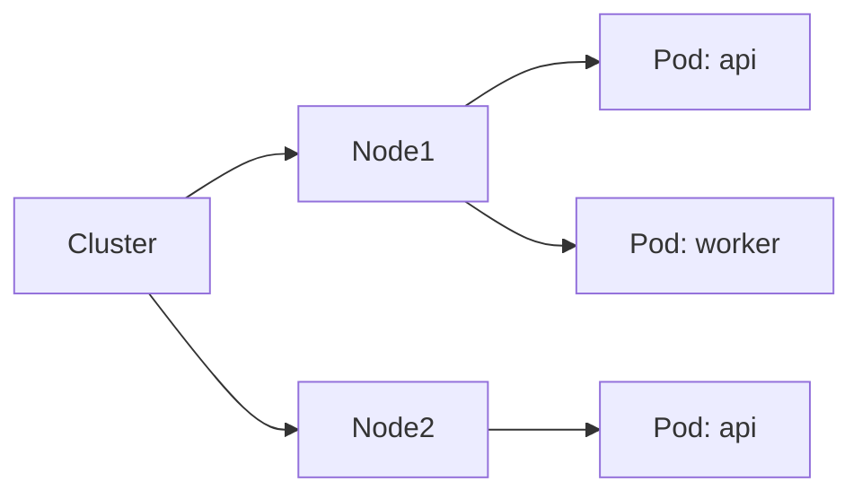
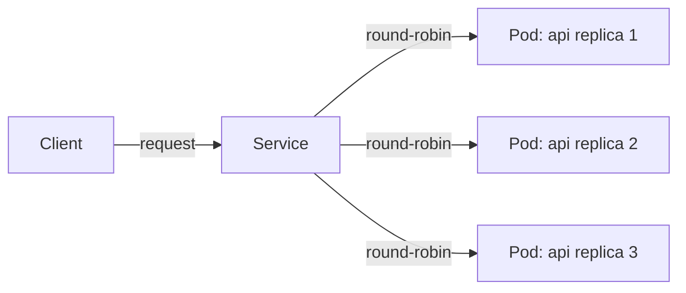

import LabSpec from '../../../../components/LabSpec.astro';
import Checkpoint from '../../../../components/Checkpoint.astro';

## 1. Conceptos

**1. ¿Qué problema resuelve Kubernetes?**

Imagínate que tienes diez servidores corriendo tu API y necesitas actualizar la versión sin que ningún usuario note un segundo de caída. También necesitas que si uno de los servidores falla, el tráfico se redistribuya automáticamente. Y si el tráfico sube mucho, que aparezcan más instancias de la API sin que tengas que hacer nada a mano.

Eso es lo que resuelve Kubernetes (K8s): orquestación de contenedores. Maneja dónde corre cada contenedor, cuántas instancias hay, cómo se actualizan, y cómo los servicios se comunican entre sí.

Fíjate que esos problemas **Rush no los tiene hoy**. Rush corre en un solo Droplet de DigitalOcean con docker-compose. Funciona bien para el volumen actual. Kubernetes agrega complejidad operativa real — clusters, etcd, kubelets, ingress controllers — que no tiene sentido pagar si no tienes el problema que resuelve.

**2. ¿Qué es un Pod?**

Un Pod es la unidad mínima de despliegue en Kubernetes. Puede contener uno o más contenedores que comparten red y almacenamiento. En la práctica, la mayoría de los Pods tienen un solo contenedor.

Fíjate en esta diferencia clave: en docker-compose defines un servicio que siempre corre en el mismo servidor. En Kubernetes, defines un Pod y el sistema decide en cuál nodo del cluster corre, dependiendo de los recursos disponibles.



**3. ¿Qué es un Deployment?**

Un Pod por sí solo no tiene resiliencia. Si falla, no se reinicia automáticamente. Por eso usas un Deployment: defines cuántas réplicas quieres de un Pod y Kubernetes se encarga de mantener ese número. Si un Pod muere, crea otro.

El Deployment también maneja las actualizaciones con rolling updates: levanta Pods nuevos con la versión nueva antes de bajar los viejos. Así no hay downtime.

**4. ¿Qué es un Service?**

Los Pods tienen IPs que cambian cuando se recrean. Un Service es una abstracción estable — tiene una IP o DNS fijo y redirige el tráfico a los Pods que coincidan con un selector. Es el equivalente de un load balancer interno.

El flujo es:



**5. ¿Cuándo tiene sentido migrar a K8s?**

Kubernetes agrega valor cuando tienes alguna de estas situaciones:

- Necesitas escalar horizontalmente de forma automática (decenas de réplicas).
- Tienes múltiples equipos desplegando servicios independientes y necesitas aislamiento.
- Necesitas rolling deployments sin downtime a escala real.
- Ya tienes un equipo de infra dedicado que puede mantener el cluster.

Rush hoy no tiene ninguna de esas. El Droplet single-node con docker-compose es predecible, barato de mantener, y fácil de debuggear. Si algo falla, haces SSH y ves los logs. Con K8s el debugging es más complejo.

La decisión correcta es: usa la herramienta más simple que resuelva tu problema. Si el Droplet alcanza, quédate con el Droplet.

---

## 2. Lab guiado

<LabSpec title="Explorar Kubernetes localmente con kind" estimatedMinutes={60} runnable={false}>

En este lab vas a instalar un cluster local de Kubernetes con `kind` (Kubernetes in Docker), desplegar una aplicación de ejemplo, y explorar los objetos que viste en los conceptos.

No es un lab de producción. El objetivo es que veas cómo se ve un Deployment y un Service reales y puedas leer manifiestos YAML sin perderte.

</LabSpec>

### Setup

Necesitas tener Docker corriendo. Luego instala `kind` y `kubectl`:

```bash
# macOS con Homebrew
brew install kind kubectl

# Linux (descarga directa)
curl -Lo ./kind https://kind.sigs.k8s.io/dl/v0.24.0/kind-linux-amd64
chmod +x ./kind
sudo mv ./kind /usr/local/bin/kind
```

Verifica que funcionan:

```bash
kind version
kubectl version --client
```

### Paso 1: crear el cluster local

```bash
kind create cluster --name rush-lab
```

Esto levanta un cluster de un solo nodo dentro de un contenedor Docker. Puede tomar uno o dos minutos.

Verifica que está activo:

```bash
kubectl cluster-info --context kind-rush-lab
kubectl get nodes
```

Deberías ver un nodo con estado `Ready`.

### Paso 2: escribir un Deployment

Crea el archivo `deployment.yaml`:

```yaml
# deployment.yaml
apiVersion: apps/v1
kind: Deployment
metadata:
  name: hello-api
  labels:
    app: hello-api
spec:
  replicas: 2
  selector:
    matchLabels:
      app: hello-api
  template:
    metadata:
      labels:
        app: hello-api
    spec:
      containers:
        - name: hello-api
          image: hashicorp/http-echo:latest
          args:
            - '-text=Hello from Kubernetes'
          ports:
            - containerPort: 5678
```

Aplícalo:

```bash
kubectl apply -f deployment.yaml
kubectl get pods
```

Espera hasta que ambos Pods estén en estado `Running`.

### Paso 3: exponer con un Service

Crea el archivo `service.yaml`:

```yaml
# service.yaml
apiVersion: v1
kind: Service
metadata:
  name: hello-api-service
spec:
  selector:
    app: hello-api
  ports:
    - protocol: TCP
      port: 80
      targetPort: 5678
  type: ClusterIP
```

Aplícalo:

```bash
kubectl apply -f service.yaml
kubectl get services
```

### Paso 4: probar que funciona

Usa `kubectl port-forward` para acceder al Service desde tu máquina:

```bash
kubectl port-forward service/hello-api-service 8080:80
```

En otra terminal:

```bash
curl http://localhost:8080
# Expected output: Hello from Kubernetes
```

### Paso 5: simular un rolling update

Edita `deployment.yaml` y cambia el texto:

```yaml
args:
  - '-text=Updated version'
```

Aplica el cambio:

```bash
kubectl apply -f deployment.yaml
kubectl rollout status deployment/hello-api
```

Kubernetes va a reemplazar los Pods de uno en uno. Mientras el rollout ocurre, el Service sigue respondiendo porque siempre hay al menos un Pod activo.

### Verificación final

Al terminar este lab deberías poder:

```bash
kubectl get deployments
kubectl get pods
kubectl get services
kubectl describe deployment hello-api
```

Y entender qué significa cada columna del output. Si algo falló, revisa `kubectl describe pod <nombre-del-pod>` para ver los eventos de error.

Limpia el cluster cuando termines:

```bash
kind delete cluster --name rush-lab
```

---

## 3. Checkpoint

<Checkpoint unit="kubernetes-intro">

- [ ] Puedo explicar la diferencia entre Pod, Deployment y Service sin leer las definiciones.
- [ ] Entiendo por qué Rush usa docker-compose single-node hoy en lugar de Kubernetes.
- [ ] Sé en qué condiciones tendría sentido migrar a Kubernetes.
- [ ] Logré correr el lab: Deployment con 2 réplicas, Service activo, rolling update completado.

1. ¿Cuál es la principal diferencia entre un Pod y un Deployment? ¿Por qué rara vez deploys un Pod directamente?

2. Si Rush duplicara su volumen de usuarios mañana, ¿Kubernetes sería la primera herramienta que agregarías? ¿Qué otras opciones existen antes de llegar a K8s?

3. ¿Qué problema resuelve un Service que no resuelve conectarse directamente a la IP de un Pod?

</Checkpoint>

## Próxima unidad → [Terraform: infraestructura como código](../terraform-iac/)
