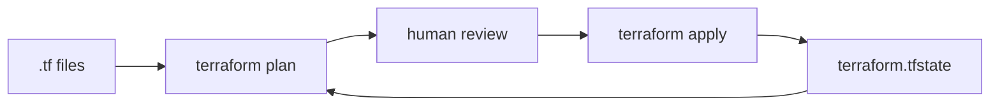

import LabSpec from '../../../../components/LabSpec.astro';
import Checkpoint from '../../../../components/Checkpoint.astro';

## 1. Conceptos

**1. ¿Qué es infraestructura como código?**

Imagínate que hoy creas un Droplet en DigitalOcean desde el dashboard web: eliges el tamaño, la región, agregas tu SSH key, y listo. Funciona. El problema es que ese proceso no está documentado en ningún lado, no se puede repetir exactamente igual la semana que viene, y si tienes que crear diez Droplets parecidos, haces diez clics manuales con margen de error en cada uno.

Infraestructura como código (IaC) es la práctica de describir tu infraestructura en archivos de texto versionables en Git, igual que el código de tu aplicación. Terraform es la herramienta de IaC más usada hoy.

Fíjate en lo que cambia: en vez de ir al dashboard, escribes un archivo `.tf` que dice "quiero un Droplet de 2GB en NYC3 con esta SSH key". Terraform lee ese archivo, le pregunta a la API de DigitalOcean qué ya existe, y solo crea lo que falta. Si cambias el archivo y vuelves a correr Terraform, actualiza la infraestructura para que coincida.

**2. ¿Cómo funciona el ciclo de Terraform?**

Terraform tiene tres operaciones principales:

- `terraform plan` — calcula qué va a crear, modificar o destruir. No toca nada aún. Es el diff de tu infraestructura.
- `terraform apply` — ejecuta los cambios que calculó el plan.
- `terraform destroy` — destruye todo lo que Terraform creó.

El estado de lo que Terraform sabe que existe vive en un archivo `terraform.tfstate`. Si lo pierdes, Terraform pierde la noción de qué está gestionando. En equipos, el state vive en un backend remoto (S3, Terraform Cloud, o el backend de DigitalOcean Spaces) para que todos vean el mismo estado.



**3. ¿Cuándo conviene Terraform vs. scripts manuales?**

Rush hoy crea infraestructura con una combinación de dashboard de DigitalOcean y scripts de deploy manuales (SSH + docker-compose). Eso funciona bien para un stack simple y estático.

Terraform agrega valor cuando:

- Tienes que recrear la infraestructura con frecuencia (staging, ambientes por PR).
- Trabajas en equipo y necesitas que todos sepan exactamente qué infraestructura existe.
- El stack es suficientemente complejo como para que un script bash sea difícil de mantener.
- Quieres un historial de cambios de infraestructura en Git.

Para Rush en su estado actual — un Droplet single-node, un servidor Postgres, un par de servicios — Terraform es probablemente más overhead del que vale. El dashboard y un README claro con los pasos de setup son suficientes.

La decisión es la misma que con Kubernetes: usa la herramienta más simple que resuelva tu problema.

---

## 2. Lab guiado

<LabSpec title="Explorar Terraform con DigitalOcean (sin crear recursos reales)" estimatedMinutes={45} runnable={false}>

En este lab vas a instalar Terraform, escribir una configuración básica para DigitalOcean, y correr `terraform plan` para ver qué haría. No vas a correr `terraform apply` — el objetivo es leer el output del plan y entender qué está calculando.

Si tienes un token de DigitalOcean de prueba disponible, puedes intentar el apply en un ambiente de desarrollo. Si no, el plan solo es suficiente para el aprendizaje.

</LabSpec>

### Setup

Instala Terraform:

```bash
# macOS con Homebrew
brew tap hashicorp/tap
brew install hashicorp/tap/terraform

# Linux (descarga directa)
wget -O- https://apt.releases.hashicorp.com/gpg | sudo gpg --dearmor -o /usr/share/keyrings/hashicorp-archive-keyring.gpg
echo "deb [signed-by=/usr/share/keyrings/hashicorp-archive-keyring.gpg] https://apt.releases.hashicorp.com $(lsb_release -cs) main" | sudo tee /etc/apt/sources.list.d/hashicorp.list
sudo apt update && sudo apt install terraform
```

Verifica:

```bash
terraform version
```

### Paso 1: crear el directorio del proyecto

```bash
mkdir terraform-do-lab && cd terraform-do-lab
```

### Paso 2: configurar el provider de DigitalOcean

Crea el archivo `main.tf`:

```hcl
# main.tf
terraform {
  required_providers {
    digitalocean = {
      source  = "digitalocean/digitalocean"
      version = "~> 2.0"
    }
  }
}

provider "digitalocean" {
  token = var.do_token
}
```

Crea el archivo de variables `variables.tf`:

```hcl
# variables.tf
variable "do_token" {
  description = "DigitalOcean API token"
  type        = string
  sensitive   = true
}

variable "region" {
  description = "DigitalOcean region"
  type        = string
  default     = "nyc3"
}
```

Crea el archivo `terraform.tfvars` con tus valores (este archivo NUNCA se commitea):

```hcl
# terraform.tfvars  — NO commitear en Git
do_token = "tu-token-de-digitalocean-aqui"
```

Agrega `terraform.tfvars` al `.gitignore`:

```text
# .gitignore
terraform.tfvars
*.tfstate
*.tfstate.backup
.terraform/
```

### Paso 3: definir un recurso de Droplet

Agrega esto al final de `main.tf`:

```hcl
# main.tf (continuación)
resource "digitalocean_droplet" "app_server" {
  name   = "rush-lab-droplet"
  region = var.region
  size   = "s-1vcpu-1gb"
  image  = "ubuntu-24-04-x64"
}
```

### Paso 4: inicializar y planear

```bash
terraform init
```

`terraform init` descarga el provider de DigitalOcean. Verás algo como `Terraform has been successfully initialized!`.

Ahora corre el plan:

```bash
terraform plan
```

Terraform va a mostrarte exactamente qué crearía si corrieras `apply`. Lee el output con cuidado: cada línea con `+` es algo que va a crear, con `~` algo que va a modificar, con `-` algo que va a destruir.

### Verificación final

Deberías ver en el output de `terraform plan` algo como:

```text
Terraform will perform the following actions:

  # digitalocean_droplet.app_server will be created
  + resource "digitalocean_droplet" "app_server" {
      + id     = (known after apply)
      + image  = "ubuntu-24-04-x64"
      + name   = "rush-lab-droplet"
      + region = "nyc3"
      + size   = "s-1vcpu-1gb"
      ...
    }

Plan: 1 to add, 0 to change, 0 to destroy.
```

Si ves ese output, el lab funcionó. Terraform leyó tu configuración, habló con la API de DigitalOcean, y calculó qué necesita crear.

No corras `terraform apply` a menos que quieras crear un Droplet real (y pagar por él). Si lo haces, recuerda correr `terraform destroy` cuando termines para no acumular costos.

---

## 3. Checkpoint

<Checkpoint unit="terraform-iac">

- [ ] Puedo explicar qué hace `terraform plan` sin confundirlo con `terraform apply`.
- [ ] Entiendo por qué `terraform.tfvars` y `terraform.tfstate` no se commitean en Git.
- [ ] Sé en qué situaciones Terraform agrega valor sobre el setup manual de Rush.
- [ ] Logré correr `terraform init` y `terraform plan` sin errores.

1. ¿Qué es el archivo `terraform.tfstate` y qué pasa si lo borras o pierdes sincronización con el equipo?

2. Rush actualmente configura el Droplet a mano con el dashboard de DigitalOcean. ¿Qué tendría que cambiar en el equipo o en el proyecto para que valga la pena migrar a Terraform?

3. Si defines un Droplet con Terraform y alguien del equipo lo modifica directamente desde el dashboard de DigitalOcean, ¿qué pasa la próxima vez que corres `terraform plan`?

</Checkpoint>

## Próxima unidad → [GitHub Actions avanzado](../github-actions-avanzado/)
