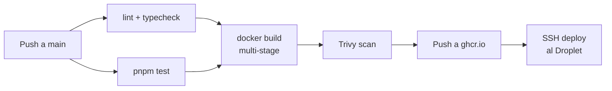

import LabSpec from '../../../components/LabSpec.astro';
import Checkpoint from '../../../components/Checkpoint.astro';

## 1. Conceptos

**1. ¿Por qué separar el pipeline en jobs y no en un solo job largo?**

Un pipeline monolítico de un solo job tiene un problema: si falla el test, igual gastaste tiempo en el build. Si falla el build, igual gastaste tiempo instalando dependencias. Con jobs separados, cada etapa falla rápido y solo corre si la anterior pasó.

Además, los jobs pueden correr en paralelo cuando no tienen dependencias. Por ejemplo: linting y tests pueden correr al mismo tiempo. El build de la imagen solo corre si ambos pasan.



**2. ¿Qué es `GITHUB_TOKEN` y por qué es suficiente para publicar en ghcr.io?**

GitHub Actions tiene una variable `GITHUB_TOKEN` que se genera automáticamente para cada ejecución del workflow. Este token tiene permisos sobre el repositorio actual. Para publicar imágenes en ghcr.io, basta con autenticarse con ese token — no necesitas crear un Personal Access Token adicional.

El truco está en los permisos del workflow: debes declarar `packages: write` para que el token tenga acceso a escribir en el Container Registry.

**3. ¿Cómo funciona el deploy por SSH sin guardar claves en el código?**

El deploy al Droplet se hace con SSH. El flujo es:

1. La clave privada SSH del usuario de deploy vive en GitHub Secrets (`SSH_PRIVATE_KEY`).
2. En el job de deploy, el pipeline carga la clave en el agente SSH del runner.
3. Ejecuta un comando remoto en el Droplet: `docker compose pull && docker compose up -d`.
4. El Droplet descarga la nueva imagen de ghcr.io y reinicia el servicio.

La clave privada nunca se escribe en disco del runner y el Droplet nunca necesita acceso a GitHub Actions — solo recibe un SSH connection.

---

## 2. Lab guiado

<LabSpec
  title="Pipeline ci.yml de Rush"
  estimatedMinutes={100}
  runnable={false}
>

Vamos a leer el pipeline completo de Rush paso a paso. El objetivo es entender cada decisión, no memorizarlo.

### Estructura general del workflow

```yaml
name: CI/CD Pipeline

on:
  push:
    branches: [main]
  pull_request:
    branches: [main]

permissions:
  contents: read
  packages: write

concurrency:
  group: ${{ github.workflow }}-${{ github.ref }}
  cancel-in-progress: true
```

El `concurrency` cancela ejecuciones anteriores del mismo workflow si llega un push nuevo. Evita que dos deploys corran al mismo tiempo.

### Job: validate

```yaml
jobs:
  validate:
    runs-on: ubuntu-latest
    steps:
      - uses: actions/checkout@v4

      - uses: pnpm/action-setup@v4
        with:
          version: 10

      - uses: actions/setup-node@v4
        with:
          node-version: '24'
          cache: 'pnpm'

      - run: pnpm install --frozen-lockfile

      - run: pnpm lint

      - run: pnpm test --coverage
```

La caché de pnpm (`cache: 'pnpm'`) guarda `~/.pnpm-store` entre ejecuciones. Una instalación limpia puede tardar 2 minutos; con caché baja a 15 segundos.

### Job: build-and-push

```yaml
build-and-push:
  needs: validate
  runs-on: ubuntu-latest
  if: github.ref == 'refs/heads/main'
  outputs:
    image-tag: ${{ steps.meta.outputs.version }}
  steps:
    - uses: actions/checkout@v4

    - uses: docker/setup-buildx-action@v3

    - uses: docker/login-action@v3
      with:
        registry: ghcr.io
        username: ${{ github.actor }}
        password: ${{ secrets.GITHUB_TOKEN }}

    - id: meta
      uses: docker/metadata-action@v5
      with:
        images: ghcr.io/${{ github.repository }}
        tags: |
          type=sha,prefix=sha-
          type=raw,value=latest,enable=true

    - uses: docker/build-push-action@v6
      with:
        context: .
        push: true
        tags: ${{ steps.meta.outputs.tags }}
        cache-from: type=gha
        cache-to: type=gha,mode=max
        target: runtime
```

El `target: runtime` construye solo hasta la etapa final del Dockerfile multi-stage. El `cache-from: type=gha` usa la caché de GitHub Actions para los layers de Docker entre builds.

### Job: scan (Trivy)

```yaml
scan:
  needs: build-and-push
  runs-on: ubuntu-latest
  steps:
    - uses: aquasecurity/trivy-action@master
      with:
        image-ref: ghcr.io/${{ github.repository }}:latest
        format: table
        exit-code: '1'
        severity: 'CRITICAL'
```

Si Trivy encuentra vulnerabilidades CRITICAL, el pipeline falla y el deploy no continúa. Las vulnerabilidades HIGH se reportan pero no bloquean. Verás más sobre esto en la unidad de Trivy.

### Job: deploy

```yaml
deploy:
  needs: [build-and-push, scan]
  runs-on: ubuntu-latest
  if: github.ref == 'refs/heads/main'
  steps:
    - uses: webfactory/ssh-agent@v0.9.0
      with:
        ssh-private-key: ${{ secrets.SSH_PRIVATE_KEY }}

    - name: Deploy to Droplet
      run: |
        ssh -o StrictHostKeyChecking=no deploy@${{ secrets.DROPLET_IP }} \
          "cd /opt/rush && \
           IMAGE_TAG=${{ needs.build-and-push.outputs.image-tag }} \
           docker compose pull api && \
           IMAGE_TAG=${{ needs.build-and-push.outputs.image-tag }} \
           docker compose up -d api"
```

El `IMAGE_TAG` se pasa desde el job de build-and-push. Esto asegura que el Droplet despliega exactamente la imagen que pasó el scan de Trivy, no simplemente `latest`.

</LabSpec>

---

## 3. Checkpoint

<Checkpoint unit="track-devops/github-actions-pipeline">

- [ ] Puedo explicar por qué separar el pipeline en jobs mejora la velocidad de feedback.
- [ ] Entiendo cómo `GITHUB_TOKEN` permite publicar en ghcr.io sin crear credenciales adicionales.
- [ ] Sé cómo el deploy por SSH funciona sin guardar claves en el código del workflow.
- [ ] Puedo seguir el flujo completo: commit → validate → build-and-push → scan → deploy.

</Checkpoint>

## Próxima unidad → [Trivy: escaneo de contenedores en CI](../trivy-container-scan/)
