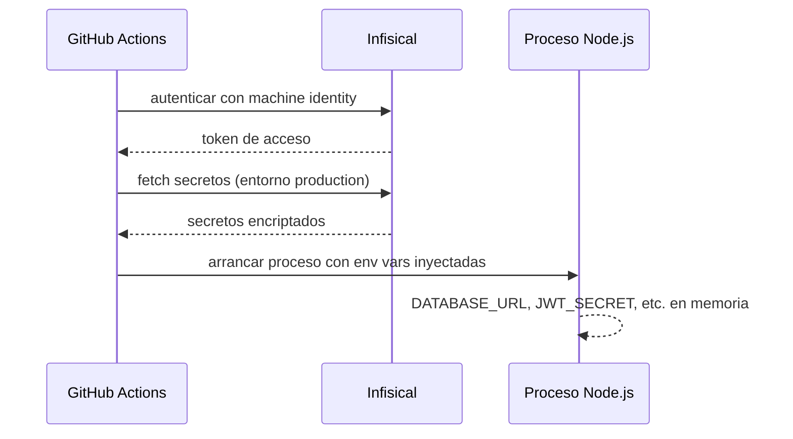

import LabSpec from '../../../components/LabSpec.astro';
import Checkpoint from '../../../components/Checkpoint.astro';

## 1. Conceptos

**1. ¿Por qué un `.env` commiteado es un problema irreversible?**

Fíjate en esto: si alguna vez commiteas un archivo con credenciales al repo, no basta con borrar el archivo en el siguiente commit. El secreto queda en el historial de Git, accesible con `git log` o `git show` para cualquiera que clone el repo.

La única solución real es rotar el secreto (generar uno nuevo, invalidar el anterior) y hacer un `git filter-repo` para limpiar el historial. Ese proceso es costoso y propenso a errores. La prevención es mucho más barata.

Acá está el punto: en Rush, los secretos nunca tocan el sistema de archivos del repo. Ni siquiera en `.env.local`. Infisical los inyecta en las variables de entorno del proceso en el momento de arranque.

**2. ¿Qué es Infisical y cómo funciona la inyección en runtime?**

Infisical es un gestor de secretos open source que Rush corre self-hosted. El flujo básico es:

1. Los secretos viven en Infisical (base de datos encriptada, acceso por API).
2. Cuando el pipeline de CI/CD arranca el backend, usa el CLI de Infisical para pedir los secretos.
3. Infisical los devuelve encriptados, los desencripta en memoria, y arranca el proceso con esas variables de entorno inyectadas.
4. El proceso de Node.js nunca escribe los secretos a disco.

Esto significa que si alguien obtiene acceso al sistema de archivos del Droplet, no encuentra secretos ahí.



**3. ¿Cuál es la diferencia entre secretos de build-time y secretos de runtime?**

Los secretos de build-time son los que necesitas durante `docker build`. Por ejemplo: un token para instalar dependencias privadas de npm desde GitHub Packages. Estos se pasan como `--secret` de Docker Buildkit y nunca quedan en las capas de la imagen.

Los secretos de runtime son los que necesita el proceso cuando está corriendo: la cadena de conexión a Postgres, la clave privada para firmar JWTs, la API key de algún servicio externo. Estos son los que Infisical inyecta al arranque.

En Rush no tenemos secretos en la imagen Docker. La imagen es pública en ghcr.io — si tuviera secretos embebidos, serían accesibles para quien descargue la imagen.

---

## 2. Lab guiado

<LabSpec
  title="Inyección de secretos con Infisical en el pipeline de Rush"
  estimatedMinutes={60}
  runnable={false}
>

Vamos a revisar cómo Rush integra Infisical en el ciclo de vida del servicio.

### Estructura de secretos en Infisical

Infisical organiza los secretos en proyectos y entornos. Para Rush:

```text
Proyecto: rush-backend
  Entorno: development
    DATABASE_URL
    REDIS_URL
    JWT_SECRET
  Entorno: production
    DATABASE_URL
    REDIS_URL
    JWT_SECRET
    SESSION_SECRET
```

Cada entorno tiene sus propios valores. El acceso por entorno se controla con tokens de servicio.

### Token de servicio de Infisical

Para que el CLI de Infisical pueda pedir secretos, necesita un token de autenticación (service token). Este token se guarda en GitHub Actions como secreto del repositorio:

```yaml
# En GitHub Actions Settings > Secrets and variables > Actions
INFISICAL_TOKEN: st.xxxxxxxxxxxxxxxxxxxx
```

El token tiene permisos de solo lectura sobre el entorno `production` del proyecto `rush-backend`.

### Arranque del proceso con inyección de secretos

En el script de deploy del Droplet, el proceso arranca así:

```bash
infisical run \
  --projectId $INFISICAL_PROJECT_ID \
  --env prod \
  -- node dist/main.js
```

El `infisical run` obtiene los secretos, los inyecta como variables de entorno en el proceso hijo (`node dist/main.js`), y cuando el proceso termina, esas variables desaparecen. No quedan en disco ni en ningún archivo de configuración.

### Integración con docker-compose en el Droplet

```yaml
services:
  api:
    image: ghcr.io/rush-vzla/rush-api:${IMAGE_TAG}
    restart: unless-stopped
    command: >
      sh -c "infisical run --projectId ${INFISICAL_PROJECT_ID} --env prod
             -- node dist/main.js"
    environment:
      INFISICAL_TOKEN: ${INFISICAL_TOKEN}
      INFISICAL_PROJECT_ID: ${INFISICAL_PROJECT_ID}
```

Las variables `INFISICAL_TOKEN` e `INFISICAL_PROJECT_ID` sí van en el `.env` del Droplet (que está fuera del repo), pero no son secretos de la app — son credenciales de acceso al gestor de secretos. Esa es una separación válida.

### Prevención con gitleaks en pre-commit

Más adelante en este track verás `gitleaks` como hook de pre-commit. Gitleaks escanea el diff antes de cada commit buscando patrones que se parecen a secretos (tokens, claves API, cadenas de conexión). Si detecta algo, bloquea el commit.

Es la segunda línea de defensa: Infisical es el patrón correcto, gitleaks es la red de seguridad.

</LabSpec>

---

## 3. Checkpoint

<Checkpoint unit="track-devops/infisical-secrets">

- [ ] Puedo explicar por qué borrar un secreto commiteado en el siguiente commit no es suficiente.
- [ ] Entiendo la diferencia entre secretos de build-time y secretos de runtime, y cómo se manejan distintos.
- [ ] Sé cómo `infisical run` inyecta variables de entorno sin escribirlas en disco.
- [ ] Puedo describir el flujo completo: secreto en Infisical → token en GitHub Actions → inyección al arrancar el proceso.

</Checkpoint>

## Próxima unidad → [Pipeline de GitHub Actions](../github-actions-pipeline/)
