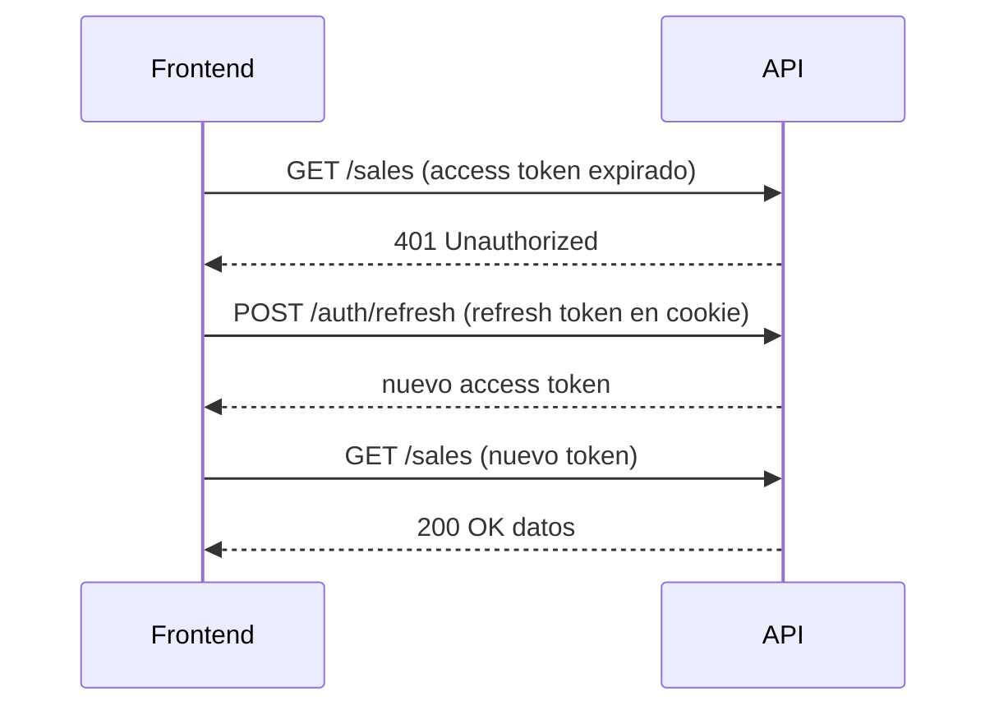

import LabSpec from '../../../components/LabSpec.astro';
import Checkpoint from '../../../components/Checkpoint.astro';

## 1. Conceptos

### Dónde guardar el JWT

Hay dos opciones principales y ambas tienen tradeoffs:

- **`localStorage`**: accesible desde JavaScript, vulnerable a XSS. Si algún script malicioso corre en tu página, puede leer el token.
- **Cookie `HttpOnly`**: no accesible desde JavaScript, el browser la envía automáticamente. Protege contra XSS pero requiere protección CSRF.

Rush usa cookies `HttpOnly` a través de Better Auth. El backend las setea al hacer login. El frontend no toca el token directamente — no lo lee, no lo almacena manualmente.

Fíjate que esto simplifica el cliente: no hay `localStorage.setItem('token', ...)` en el código. El browser maneja el ciclo de vida de la cookie.

### Renovar el refresh token automáticamente

Las sesiones de Rush tienen dos tokens:

- **Access token**: válido por 15 minutos, se envía en cada request
- **Refresh token**: válido por 30 días, se usa solo para obtener un nuevo access token

Cuando el access token expira, el API devuelve `401`. El frontend intercepta ese `401`, pide un nuevo access token usando el refresh token, y reintenta el request original.



El interceptor vive en la instancia de axios o en el fetch wrapper:

```ts
if (response.status === 401) {
  const refreshed = await tryRefreshToken();
  if (refreshed) {
    return fetch(url, options); // retry
  }
  await logout();
}
```

### Limpiar el cache al hacer logout

Al hacer logout, hay tres cosas que deben pasar:

1. Llamar al endpoint de logout del backend (invalida la cookie y el refresh token)
2. `queryClient.clear()` — elimina todos los datos del cache de TanStack Query
3. Redirigir al `/login`

Si no limpias el cache, el próximo usuario que entre en el mismo dispositivo podría ver los datos del usuario anterior durante unos segundos (hasta que las queries revaliden).

## 2. Lab guiado

<LabSpec title="Interceptor de 401 y flujo de logout con limpieza de cache" estimatedMinutes={60} runnable={false}>

Vas a crear el cliente HTTP de Rush con manejo automático de expiración de token y logout.

### Paso 1: cliente HTTP centralizado

```ts
// src/lib/http.ts
import { queryClient } from './queryClient';

let isRefreshing = false;
let refreshPromise: Promise<boolean> | null = null;

async function tryRefreshToken(): Promise<boolean> {
  if (isRefreshing && refreshPromise) {
    return refreshPromise;
  }

  isRefreshing = true;
  refreshPromise = fetch('/api/auth/refresh', {
    method: 'POST',
    credentials: 'include',
  })
    .then((res) => res.ok)
    .finally(() => {
      isRefreshing = false;
      refreshPromise = null;
    });

  return refreshPromise;
}

async function logout(): Promise<void> {
  await fetch('/api/auth/logout', { method: 'POST', credentials: 'include' });
  queryClient.clear();
  window.location.href = '/login';
}

export async function http(url: string, options?: RequestInit): Promise<Response> {
  const response = await fetch(url, {
    ...options,
    credentials: 'include',
  });

  if (response.status === 401) {
    const refreshed = await tryRefreshToken();

    if (refreshed) {
      return fetch(url, { ...options, credentials: 'include' });
    }

    await logout();
    throw new Error('Session expired');
  }

  return response;
}
```

### Paso 2: usar el cliente HTTP en las queries

```ts
// src/features/sales/api/sales.api.ts
import { http } from '@/lib/http';
import { saleSchema } from '@rush/shared-schemas';
import { z } from 'zod';

export async function fetchSales(businessId: string) {
  const response = await http(`/api/businesses/${businessId}/sales`);
  if (!response.ok) throw new Error('Failed to fetch sales');
  const raw = await response.json();
  return z.array(saleSchema).parse(raw);
}
```

### Paso 3: store de autenticación

```ts
// src/features/auth/auth.store.ts
import { create } from 'zustand';
import { queryClient } from '@/lib/queryClient';

interface AuthState {
  isAuthenticated: boolean;
  userId: string | null;
  login: (userId: string) => void;
  logout: () => Promise<void>;
}

export const useAuthStore = create<AuthState>((set) => ({
  isAuthenticated: false,
  userId: null,
  login: (userId) => set({ isAuthenticated: true, userId }),
  logout: async () => {
    await fetch('/api/auth/logout', { method: 'POST', credentials: 'include' });
    queryClient.clear();
    set({ isAuthenticated: false, userId: null });
  },
}));
```

### Paso 4: botón de logout

```tsx
// src/features/auth/LogoutButton.tsx
import { useAuthStore } from './auth.store';
import { useNavigate } from 'react-router';
import { Button } from '@/components/Button';

export function LogoutButton() {
  const logout = useAuthStore((s) => s.logout);
  const navigate = useNavigate();

  const handleLogout = async () => {
    await logout();
    navigate('/login', { replace: true });
  };

  return (
    <Button variant="outline" onClick={handleLogout}>
      Cerrar sesión
    </Button>
  );
}
```

### Verificación final

Simula una sesión expirada en el browser:

1. Abre DevTools → Network → filtra por `/api/auth/refresh`
2. Bloquea la URL con "Block request URL"
3. Espera a que el access token expire o fuerza un `401` desde el servidor
4. La aplicación debe redirigir a `/login` automáticamente

</LabSpec>

## 3. Checkpoint

<Checkpoint unit="auth-frontend">

1. ¿Por qué Rush usa cookies `HttpOnly` en vez de `localStorage` para guardar el JWT?
2. ¿Qué hace la variable `isRefreshing` en el interceptor de 401?
3. ¿Qué pasa si no llamas `queryClient.clear()` al hacer logout?

- [ ] El cliente HTTP (`http.ts`) intercepta los `401` y reintenta después de refrescar
- [ ] El logout llama `queryClient.clear()` antes de redirigir
- [ ] El interceptor no entra en bucle infinito si el refresh token también expira

</Checkpoint>

## Próxima unidad → [Container vs presentational: separar lógica de UI](../container-presentational/)
