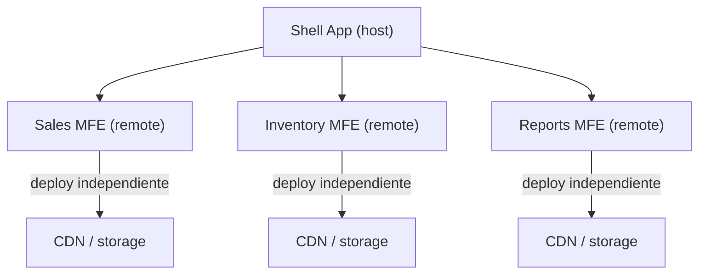

import LabSpec from '../../../../components/LabSpec.astro';
import Checkpoint from '../../../../components/Checkpoint.astro';

Rush usa una SPA monolítica. Esta unidad explica por qué esa decisión tiene sentido hoy, qué son los micro-frontends, y qué tendría que cambiar en el contexto de Rush para que valiera la pena considerarlos.

## 1. Conceptos

### 1. El problema que los micro-frontends intentan resolver

Los micro-frontends nacieron como solución a un problema específico: equipos grandes que trabajan en el mismo frontend al mismo tiempo, con ciclos de deploy que se bloquean entre sí.

Fíjate en este escenario: tienes 5 equipos de 6 personas cada uno, todos trabajando en el mismo repo de React. Un equipo necesita deployar un fix urgente, pero hay 3 PRs de otros equipos que todavía no pasaron QA. El deploy se bloquea. Eso duele.

La solución que proponen los micro-frontends: cada equipo tiene su propia aplicación frontend, con su propio ciclo de deploy, su propio repositorio, y sus propias dependencias. Un shell app los compone en runtime.



¿Cuándo este problema existe en la práctica? Cuando el frontend tiene más de 3 equipos autónomos que deployean en frecuencias distintas. Con 1 o 2 equipos, el costo de coordinación para un monolito es manejable.

### 2. Module Federation: el mecanismo de composición en runtime

Module Federation es una feature de webpack (y ahora también disponible para Vite via plugins) que permite que una aplicación cargue módulos de otra aplicación en runtime, no en build time.

El concepto es:

- **Host** (shell): la app que carga módulos de otros.
- **Remote**: la app que expone módulos para que otros los carguen.

En la config de webpack del remote:

```js
// webpack.config.js del remote (Sales MFE)
new ModuleFederationPlugin({
  name: 'salesMfe',
  filename: 'remoteEntry.js',
  exposes: {
    './SalesModule': './src/SalesModule',
    './SalesList': './src/components/SalesList',
  },
  shared: {
    react: { singleton: true, requiredVersion: '^19.0.0' },
    'react-dom': { singleton: true, requiredVersion: '^19.0.0' },
  },
}),
```

En el host:

```js
// webpack.config.js del host (shell)
new ModuleFederationPlugin({
  name: 'shell',
  remotes: {
    salesMfe: 'salesMfe@https://sales.tuapp.com/remoteEntry.js',
  },
  shared: {
    react: { singleton: true },
    'react-dom': { singleton: true },
  },
}),
```

Uso en el host:

```tsx
// src/App.tsx en el shell
const SalesList = React.lazy(() => import('salesMfe/SalesList'));

function App() {
  return (
    <React.Suspense fallback={<div>Cargando ventas...</div>}>
      <SalesList />
    </React.Suspense>
  );
}
```

`singleton: true` en las dependencias compartidas es crítico: si tanto el host como el remote cargan su propia copia de React, hay dos estados de React en la misma página, y todo falla silenciosamente.

Con Vite, el ecosistema es diferente: el plugin `@originjs/vite-plugin-federation` o la integración con Rspack permiten algo similar, pero el soporte todavía es menos maduro que el de webpack en producción.

### 3. Por qué Rush no usa micro-frontends hoy

Rush tiene un equipo pequeño (menos de 5 devs trabajando en el frontend al mismo tiempo) y una cadencia de deploy que no requiere independencia por equipo. El costo de los micro-frontends no está justificado:

**Costos reales de los micro-frontends**:

1. **Infraestructura multiplicada**: cada MFE necesita su propio pipeline de CI/CD, su propio deployment, su propia estrategia de versionado.
2. **Duplicación de dependencias**: aunque `singleton: true` resuelve React, otras librerías (TanStack Query, React Router, Zod) pueden tener versiones distintas entre MFEs, lo que crea bugs difíciles de reproducir.
3. **Estado compartido complejo**: si Sales y Inventory necesitan compartir el estado del tenant activo, necesitas un mecanismo de comunicación entre MFEs (custom events, un estado global compartido en el shell, o una URL como fuente de verdad). Cada opción tiene fricción.
4. **Testing cross-MFE difícil**: los tests de integración tienen que levantar múltiples apps en paralelo.
5. **TypeScript across MFEs**: los tipos no fluyen automáticamente entre repositorios — necesitas packages compartidos o copies de tipos.

¿Qué tendría que cambiar para que Rush considerara micro-frontends?

- Más de 3 equipos autónomos con frontends que se solapan.
- Requisito de deployar features de Sales sin tocar el código de Inventory ni Reporting.
- Frontends con stacks o versiones distintas que no pueden convivir en el mismo build (raro, pero pasa).

Por ahora, la arquitectura feature-first que Rush usa (una carpeta por dominio, boundaries enforced por ESLint, un solo repo) da independencia suficiente sin el overhead de los MFEs.

## 2. Lab guiado

<LabSpec
  title="Explorar Module Federation con Vite"
  estimatedMinutes={60}
  runnable={false}
>

En este lab vas a entender la estructura de un proyecto con Module Federation leyendo un ejemplo de configuración real. No vas a levantar el servidor — el objetivo es que puedas leer y entender la configuración cuando la veas en un proyecto real.

**Paso 1**: Lee la estructura de un proyecto típico con MFEs.

```text
projects/
  shell/
    package.json
    vite.config.ts          ← host config con remotes
    src/
      App.tsx               ← lazy imports de remotes
      router.tsx
  mfe-sales/
    package.json
    vite.config.ts          ← exposes SalesModule
    src/
      SalesModule.tsx       ← punto de entrada expuesto
      components/
      hooks/
  mfe-inventory/
    package.json
    vite.config.ts
    src/
      InventoryModule.tsx
```

**Paso 2**: Lee esta configuración de Vite para el remote y entiende qué hace cada sección.

```ts
// mfe-sales/vite.config.ts
import { defineConfig } from 'vite';
import react from '@vitejs/plugin-react';
import federation from '@originjs/vite-plugin-federation';

export default defineConfig({
  plugins: [
    react(),
    federation({
      name: 'salesMfe',
      // Módulos que este MFE expone al host
      exposes: {
        './SalesModule': './src/SalesModule.tsx',
      },
      // Dependencias compartidas — react y react-dom deben ser singleton
      shared: ['react', 'react-dom', 'react-router-dom'],
    }),
  ],
  build: {
    // Necesario para Module Federation con Vite
    target: 'esnext',
    minify: false,
    cssCodeSplit: false,
  },
  server: {
    port: 5001,
    cors: true,
  },
  preview: {
    port: 5001,
    cors: true,
  },
});
```

```ts
// shell/vite.config.ts
import { defineConfig } from 'vite';
import react from '@vitejs/plugin-react';
import federation from '@originjs/vite-plugin-federation';

export default defineConfig({
  plugins: [
    react(),
    federation({
      name: 'shell',
      remotes: {
        // En desarrollo: URL local del MFE
        // En producción: URL del CDN donde está deployado
        salesMfe: 'http://localhost:5001/assets/remoteEntry.js',
      },
      shared: ['react', 'react-dom', 'react-router-dom'],
    }),
  ],
  build: {
    target: 'esnext',
    minify: false,
  },
});
```

**Paso 3**: Lee este componente del shell que consume el remote y entiende el flujo.

```tsx
// shell/src/App.tsx
import React from 'react';

// Este import NO existe en build time — se resuelve en runtime
// TypeScript necesita un declaration file o el tipo tiene que ser 'any'
const SalesModule = React.lazy(() => import('salesMfe/SalesModule'));
const InventoryModule = React.lazy(() => import('mfeInventory/InventoryModule'));

export function App() {
  return (
    <div>
      <nav>Shell Navigation</nav>
      <React.Suspense fallback={<div>Loading module...</div>}>
        <SalesModule />
      </React.Suspense>
    </div>
  );
}
```

**Paso 4**: Identifica los problemas de esta arquitectura para un equipo del tamaño de Rush.

Para un equipo de 3 devs frontend:

- ¿Cuántos repositorios hay que mantener?
- ¿Cuántos pipelines de CI hay que configurar?
- Si necesitas actualizar React de 18 a 19, ¿cuántos lugares hay que tocar?
- Si hay un bug que cruza Sales e Inventory, ¿cómo lo reproduces en tests?

Escribe las respuestas como comentarios en un archivo local — son las preguntas que debes hacerte antes de adoptar micro-frontends.

**Verificación**: sin levantar ningún servidor, deberías poder responder estas preguntas usando solo la lectura de la configuración:

- ¿En qué puerto sirve el remote de Sales?
- ¿Qué módulo expone?
- ¿Cómo sabe el host dónde encontrar el remote en producción?
- ¿Por qué las dependencias compartidas necesitan estar listadas en ambos lados?

</LabSpec>

## 3. Checkpoint

<Checkpoint unit="micro-frontends-intro">

1. ¿Qué problema concreto resuelven los micro-frontends que una SPA monolítica con arquitectura feature-first no puede resolver? ¿En qué tamaño de equipo ese problema se vuelve real?
2. ¿Por qué `singleton: true` en las dependencias compartidas de Module Federation es crítico? ¿Qué falla si no lo configuras?
3. Rush usa feature-first con un solo repo. ¿Qué cosas tendrían que ser distintas en el contexto de Rush para que los micro-frontends valieran la pena? Nombra al menos tres condiciones concretas.

- [ ] Puedo describir la diferencia entre composición en build time (monolito con feature-first) y composición en runtime (Module Federation) y cuándo cada una tiene sentido.
- [ ] Entiendo por qué `singleton` en las dependencias compartidas es necesario para que React funcione correctamente cuando hay múltiples MFEs en la misma página.
- [ ] Puedo explicar por qué Rush eligió una SPA monolítica y qué criterio debería guiar la decisión de migrar a micro-frontends en el futuro.

</Checkpoint>

## Próxima unidad → [Accesibilidad](../accesibilidad-a11y/)
