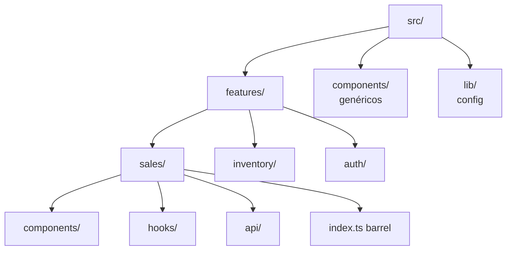

import LabSpec from '../../../components/LabSpec.astro';
import Checkpoint from '../../../components/Checkpoint.astro';

## 1. Conceptos

### El problema de la carpeta global `components/`

Imagínate que tienes esta estructura:

```text
src/
├── components/
│   ├── SalesTable.tsx
│   ├── SalesForm.tsx
│   ├── InventoryList.tsx
│   ├── LoginForm.tsx
│   └── Button.tsx
```

¿Qué tienen en común `SalesTable` y `Button`? Nada, excepto que alguien decidió que ambos son "componentes". Cuando el proyecto crece, esta carpeta se vuelve un cajón de sastre donde nada es fácil de encontrar.

Fíjate en qué pasa cuando trabajas en un feature de ventas: tienes que buscar en `components/`, `hooks/`, `api/`, `types/` — todo separado por tipo técnico, no por el problema que resuelve.

### Feature-first: agrupar por capacidad de negocio

La alternativa es agrupar todo lo relacionado con una capacidad de negocio en un solo directorio:

```text
src/
├── features/
│   ├── sales/
│   │   ├── components/      <- componentes de ventas
│   │   ├── hooks/           <- hooks de ventas
│   │   ├── api/             <- llamadas al API de ventas
│   │   ├── schemas/         <- schemas Zod para validar responses
│   │   └── index.ts         <- barrel export (qué expone este feature)
│   ├── inventory/
│   └── auth/
├── components/              <- solo componentes verdaderamente genéricos (Button, Modal, Input)
├── lib/                     <- config de librerías (queryClient, axios, i18n)
└── hooks/                   <- hooks genéricos (useWindowSize, useDebounce)
```



Vale, ahora la regla práctica: si un componente, hook o función solo tiene sentido dentro de `sales/`, vive en `features/sales/`. Si lo necesitas desde dos features distintos, ahí sí va a `components/` o `hooks/` global.

### El barrel export del feature

Cada feature tiene un `index.ts` que declara explícitamente qué expone:

```ts
// src/features/sales/index.ts
export { SalesTable } from './components/SalesTable';
export { SalesPage } from './components/SalesPage';
export type { Sale } from './schemas/sale.schema';
```

Los componentes internos del feature (`SalesRow`, `SalesFilters`) no se exportan. Eso es encapsulación: el resto del proyecto no puede importar los internos del feature directamente.

### La regla de las importaciones

- Dentro de un feature: importa con path relativo (`./components/SalesTable`)
- Fuera del feature: importa siempre del barrel (`@/features/sales`)
- Un feature NO puede importar directamente los internos de otro feature — tiene que pasar por el barrel

Si `inventory/` necesita algo de `sales/`, lo importa de `@/features/sales`, no de `@/features/sales/components/SomethingInternal`.

## 2. Lab guiado

<LabSpec title="Crear el feature sales/ con estructura completa" estimatedMinutes={60} runnable={false}>

Vas a crear la estructura completa del feature `sales` con sus capas internas.

### Paso 1: crear la estructura de directorios

```bash
mkdir -p src/features/sales/components
mkdir -p src/features/sales/hooks
mkdir -p src/features/sales/api
mkdir -p src/features/sales/schemas
```

### Paso 2: definir el schema de la entidad

```ts
// src/features/sales/schemas/sale.schema.ts
import { z } from 'zod';

export const saleSchema = z.object({
  id: z.string().uuid(),
  businessId: z.string().uuid(),
  amount: z.number().positive(),
  currency: z.enum(['VES', 'USD']),
  usdEquivalent: z.number().positive(),
  createdAt: z.string().datetime(),
});

export type Sale = z.infer<typeof saleSchema>;
```

### Paso 3: capa de API del feature

```ts
// src/features/sales/api/sales.api.ts
import { saleSchema } from '../schemas/sale.schema';
import { z } from 'zod';

const salesListSchema = z.array(saleSchema);

export async function fetchSales(businessId: string): Promise<z.infer<typeof salesListSchema>> {
  const response = await fetch(`/api/businesses/${businessId}/sales`);
  if (!response.ok) throw new Error('Failed to fetch sales');
  const data = await response.json();
  return salesListSchema.parse(data);
}
```

### Paso 4: hook del feature

```ts
// src/features/sales/hooks/useSales.ts
import { useQuery } from '@tanstack/react-query';
import { fetchSales } from '../api/sales.api';

export function useSales(businessId: string) {
  return useQuery({
    queryKey: ['tenant', businessId, 'sales'],
    queryFn: () => fetchSales(businessId),
  });
}
```

### Paso 5: componente principal del feature

```tsx
// src/features/sales/components/SalesPage.tsx
import { useSales } from '../hooks/useSales';

interface SalesPageProps {
  businessId: string;
}

export function SalesPage({ businessId }: SalesPageProps) {
  const { data, isLoading, error } = useSales(businessId);

  if (isLoading) return <div>Cargando ventas...</div>;
  if (error) return <div>Error al cargar ventas</div>;

  return (
    <div>
      <h1>Ventas</h1>
      <p>{data?.length} ventas registradas</p>
    </div>
  );
}
```

### Paso 6: barrel export

```ts
// src/features/sales/index.ts
export { SalesPage } from './components/SalesPage';
export type { Sale } from './schemas/sale.schema';
```

### Verificación final

Desde `src/main.tsx`, importa `SalesPage` usando el barrel:

```tsx
import { SalesPage } from '@/features/sales';
```

TypeScript no debe mostrar errores. Si intentas importar directamente `@/features/sales/components/SalesPage`, TypeScript no lo prohíbe por defecto — eso lo puedes hacer cumplir con `eslint-plugin-boundaries` (que se cubre en la unidad del track backend sobre clean arch módulos).

</LabSpec>

## 3. Checkpoint

<Checkpoint unit="feature-first">

1. ¿Qué diferencia hay entre `src/components/Button.tsx` y `src/features/sales/components/SalesButton.tsx`? ¿Cuál es el criterio?
2. Si el feature `inventory` necesita mostrar el total de ventas de hoy, ¿cómo accede a esa información respetando los límites del feature?
3. ¿Por qué el barrel export (`index.ts`) importa que no exporte los internos del feature?

- [ ] La estructura `features/sales/` existe con las cuatro capas (components, hooks, api, schemas)
- [ ] El barrel export expone solo `SalesPage` y el tipo `Sale`
- [ ] `SalesPage` se puede importar desde `@/features/sales` sin error de TypeScript

</Checkpoint>

## Próxima unidad → [TanStack Query: data fetching sin dolor](../tanstack-query-fundamentos/)
