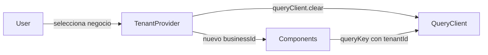

import LabSpec from '../../../components/LabSpec.astro';
import Checkpoint from '../../../components/Checkpoint.astro';

## 1. Conceptos

### El problema del cache cross-tenant

Rush es multi-tenant. Un usuario puede pertenecer a más de un negocio. Si ese usuario cambia de tenant en el frontend y el cache no se limpia, puede terminar viendo datos del tenant anterior.

Imagínate este escenario:

1. Usuario entra a Negocio A — TanStack Query cachea las ventas bajo la key `['sales']`
2. Usuario cambia a Negocio B — la key `['sales']` todavía tiene los datos de Negocio A
3. El componente de ventas renderiza con datos de Negocio A hasta que la revalidación llega

Eso es un bug de seguridad, no solo un bug de UX. En un sistema con dinero de por medio, mostrar los datos del negocio equivocado es inaceptable.

### Query keys con tenantId

La solución es simple: el `tenantId` forma parte de cada query key de datos tenant-específicos.

```ts
queryKey: ['tenant', businessId, 'sales']
queryKey: ['tenant', businessId, 'inventory']
queryKey: ['tenant', businessId, 'reports', reportId]
```

Con este patrón, los datos de Negocio A y Negocio B nunca comparten cache. Son queries distintas.

Fíjate que no todos los datos son tenant-específicos. La lista de países, los códigos de moneda, la configuración global del sistema — esos pueden ir sin el prefijo `tenant`:

```ts
queryKey: ['currencies']
queryKey: ['countries']
```

### Resetear el QueryClient al cambiar de tenant

Tener query keys con `tenantId` evita la contaminación de cache, pero los datos del tenant anterior siguen en memoria. Para limpiar completamente:

```ts
queryClient.clear();
```

Esto elimina todas las queries del cache. Es el equivalente de hacer logout del estado del servidor. Al llamar `clear()` al cambiar de tenant, el usuario parte de cero con el nuevo tenant.

¿Por qué `clear()` y no solo invalidar las queries del tenant anterior? Porque puede haber queries sin prefijo `tenant` que también contienen datos del contexto anterior, o queries antiguas con el tenantId anterior que ya no se necesitan.

### TenantProvider

El `TenantProvider` es el contexto que hace disponible el `businessId` activo en toda la aplicación. Cuando el usuario cambia de negocio, el provider actualiza el valor y dispara el reset del cache.



## 2. Lab guiado

<LabSpec title="TenantProvider con reset de QueryClient" estimatedMinutes={60} runnable={false}>

Vas a crear el `TenantProvider` y conectarlo al reset del QueryClient.

### Paso 1: crear el contexto de tenant

```tsx
// src/features/auth/TenantContext.tsx
import { createContext, useContext, useState, useCallback } from 'react';
import { useQueryClient } from '@tanstack/react-query';

interface TenantContextValue {
  businessId: string | null;
  switchTenant: (newBusinessId: string) => void;
}

const TenantContext = createContext<TenantContextValue | null>(null);

export function TenantProvider({ children }: { children: React.ReactNode }) {
  const [businessId, setBusinessId] = useState<string | null>(null);
  const queryClient = useQueryClient();

  const switchTenant = useCallback(
    (newBusinessId: string) => {
      queryClient.clear();
      setBusinessId(newBusinessId);
    },
    [queryClient],
  );

  return (
    <TenantContext.Provider value={{ businessId, switchTenant }}>
      {children}
    </TenantContext.Provider>
  );
}

export function useTenant() {
  const ctx = useContext(TenantContext);
  if (!ctx) throw new Error('useTenant must be used inside TenantProvider');
  return ctx;
}
```

### Paso 2: actualizar el hook useSales para usar el contexto

```ts
// src/features/sales/hooks/useSales.ts
import { useQuery } from '@tanstack/react-query';
import { useTenant } from '@/features/auth/TenantContext';
import { fetchSales } from '../api/sales.api';

export function useSales() {
  const { businessId } = useTenant();

  return useQuery({
    queryKey: ['tenant', businessId, 'sales'],
    queryFn: () => fetchSales(businessId!),
    enabled: !!businessId,
  });
}
```

### Paso 3: integrar TenantProvider en el árbol de la app

```tsx
// src/main.tsx
createRoot(document.getElementById('root')!).render(
  <StrictMode>
    <QueryClientProvider client={queryClient}>
      <TenantProvider>
        <RouterProvider router={router} />
      </TenantProvider>
      <ReactQueryDevtools initialIsOpen={false} />
    </QueryClientProvider>
  </StrictMode>,
);
```

### Paso 4: selector de negocio para probar el switch

```tsx
// src/features/auth/BusinessSelector.tsx
import { useTenant } from './TenantContext';

const MOCK_BUSINESSES = [
  { id: 'biz-001', name: 'Arepera del Centro' },
  { id: 'biz-002', name: 'Ferretería El Pana' },
];

export function BusinessSelector() {
  const { businessId, switchTenant } = useTenant();

  return (
    <select value={businessId ?? ''} onChange={(e) => switchTenant(e.target.value)}>
      <option value="">Selecciona un negocio</option>
      {MOCK_BUSINESSES.map((b) => (
        <option key={b.id} value={b.id}>
          {b.name}
        </option>
      ))}
    </select>
  );
}
```

### Verificación final

Con el React Query Devtools abierto:

1. Selecciona "Arepera del Centro" — debes ver la query `['tenant', 'biz-001', 'sales']` aparecer
2. Selecciona "Ferretería El Pana" — el Devtools debe mostrar que el cache se limpió y aparece la query `['tenant', 'biz-002', 'sales']`

</LabSpec>

## 3. Checkpoint

<Checkpoint unit="tanstack-query-tenant-aware">

1. ¿Por qué mostrar datos del tenant equivocado es un bug de seguridad y no solo de UX?
2. ¿Cuál es la diferencia entre `queryClient.invalidateQueries()` y `queryClient.clear()` en el contexto del cambio de tenant?
3. ¿Qué pasa si olvidas poner `businessId` en la query key pero sí lo usas en el `queryFn`?

- [ ] `TenantProvider` resetea el QueryClient al llamar `switchTenant`
- [ ] Las queries usan el patrón `['tenant', businessId, ...]`
- [ ] Al cambiar de tenant en el selector, el Devtools muestra que el cache se limpió

</Checkpoint>

## Próxima unidad → [TanStack Table: tablas tipadas y potentes](../tanstack-table/)
